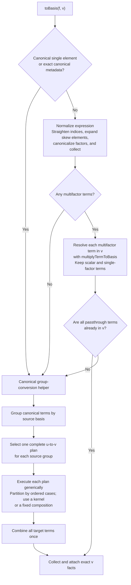
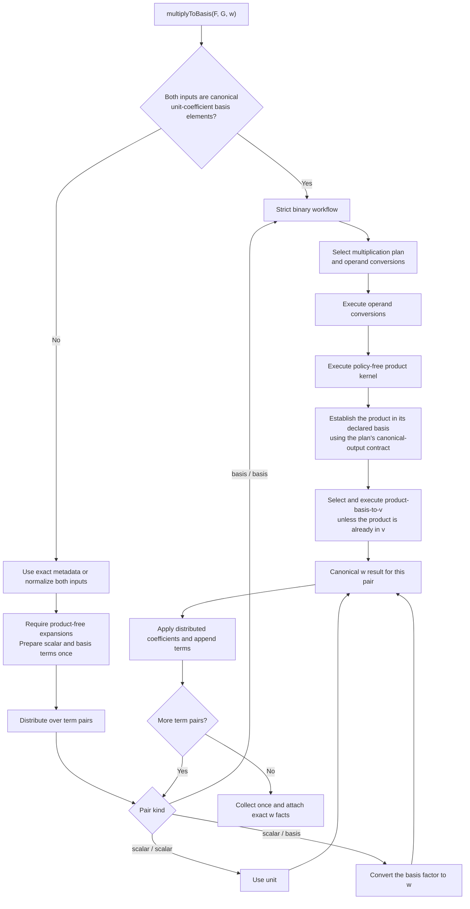
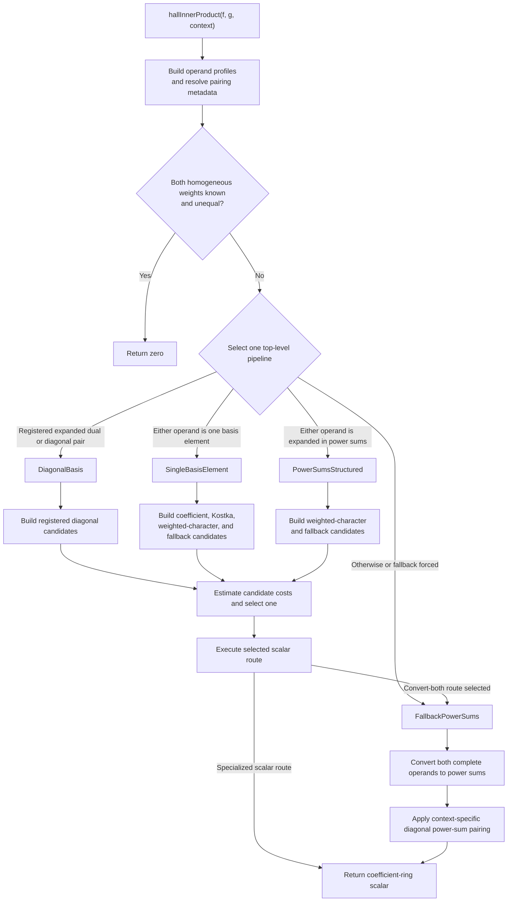

# SymmetricRings C++ pipeline guide

This document describes the engine workflows for basis conversion,
multiplication, plethysm, inner products, and targeted basis coefficients.
The public M2 layer retains ownership of user-defined and transformed-basis
formulas; built-in algebra crosses the raw boundary into these workflows.
Each workflow is described first by its mathematical purpose and decomposition,
then by the engine stages that realize it. The diagrams describe the current
implementation. Proposed replacements and unchecked experiments remain in
`TODO-pipelines.md`.

## Conversion plans

### Mathematical model

If $\Lambda_u$ denotes finite canonical expansions in a basis $u$, then a
conversion formula from $u$ to $v$ is a map

$$
K_{u,v}\colon \Lambda_u\longrightarrow\Lambda_v,
\qquad K_{u,v}(f)=f.
$$

Different identities can realize the same map with very different costs.
For example, a character formula, a recurrence, and a composition through
power sums may all produce the same $v$-expansion.

### Engine representation

The engine separates three roles:

$$
\text{kernel = one formula},\qquad
\text{plan = a complete conversion},\qquad
\text{picker = a performance choice among plans}.
$$

A kernel implements one identity and states when that identity is valid. A
plan gives a complete, inspectable rule for converting a specified $u$ to a
specified $v$. The picker does not perform algebra: it chooses an applicable
complete plan from the available $u\to v$ plans.

#### Structure of a plan

For a canonical, product-free expression

$$
f=\sum_\alpha c_\alpha u_\alpha,
$$

a plan may treat $f$ as one expression, as individual terms, or as
homogeneous components. Its cases are ordered mathematical predicates
$C_1,\ldots,C_r$, with a final `otherwise()` case. If $f_i$ is the part of
$f$ assigned to the first applicable case $C_i$, then

$$
P_{u,v}(f)=\sum_{i=1}^r F_i(f_i).
$$

Each $F_i$ has one of two forms:

- **Kernel:** apply one named mathematical formula directly to $f_i$.
- **Fixed composition:** pass $f_i$ through an ordered list of named plans,
  with matching adjacent endpoints from $u$ to $v$. The list is nonempty: one
  plan delegates to that exact, possibly piecewise plan, while several plans
  form a conversion through intermediate bases. Each plan receives the actual
  canonical output of the preceding plan.

The pieces $f_i$ are disjoint and cover all of $f$, and every named plan is
fixed by the parent definition rather than selected during execution.

This distinction keeps correctness and cost separate. Plan applicability
records where a conversion is mathematically valid. The picker may inspect
degree, support, index shape, coefficient ring, or known provenance only to
choose among valid complete plans.

#### Representative examples

The direct Schur-to-power-sum plan uses the Frobenius character formula

$$
s_\lambda
=\sum_{\mu\vdash |\lambda|}
  \frac{\chi^\lambda(\mu)}{z_\mu}p_\mu.
$$

Its plan, `Schur->PowerSum:Frobenius-character-formula`, applies this kernel
linearly to the whole Schur expansion. This is the simplest case: one
mathematical identity is already a complete plan.

When there is no preferred direct conversion between two built-in bases, the
generic power-sum plan uses

$$
P_{u,v}^{(p)}=P_{p,v}\circ P_{u,p}.
$$

The plan `u->v:via-power-sums` fixes both component plans before execution.
Power sums are used because their multiplicative and character-theoretic
formulas give a broad bridge between the built-in families. The intermediate
$p$-expansion is passed directly to the fixed second plan; it is not sent
back to the picker.

Some conversions benefit from a piecewise mathematical rule. Write a
power-sum expansion as

$$
f=\sum_n f^{(n)},
$$

where $f^{(n)}$ is homogeneous of weight $n$. The plan
`PowerSum->Schur:homogeneous-component-formulas` assigns each $f^{(n)}$ to
one of its fixed cases. A component may use the composition
$p\to h\to S$, a short-cycle formula applied termwise, or an abacus
rim-hook formula. These formulas agree mathematically, but their costs depend
on the component's support and cycle shapes. The case split belongs to this
single complete plan, rather than being a special branch in the surrounding
pipeline.

The picker becomes relevant only when several complete plans share endpoints.
For example, a power-sum expression consisting of single cycles can use a
Green-polynomial plan for conversion to a capital Hall--Littlewood basis;
more general input uses the corresponding triangular-reduction plan. Both
plans describe valid coordinate changes, while the picker records which is
expected to be cheaper for the observed expression.

The hard-coded mathematical plans live in `basis-conversion-plans.cpp`; the
separate performance choices live in `basis-conversion-picker.cpp`. Custom
and transformed-basis formulas remain owned by the M2 layer. Equal source and
target bases require no conversion plan.

## Basis conversion

### Mathematical workflow

The goal of `toBasis(f, v)` is to write the same symmetric function in the
target basis $v$:

$$
f=\sum_\lambda a_\lambda v_\lambda.
$$

Linearity reduces mixed-basis conversion to conversions of pure expansions.
If the normalized, product-free expression decomposes as

$$
f=\sum_u f_u,\qquad f_u\in\Lambda_u,
$$

then

$$
[f]_v=\sum_u P_{u,v}(f_u).
$$

Before this decomposition, skew indices must be expanded and a product term
$c\,f_1\cdots f_r$ must be resolved as a product, because it is not yet a
linear expansion in any one basis. These are mathematical normalization
steps; the later plan selection acts only on canonical, product-free
expansions.

### Engine workflow

`toBasis(f, v)` accepts pure, mixed-basis, skew, and product-bearing input. A
single canonical basis element or an expression with exact canonical metadata
can enter group conversion immediately. Other input is normalized by
straightening indices, expanding skew elements, canonicalizing factors, and
collecting terms.

The picker considers only complete available plans with the requested
source and target endpoints. A plan is an ordered set of cases over the whole
expression, individual terms, or homogeneous components. Cases receive only
unassigned input, and the final `otherwise` case proves complete coverage.
Each case contains one kernel or a nonempty ordered composition of named
plans. A one-plan composition delegates to that exact plan.

For a mathematician, a plan can be read as a named casewise identity: its
source and target specify the two bases, its conditions describe the portion
of the expression under consideration, and its formula names the conversion
identity or fixed chain of identities to apply. Performance policy chooses
among complete identities; it does not alter their mathematics.

The selected top-level plan fixes every kernel and component-plan identifier
that execution can reach. The generic executor evaluates component-plan cases
against the actual intermediate expression, but never calls the picker. When
an endpoint has no specific plan, or when the generic plan is forced, one
parameterized plan resolves the designated `u -> PowerSum` and
`PowerSum -> v` components and becomes an ordinary immutable composition
before execution. It is the only broad `u -> PowerSum -> v` plan; there are
no separately materialized copies for individual endpoint pairs. The
power-sum-to-Schur component and term hybrids are ordinary piecewise plans,
not special pipeline control flow.

Canonical target output is an unconditional kernel and plan invariant.
Execution checks it whenever exact result facts or an intermediate are needed,
and each owning conversion or multiplication workflow validates its final
target contract. A plan's `outputGuarantee` condition records only a stronger
shape or profile postcondition needed by a later component; `always()` means that
no stronger condition is claimed.

If resolving products leaves only target terms, the workflow attaches exact
target facts directly instead of performing identity grouping and plan
execution.

The expression-facts contract contains only exact facts about a realized
expression: canonical form, basis composition, homogeneous weight, term and
factor counts, skew counts, single-element index, and provenance. Derived
flags are computed from those values. Whole-expression profiles needed by a
picker are computed lazily. Term and homogeneous-component profiles are
computed by the executor from the actual pieces only when a selected plan has
such cases. Exact metadata lets canonical input bypass normalization and
general rescanning.

Arithmetic may retain individually valid hints after it invalidates the exact
canonical-core marker. Only the complete marker can justify a conversion
bypass. Numeric basis IDs are allocated by the package registry and remain
stable, but each engine ring has its own available-basis descriptors.
Cross-ring fallback transport therefore discards basis-identity facts and
reconstructs them from the realized target-ring expression.

## Multiplication

### Mathematical workflow

For product-free expansions

$$
F=\sum_\lambda a_\lambda u_\lambda,
\qquad
G=\sum_\mu b_\mu v_\mu,
$$

bilinearity gives

$$
FG=\sum_{\lambda,\mu}a_\lambda b_\mu
   \bigl(u_\lambda v_\mu\bigr).
$$

The remaining problem is therefore the product of two basis elements. Its
best formula depends on their families and on the requested output basis.
Schur products may use Littlewood--Richardson, Pieri, or
Murnaghan--Nakayama rules. In a multiplicative basis one instead has the
concatenation rule

$$
w_\alpha w_\beta=w_{\alpha\sqcup\beta}.
$$

If neither specialized situation applies, converting both factors to power
sums gives a broad multiplicative fallback.

### Engine layers

The implementation has three layers. `multiplyTermToBasis` resolves one
stored product term encountered during basis conversion. Public
`multiplyToBasis` distributes two product-free linear combinations. Its
strict binary helper multiplies two canonical unit-coefficient basis elements
using one selected multiplication plan.

#### One-term product resolution

Mathematically, a stored term has the form $c\,f_1\cdots f_r$. With no
nonidentity factors it is the scalar $c$; with one factor it needs only basis
conversion. With several factors, a multiplicative target permits all factors
to be converted and concatenated there. Otherwise the product is associated
into binary products, each expressed in the target basis before the next
factor is introduced.

`multiplyTermToBasis` removes encoded identity factors and preserves the term
coefficient until the result is complete. Canonical storage has already
removed zero-coefficient terms, so the zero branch in the mathematical
contract does not require a runtime branch here.

#### Public distribution and strict binary execution

The public operation is the linear extension of the strict basis-element
product:

$$
\operatorname{multiplyToBasis}(F,G;w)
=\sum_{\lambda,\mu}a_\lambda b_\mu\,
  \bigl[u_\lambda v_\mu\bigr]_w.
$$

Scalar pairs contribute the unit, while every nonscalar pair uses the same
strict mathematical product contract. Coefficients are applied only after
the unit-coefficient product is known.

The public wrapper has a fast path for two canonical unit-coefficient basis
elements. Otherwise it uses exact metadata or normalizes both operands,
requires product-free expansions, prepares every atom once, and distributes
over term pairs. Scalar pairs bypass multiplication-plan selection. Nonscalar
pairs use the strict workflow, and all distributed results are collected once.

Multiplication plans declare their operand bases, mathematical output basis,
and canonical-output guarantee. Selection fixes operand conversions before
kernel execution. The owning binary workflow selects any support-dependent
final product conversion only after the canonical product and its facts exist.
Hall--Littlewood multiplication reaches generator bases through the same
conversion plan database.

`buildMultiplicationPlansFor` lists plans from most specialized to broadest:

- a Schur-factor plan for Schur targets, reported as
  Littlewood--Richardson, horizontal or vertical Pieri,
  Murnaghan--Nakayama, or the mixed formula according to the operand kinds;
- exponent splittings for monomial or forgotten targets;
- conversion to the appropriate Hall--Littlewood generator basis for capital
  Hall--Littlewood targets;
- multiplication directly in a multiplicative target basis; and
- multiplication in power sums as the always-available built-in fallback.

The picker executes the first applicable plan unless a valid plan identifier
is forced. Every currently constructed multiplication plan declares its
product canonical, although the workflow retains the general normalization
branch required by the plan contract.

Stable multiplication plan names are rendered from typed plan identifiers;
applicability and execution never branch on their diagnostic strings.

## Plethysm

### Mathematical workflow

Plethysm $f[g]$ is determined by its action on power sums. If $\psi_r$ is the
$r$th Adams operation, then

$$
p_r[g]=\psi_r(g),
\qquad
p_\lambda[g]=\prod_i\psi_{\lambda_i}(g).
$$

Thus a broad computation converts $f$ and $g$ to power sums, performs these
substitutions, and converts the result to the requested basis. For suitable
Schur inputs, an Adams/Jacobi--Trudi recurrence computes the same plethysm
directly in Schur coordinates and avoids the general power-sum intermediate.

### Engine workflow

Plain `plethysm(f, g)` follows the power-sum definition.
`plethysmToBasis(f, g, target)` either selects the applicable specialized
Schur recurrence or computes power-sum plethysm and passes that canonical
result, with provenance metadata, to `toBasis`.

The selector tests the fused route's structural applicability before any
algebra. Benchmark evidence determines whether that route remains available;
benchmarking is not performed at runtime. The fused executor validates its
contract again before running.

The broad route is therefore identical to
`toBasis(plethysm(f, g), v)`. The fused route avoids materializing the general
power-sum intermediate when its complete contract applies.

## Hall inner products

### Mathematical workflow

For the ordinary Hall inner product, the power sums are orthogonal:

$$
\langle p_\lambda,p_\mu\rangle
=\delta_{\lambda\mu}z_\lambda.
$$

Other supported pairing contexts replace $z_\lambda$ by the appropriate
diagonal weight. Bilinearity makes conversion of both operands to power sums
an unconditional method. Dual or diagonal basis pairs, coefficient formulas,
and character formulas can evaluate the same scalar without constructing both
complete power-sum expansions. Homogeneous components of different weights
are orthogonal, so known unequal homogeneous weights give zero immediately.

### Engine workflow

The current implementation uses four top-level pipelines; the unified
weight-splitting workflow in `TODO-pipelines.md` is not yet implemented. The
public entry builds operand profiles and a pairing context, applies the known
unequal-weight zero test, and then selects one pipeline for the complete
expressions.

Candidate costs may use term counts, homogeneous weight, partition lengths,
and transition-cache state. A selected specialized route returns a
coefficient-ring scalar. The broad route calls `toBasis` independently for
both complete operands and then applies the requested power-sum pairing; it
does not split nonhomogeneous operands into weight blocks or group them by
basis first.

## Basis coefficients

### Mathematical workflow

For a target basis element $v_\lambda$, coefficient extraction asks for

$$
[v_\lambda]f=a_\lambda,
\qquad
f=\sum_\mu a_\mu v_\mu.
$$

Computing the full $v$-expansion and reading $a_\lambda$ is always valid.
When the source is already in $v$, this is direct lookup. For a power-sum
source, duality, character values, or transition formulas can often compute
the one requested scalar without constructing coefficients for every
partition.

### Engine workflow

`basisCoefficient(f, targetElement)` validates one coefficient-one, non-skew,
partition-indexed target element. If `f` is already expanded in the target it
uses direct lookup. If `f` is a pure power-sum expansion, it uses the targeted
formula for the requested Schur-like, complete, elementary,
Hall--Littlewood, monomial, or forgotten coefficient. Every other case calls
`toBasis` once and reads the requested coefficient from the complete target
expansion.

## Multiplication provenance

### Mathematical motivation

Many products carry more information than their final expansion alone. For
example,

$$
s_\lambda h_r
=\sum_{\substack{\mu\supseteq\lambda\\
                  \mu/\lambda\text{ is a horizontal }r\text{-strip}}}
  s_\mu,
$$

and the analogous elementary Pieri rule uses vertical strips. Products with
a power sum are governed by border strips, while general Schur products use
Littlewood--Richardson coefficients. Remembering which structure created an
expression can help a later mathematically equivalent conversion choose an
appropriate formula.

### Engine representation

Ordinary `mult(f, g)` attaches combinatorial provenance such as horizontal
Pieri, vertical Pieri, border strips, or Littlewood--Richardson structure.
Tags describe the dominant mathematical origin of an expression; they are
selection evidence, not a claim that a particular kernel already ran.

Scalar multiplication preserves tags and exact structural metadata when its
support is unchanged, refreshing coefficient-sensitive facts. General
addition and multiplication retain conservative basis, weight, and shape
hints; workflows attach complete exact metadata only after inspecting a
canonical realized result.

## Contributor map

The source layout mirrors the mathematical separation used above. A
conversion identity belongs to a kernel; a complete casewise identity belongs
to a plan; and a choice among equivalent complete identities belongs to the
picker. Product identities, scalar pairings, and plethysm formulas remain
grouped with their own mathematics.

### Source ownership

- `basis-conversion-policy.*` owns reusable performance-only selection facts.
- `expression-conditions.*` owns inspectable mathematical conditions, logical
  composition, diagnostics, and ordered expression-piece partitioning.
- `basis-conversion.hpp` declares expression facts, plan contracts,
  database indexes, pickers, executors, and public engine entry points.
- `basis-conversion-plans.cpp` is the policy-free inventory of complete named
  conversion plans.
- `basis-conversion-picker.cpp` is the complete inventory of endpoint
  performance choices.
- `basis-conversion.cpp` implements preparation, metadata, plan indexing and
  validation, generic execution, product resolution, and conversion and
  multiplication workflows.
- `basis-conversion-kernels.*` owns basis-family conversion mathematics.
- `basis-conversion-products.*` owns Littlewood--Richardson, Pieri,
  border-strip, and monomial-like product mathematics.
- `basis-coefficient.*` owns targeted scalar transition selection.
- `plethysm.*`, `inner-product-dispatch.*`, and
  `inner-product-kernels.*` own their operation-specific workflows.
- `raw-interface.*` and `computations.m2` form the C++/M2 boundary.

### Adding a conversion identity

Suppose a new identity gives a conversion

$$
K_{u,v}\colon\Lambda_u\longrightarrow\Lambda_v.
$$

Its mathematical formula and domain of validity determine the kernel and
plan. Only after those are fixed should performance policy decide when this
identity is preferable to the other complete $u\to v$ plans. This requires
three production edits:

1. Implement the callable formula in `basis-conversion-kernels.cpp` and add
   its mechanical declaration in `basis-conversion-kernels.hpp`.
2. Add one complete named plan in `basis-conversion-plans.cpp`. This is the
   sole declaration of the formula's source, target, applicability, cases,
   and output guarantee.
3. Add one ordered performance rule to the endpoint block in
   `basis-conversion-picker.cpp`.

For example, the power-sum-to-Schur character identity is implemented by
`powerSumsToSchurViaFrobeniusCharacterFormula`, represented by the one-kernel
plan `PowerSum->Schur:Frobenius-character-formula`, and listed explicitly
beside the automatically chosen
`PowerSum->Schur:homogeneous-component-formulas` plan. No kernel enum, endpoint
contract switch, executor case, `toBasis` branch, or other dispatch edit is
needed.

Express mathematical preconditions with inspectable conditions, adding a
primitive predicate to its natural mathematical owner only when needed.
Then add forced-plan coverage, an automatic-selection assertion if the picker
can choose the plan, and a differential test against an independent broad
fallback.

Multiplication follows the same separation: plan construction belongs in
`buildMultiplicationPlansFor`, applicability in
`multiplicationPlanApplicable`, and formula execution in
`executeMultiplicationKernel`. Internal kernels use the shared picker and
executor and do not call public conversion or multiplication entry points.

The same complete-plan abstraction is used everywhere conversion occurs. A
caller provides a canonical source expansion, asks the picker for one
`RingBasisConversionPlan`, and passes it to the generic executor. Callers do
not split input for particular basis pairs, and composed plans never re-enter
the picker.
