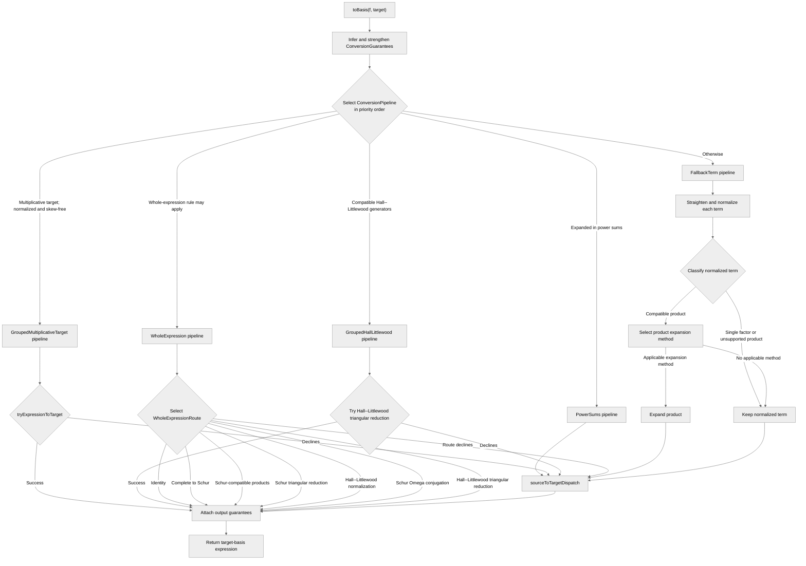
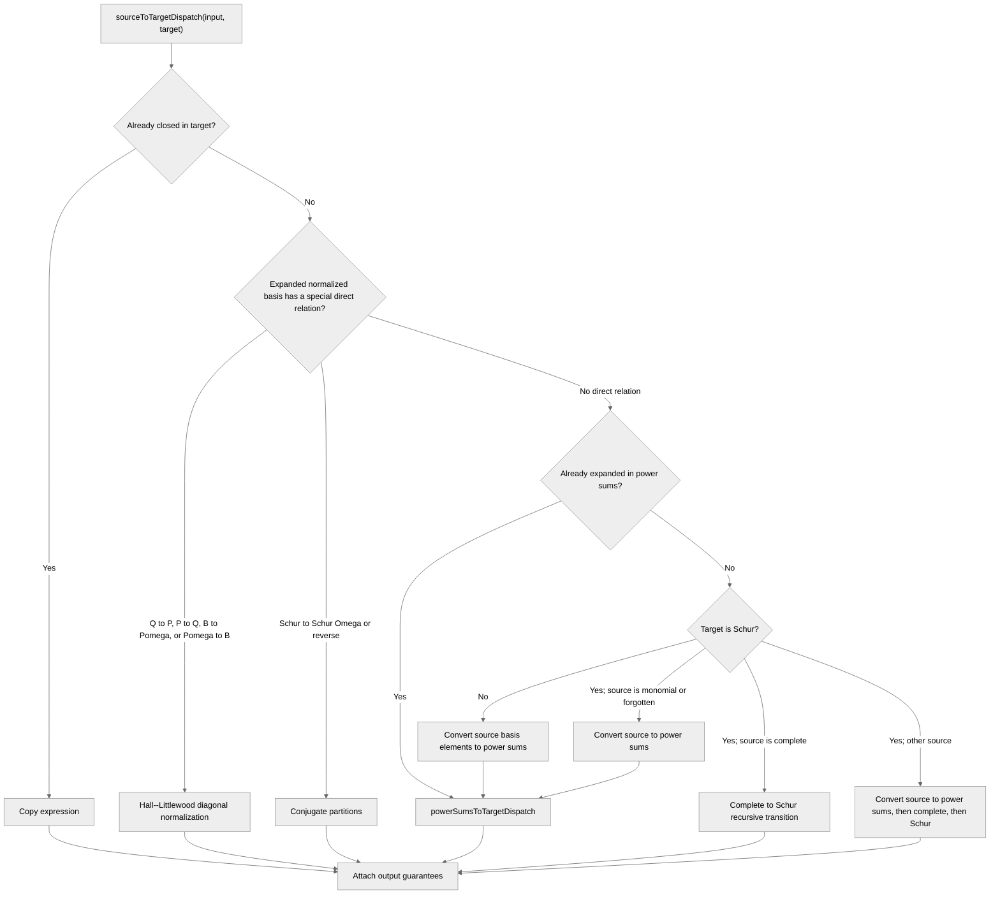
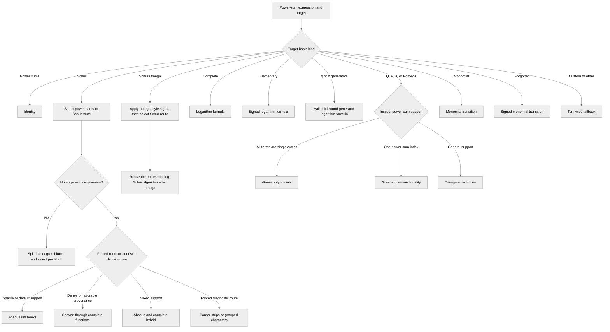
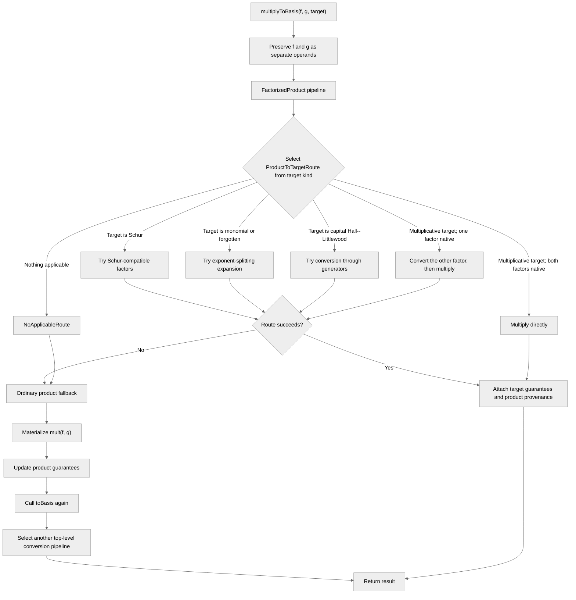
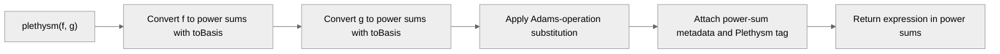
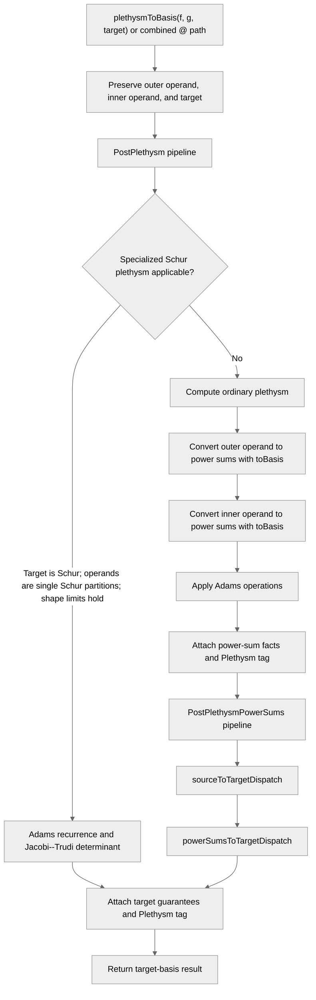
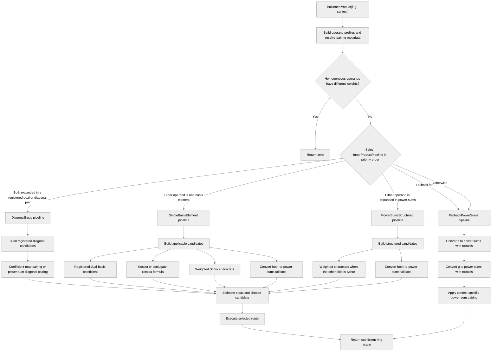
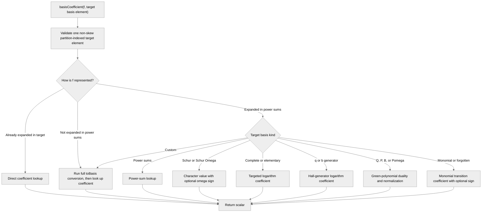
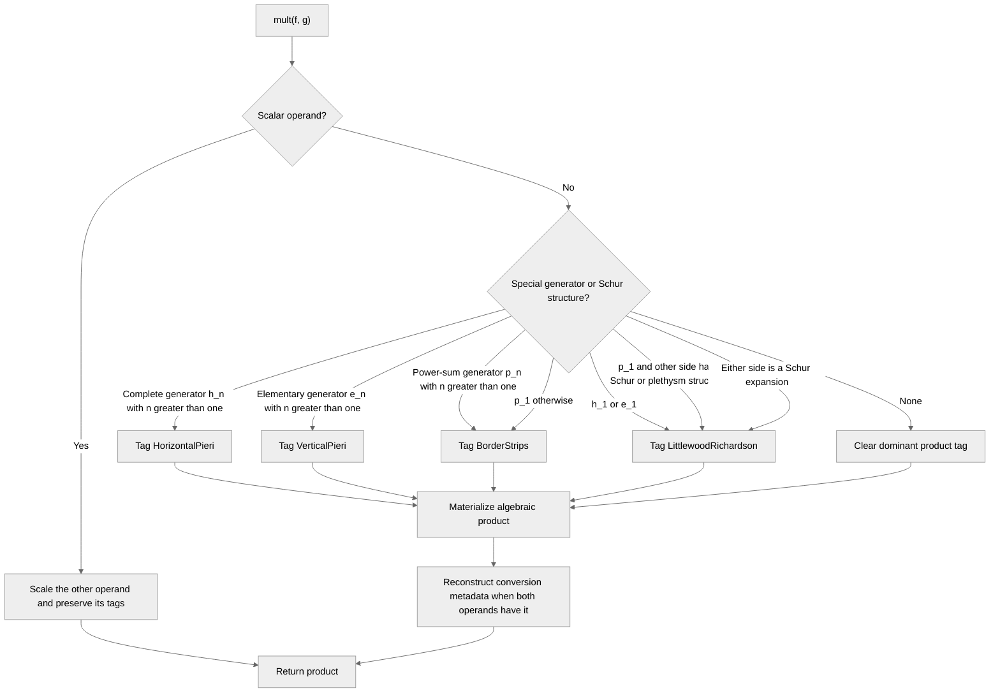

# SymmetricRings C++ pipeline guide

This document describes the high-level control flow of the current C++
pipeline and dispatcher implementations. **A major goal is to redesign, simplify, and standardize the pipeline architecture before adding more features to the package.** A redesign should make the structure easy to both understand and to extend.

The principal distinction used below is:

- a **pipeline** is a high-level expression workflow selected from facts known
  at an operation boundary;
- a **route** is a mathematical or representational path selected inside a
  workflow;
- a **kernel** performs the algebra for a selected route;
- a **fallback** is the broad correctness path used when a specialized route
  declines its input.

## Entry points and shared state

The relevant public engine entry points are:

- `toBasis(f, targetBasisId)` for ordinary conversion;
- `productToBasisDispatch(f, g, targetBasisId)` for retained products;
- `plethysm(f, g)` for a power-sum plethysm result;
- `plethysmToBasisDispatch(f, g, targetBasisId)` for retained plethysm operands;
- `hallInnerProduct(f, g, ...)` for context-dependent pairings;
- `basisCoefficient(f, targetBasisElement)` for targeted coefficient extraction.

These operations share expression facts stored in `SymmetricConversionMetadata`
and transiently represented by `ConversionGuarantees` or
`InnerProductProfile`.  Combinatorial tags record provenance such as plethysm,
Littlewood--Richardson multiplication, Pieri multiplication, and border strips.

## Ordinary `toBasis`

An ordinary `toBasis` request infers facts about the expression and selects a
top-level conversion pipeline in a fixed priority order.

The `PowerSums` pipeline is currently a forwarding workflow: it calls
`sourceToTargetDispatch`, which recognizes that the source is already expanded
in power sums.  The grouped and whole-expression pipelines also fall through
to `sourceToTargetDispatch` when their specialized attempt declines.

The `FallbackTerm` pipeline is the broad conversion path.  It normalizes each
term, tries product-aware expansion, and then sends the resulting expression to
the shared source-to-target dispatcher.

## Shared source-to-target dispatch

Most conversion pipelines eventually enter `sourceToTargetDispatch`.  This
dispatcher selects direct basis relations or composes conversion through power
sums.

### Power sums to target

`powerSumsToTargetDispatch` is a nested route dispatcher shared by ordinary,
product-fallback, and plethysm-fallback conversion.

The power-sum-to-Schur selector may use weight, support size, density,
coefficient ring, common cycle structure, and combinatorial provenance tags.
Forced routes exist for diagnostic comparisons.

## `multiplyToBasis`

`productToBasisDispatch` constructs a `FactorizedProduct` request, retaining
the two operands so that product structure is available before expansion.

The fallback therefore re-enters the top-level conversion pipeline selector
after materializing the product.

## Plethysm

Plain `plethysm(f, g)` uses power sums as its interchange basis.

The combined plethysm-to-basis operation retains both operands and selects the
`PostPlethysm` pipeline.

The retained `PostPlethysmPowerSums` stage is a forwarding pipeline.  It does
not own an independent power-sum-to-target decision tree.

## Hall inner products

Inner products use a separate pipeline family because route applicability
depends on two operand profiles and an explicit pairing context.  Applicable
routes within a pipeline are represented as candidates with estimated costs.

Candidate costs can depend on operand term counts, homogeneous weight,
partition lengths, and transition-cache state.  A candidate may also invoke
the basis-coefficient dispatcher described next.

## Basis coefficient dispatch

`basisCoefficient` is not named as a pipeline, but it is a substantial route
dispatcher and is used by the single-basis-element inner-product pipeline.

## Multiplication provenance

Ordinary `mult(f, g)` is not a conversion pipeline, but its classification
feeds later conversion heuristics through combinatorial tags.

Tags describe the dominant semantic origin of the product, not necessarily the
literal kernel that was executed.  Later conversion selectors may use these
tags as performance evidence.

## Where the pipeline systems meet

The current implementation has three important forms of nesting:

1. `PowerSums`, grouped conversion, whole-expression conversion, and the
   termwise fallback can all enter `sourceToTargetDispatch`.
2. A failed factorized-product route materializes the product and calls
   `toBasis`, causing another top-level pipeline selection.
3. Plethysm fallback converts both operands with ordinary `toBasis`, computes a
   power-sum result, enters `PostPlethysmPowerSums`, and then enters the shared
   source-to-target dispatcher.

These connections allow specialized workflows to reuse the broad power-sum
fallback, but they are also the principal reason that the current pipeline
decision tree is intertwined.

## Source ownership

The principal implementations described here are located in:

- `basis-conversion-dispatch.*`: conversion guarantees, pipelines, route
  selection, execution, and basis-coefficient dispatch;
- `basis-conversion-products.*`: product-specific route selection and kernels;
- `basis-conversion-kernels.*`: basis conversion formulas and straightening;
- `plethysm.*`: Adams-operation and specialized Schur plethysm;
- `inner-product-dispatch.*`: inner-product profiles, pipelines, candidates,
  costs, and execution;
- `inner-product-kernels.*`: scalar pairing kernels;
- `arithmetic.cpp`: multiplication and combinatorial tag selection;
- `storage.*`: expression representation, persisted metadata, and tags.
