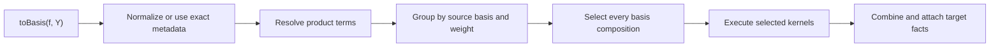

# SymmetricRings C++ pipeline guide

This document describes the engine workflows for basis conversion,
multiplication, plethysm, inner products, and targeted basis coefficients.
The public M2 layer retains ownership of user-defined and transformed-basis
formulas; built-in algebra crosses the raw boundary into these workflows.

## Basis conversion

`toBasis(f, target)` owns pure, mixed-basis, skew, and product-bearing input.
It uses one shared plan registry:

The picker searches the registered basis graph for a complete composition.
It uses exact facts for the first edge. If a later kernel depends on realized
support, the workflow selects that edge at the intermediate stage boundary.
A caller may force an exact basis composition and one ordered plan identifier
per edge; forced plans are validated and never reselected.

Nonhomogeneous power-sum input is split into weight blocks, with all block
plans selected before execution. Broad conversion through power sums remains
the correctness fallback for any supported built-in basis pair.

The expression-facts contract records canonical form, basis composition,
weights, term and factor counts, skew counts, single-element shape, and
provenance. Selector-only facts such as density and power-sum cycle profiles
are computed only when a policy consumes them. Exact metadata lets canonical
input bypass normalization and general rescanning.

## Multiplication

The strict binary helper accepts two normalized basis elements. The public
`multiplyToBasis` method distributes over product-free expansions and delegates
each nonscalar pair to that helper:

Multiplication plans declare the mathematical output basis and normalization
guarantee of their kernel. Selection fixes operand conversions before
execution; the executor performs no performance policy. Hall--Littlewood
multiplication reaches generator bases through the same conversion registry.

`multiplyTermToBasis` removes identity factors. For multiplicative targets it
converts all factors to the target, combines them directly, and collects once.
For other targets it executes the required pairwise binary workflows.

## Contributor map

- `basis-conversion-policy.*` owns reusable performance-only selection facts.
- `basis-conversion.hpp` declares expression facts, plan contracts,
  registries, pickers, executors, and public engine entry points.
- `basis-conversion.cpp` implements preparation, metadata, selection,
  execution, product resolution, and conversion and multiplication workflows.
- `basis-conversion-kernels.*` owns basis-family conversion mathematics.
- `basis-conversion-products.*` owns Littlewood--Richardson, Pieri,
  border-strip, and monomial-like product mathematics.
- `basis-coefficient.*` owns targeted scalar transition selection.
- `plethysm.*`, `inner-product-dispatch.*`, and
  `inner-product-kernels.*` own their operation-specific workflows.
- `raw-interface.*` and `computations.m2` form the C++/M2 boundary.

To add a direct conversion plan:

1. Add or reuse a policy-free mathematical kernel.
2. Add its contract to `BasisConversionKernel`.
3. Register the source, target, and stable identifier in
   `buildBasisConversionPlans`.
4. Put mathematical preconditions in `basisConversionPlanApplicable`.
5. Add its executor arm to `executeBasisConversionPlan`.
6. Add forced-plan coverage and a differential test against power sums.

Multiplication follows the same division: registration belongs in
`buildMultiplicationPlans`, applicability in
`multiplicationPlanApplicable`, and execution in
`executeMultiplicationKernel`. Internal kernels use the shared picker and
executor and do not call public conversion or multiplication entry points.

## Plethysm

Plain `plethysm(f, g)` converts its operands to power sums and applies
Adams-operation substitution. `plethysmToBasis(f, g, target)` either selects
the applicable specialized Schur recurrence or computes power-sum plethysm and
passes that canonical result, with provenance metadata, to `toBasis`.

This makes the general route identical to
`toBasis(plethysm(f, g), target)` while allowing the combined operation to
avoid materializing an unnecessary intermediate when a specialized kernel is
available.

## Hall inner products

Inner products use a separate registry because applicability depends on two
operand profiles and an explicit pairing context. The picker considers
registered diagonal pairs, single-basis-element formulas, structured
power-sum formulas, and the broad convert-both-to-power-sums fallback.

Candidate costs may use term counts, homogeneous weight, partition lengths,
and transition-cache state. Executors return coefficient-ring scalars and do
not participate in basis-conversion plan selection except when a selected
fallback explicitly requests conversion.

## Basis coefficients

`basisCoefficient(f, targetElement)` validates a single non-skew,
partition-indexed target element. It first attempts direct lookup or a targeted
formula for power sums, Schur-like bases, complete or elementary functions,
Hall--Littlewood bases, and monomial-like bases. If no targeted formula
applies, it calls `toBasis` once and reads the requested coefficient.

## Multiplication provenance

Ordinary `mult(f, g)` attaches combinatorial provenance such as horizontal
Pieri, vertical Pieri, border strips, or Littlewood--Richardson structure.
Tags describe the dominant mathematical origin of an expression; they are
selection evidence, not a claim that a particular kernel already ran.

Scalar multiplication preserves tags. General multiplication reconstructs
exact conversion metadata when both inputs carry enough information, allowing
later operations to avoid rescanning the result.
