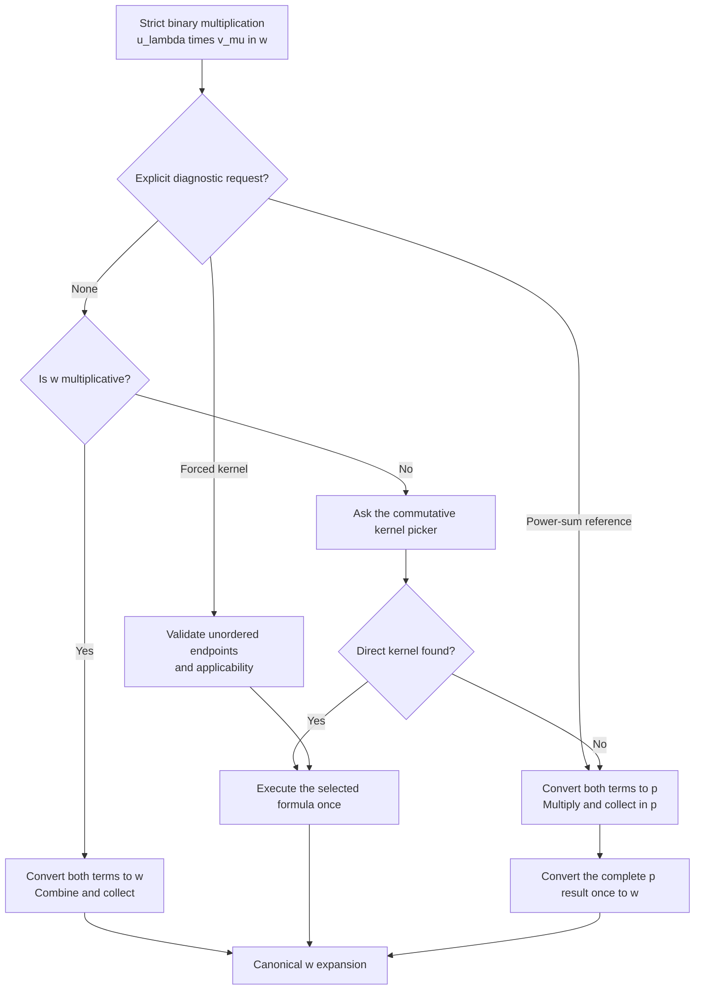
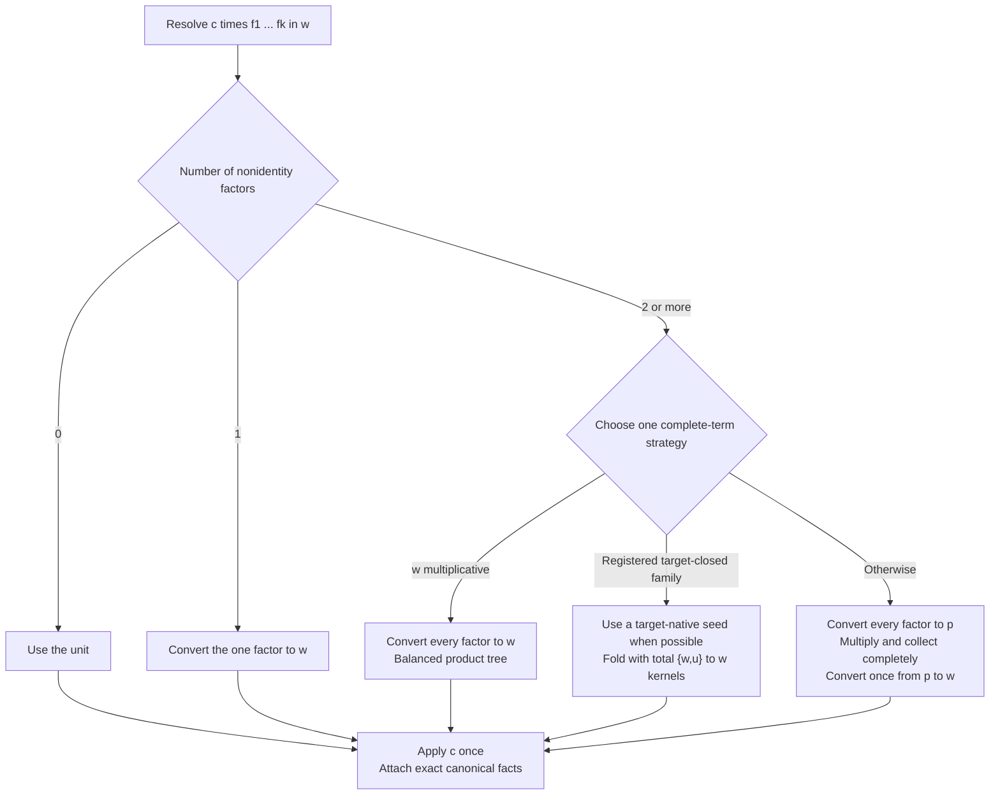
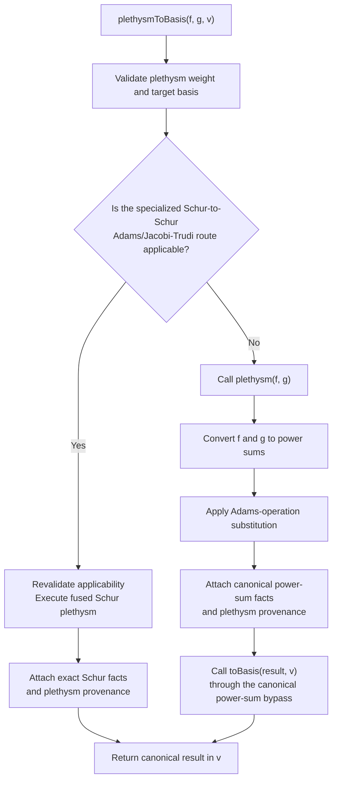

# SymmetricRings C++ pipeline guide

This document describes the engine workflows for basis conversion,
multiplication, plethysm, inner products, and targeted basis coefficients.
The public M2 layer retains ownership of user-defined and transformed-basis
formulas; built-in algebra crosses the raw boundary into these workflows.
Each workflow is described first by its mathematical purpose and decomposition,
then by the engine stages that realize it. The diagrams describe the current
implementation. Proposed replacements and unchecked experiments remain in
`TODO-pipelines.md`.

## Conversion plans

### Mathematical model

If $\Lambda_u$ denotes finite canonical expansions in a basis $u$, then a
conversion formula from $u$ to $v$ is a map

$$
K_{u,v}\colon \Lambda_u\longrightarrow\Lambda_v,
\qquad K_{u,v}(f)=f.
$$

Different identities can realize the same map with very different costs.
For example, a character formula, a recurrence, and a composition through
power sums may all produce the same $v$-expansion.

### Engine representation

The engine separates three roles:

$$
\text{kernel = one formula},\qquad
\text{plan = a complete conversion},\qquad
\text{picker = a performance choice among plans}.
$$

A kernel implements one identity and states when that identity is valid. A
plan gives a complete, inspectable rule for converting a specified $u$ to a
specified $v$. The picker does not perform algebra: it chooses an applicable
complete plan from the available $u\to v$ plans.

#### Structure of a plan

For a canonical, product-free expression

$$
f=\sum_\alpha c_\alpha u_\alpha,
$$

a plan may treat $f$ as one expression, as individual terms, or as
homogeneous components. Its cases are ordered mathematical predicates
$C_1,\ldots,C_r$, with a final `otherwise()` case. If $f_i$ is the part of
$f$ assigned to the first applicable case $C_i$, then

$$
P_{u,v}(f)=\sum_{i=1}^r F_i(f_i).
$$

Each $F_i$ has one of two forms:

- **Kernel:** apply one named mathematical formula directly to $f_i$.
- **Fixed composition:** pass $f_i$ through an ordered list of named plans,
  with matching adjacent endpoints from $u$ to $v$. The list is nonempty: one
  plan delegates to that exact, possibly piecewise plan, while several plans
  form a conversion through intermediate bases. Each plan receives the actual
  canonical output of the preceding plan.

The pieces $f_i$ are disjoint and cover all of $f$, and every named plan is
fixed by the parent definition rather than selected during execution.

This distinction keeps correctness and cost separate. Plan applicability
records where a conversion is mathematically valid. Fixed cases within a plan
may inspect degree, support, index shape, coefficient ring, or provenance to
choose a formula for each piece. The picker uses the same kinds of facts only
to choose among valid complete plans.

#### Representative examples

The direct Schur-to-power-sum plan uses the Frobenius character formula

$$
s_\lambda
=\sum_{\mu\vdash |\lambda|}
  \frac{\chi^\lambda(\mu)}{z_\mu}p_\mu.
$$

Its plan, `Schur->PowerSum:Frobenius-character-formula`, applies this kernel
linearly to the whole Schur expansion. This is the simplest case: one
mathematical identity is already a complete plan.

When there is no preferred direct conversion between two built-in bases, the
generic power-sum plan uses

$$
P_{u,v}^{(p)}=P_{p,v}\circ P_{u,p}.
$$

The plan `u->v:via-power-sums` fixes both component plans before execution.
Power sums are used because their multiplicative and character-theoretic
formulas give a broad bridge between the built-in families. The intermediate
$p$-expansion is passed directly to the fixed second plan; it is not sent
back to the picker.

Some conversions benefit from a piecewise mathematical rule. Write a
power-sum expansion as

$$
f=\sum_n f^{(n)},
$$

where $f^{(n)}$ is homogeneous of weight $n$. The plan
`PowerSum->Schur:homogeneous-component-formulas` assigns each $f^{(n)}$ to
one of its fixed cases. A component may use the composition
$p\to h\to S$, a short-cycle formula applied termwise, or an abacus
rim-hook formula. These formulas agree mathematically, but their costs depend
on the component's support and cycle shapes. The case split belongs to this
single complete plan, rather than being a special branch in the surrounding
pipeline.

The picker becomes relevant only when several complete plans share endpoints.
For example, a power-sum expression consisting of single cycles can use a
Green-polynomial plan for conversion to a capital Hall--Littlewood basis;
more general input uses the corresponding triangular-reduction plan. Both
plans describe valid coordinate changes, while the picker records which is
expected to be cheaper for the observed expression.

The hard-coded mathematical plans and their fixed piecewise formula policies
live in `basis-conversion-plans.cpp`; top-level performance choices among
complete plans live in `basis-conversion-picker.cpp`. Custom and
transformed-basis formulas remain owned by the M2 layer. Equal source and
target bases require no conversion plan.

## Basis conversion

### Mathematical workflow

The goal of `toBasis(f, v)` is to write the same symmetric function in the
target basis $v$:

$$
f=\sum_\lambda a_\lambda v_\lambda.
$$

Linearity reduces mixed-basis conversion to conversions of pure expansions.
If the normalized, product-free expression decomposes as

$$
f=\sum_u f_u,\qquad f_u\in\Lambda_u,
$$

then

$$
[f]_v=\sum_u P_{u,v}(f_u).
$$

Before this decomposition, skew indices must be expanded and a product term
$c\,f_1\cdots f_r$ must be resolved as a product, because it is not yet a
linear expansion in any one basis. These are mathematical normalization
steps; the later plan selection acts only on canonical, product-free
expansions.

### Engine workflow

`toBasis(f, v)` accepts pure, mixed-basis, skew, and product-bearing input. A
single canonical basis element or an expression with exact canonical facts
can enter group conversion immediately. Other input is normalized by
straightening indices, expanding skew elements, canonicalizing factors, and
collecting terms. The shared configurable normalization service owns these
steps and term-local product resolution; conversion supplies $v$ as the
product target and then consumes the returned exact expression facts.

The picker considers only complete available plans with the requested
source and target endpoints. A plan is an ordered set of cases over the whole
expression, individual terms, or homogeneous components. Cases receive only
unassigned input, and the final `otherwise` case proves complete coverage.
Each case contains one kernel or a nonempty ordered composition of named
plans. A one-plan composition delegates to that exact plan.

For a mathematician, a plan can be read as a named casewise identity: its
source and target specify the two bases, its conditions describe the portion
of the expression under consideration, and its formula names the conversion
identity or fixed chain of identities to apply. Performance policy chooses
among complete identities; it does not alter their mathematics.

The selected top-level plan fixes every kernel and component-plan identifier
that execution can reach. The generic executor evaluates component-plan cases
against the actual intermediate expression, but never calls the picker. When
an endpoint has no specific plan, or when the generic plan is forced, one
parameterized plan resolves the designated `u -> PowerSum` and
`PowerSum -> v` components and becomes an ordinary immutable composition
before execution. It is the only broad `u -> PowerSum -> v` plan; there are
no separately materialized copies for individual endpoint pairs. The
power-sum-to-Schur component and term hybrids are ordinary piecewise plans,
not special pipeline control flow.

Canonical target output is an unconditional kernel and plan invariant.
Execution checks it whenever exact result facts or an intermediate are needed,
and each owning conversion or multiplication workflow validates its final
target contract. A plan's `outputGuarantee` condition records only a stronger
structural postcondition needed by a later component; `always()` means that
no stronger condition is claimed.

If resolving products leaves only target terms, the workflow attaches exact
target facts directly instead of performing identity grouping and plan
execution.

The expression-facts contract contains only exact facts about a realized
expression: canonical form, basis composition, homogeneous weight, term and
factor counts, skew counts, single-element index, and provenance. Derived
flags are computed from those values. A stored cache holds either those exact
facts or the small set of postconditions arithmetic can preserve safely.
Selector-specific power-sum support facts are still computed lazily. The
condition language declares which target-independent support facts it needs,
and one inspector computes them for whole expressions, terms, or homogeneous
components from the actual assigned support. A complete canonical fact cache
lets canonical input bypass normalization and general rescanning.

Arithmetic may retain individually valid facts after it invalidates the
complete canonical marker. Only that whole-record marker can justify a
conversion bypass. Numeric basis IDs are allocated by the package registry
and remain stable, but each engine ring has its own available-basis descriptors.
Cross-ring fallback transport therefore discards basis-identity facts and
reconstructs them from the realized target-ring expression.

## Multiplication

### Mathematical workflow

Multiplication separates the strict product of two basis terms from linear
extension and products with many factors.

For coefficient-one canonical terms, a binary kernel is one combinatorial
formula

$$
K_{u,v}^{w}(u_\lambda,v_\mu)
=u_\lambda v_\mu
\quad\text{expressed canonically in }w.
$$

The source endpoint is the unordered pair $\{u,v\}$ because multiplication is
commutative. Littlewood--Richardson, horizontal and vertical Pieri,
Murnaghan--Nakayama, and monomial exponent splitting are examples. A kernel's
output is already in $w$; it performs no subsequent conversion.

Strict binary multiplication uses three alternatives:

1. if $w$ is multiplicative, convert both terms to $w$ and combine them;
2. otherwise, use the applicable direct kernel preferred for
   $\{u,v\}\to w$;
3. if no direct kernel applies, convert both terms to $p$, multiply and
   collect in $p$, and convert the complete result once to $w$.

For a complete stored product term

$$
T=c\,f_1\cdots f_k,
$$

the complete factor list is examined before multiplication. For $k\geq2$,
exactly three strategies are used:

1. if $w$ is multiplicative, convert every factor to $w$ and combine the
   converted expansions in a balanced product tree;
2. if a declaratively registered target-closed family $(w,\mathcal A)$ applies,
   begin with the first factor already in $w$ when one exists, otherwise
   convert the first factor to $w$, and fold the remaining factors with the
   total direct kernels $\{w,u\}\to w$ for $u\in\mathcal A$;
3. otherwise, convert every factor to $p$, multiply and collect the complete
   product there, and make one $p\to w$ conversion.

A target-closed declaration is the mathematical assertion

$$
u\in\mathcal A
\quad\Longrightarrow\quad
\{w,u\}\to w
\text{ has a total direct formula.}
$$

The family database records this assertion explicitly; the workflow never
infers it by searching the kernel declarations. For example, $(S,\{S,e,h,p\})$
covers every subset and repetition of those factor bases. The four
Hall--Littlewood capital examples use $(w,\{w\})$. Their direct formula
multiplies raising-operator generator coordinates and unitriangularly reduces
directly to $w$. All families use the same selection and fold code.
The power-sum strategy operates on the complete term so linear expansion
cannot cause repeated $p\to w$ conversions.

Finally, for product-free expansions

$$
F=\sum_i a_i f_i,\qquad G=\sum_j b_j g_j,
$$

`multiplyToBasis` applies bilinearity only after making a complete-input
decision. It distributes over term pairs only when every nonscalar pair has an
automatic direct kernel. Otherwise it multiplies the two complete expansions
in $p$ and converts once.

### Engine workflow

The implementation mirrors these mathematical boundaries:

- `multiplication-kernels.*` contains the combinatorial formulas;
- `multiplication-picker.*` contains the commutative kernel inventory,
  mathematical applicability, and ordered performance policy;
- `multiplication-folds.*` contains explicit target-closed family declarations,
  complete-factor-list selection, and validation of the required total binary
  formulas;
- `binary-multiplication.cpp` owns the strict two-term workflow and its two
  fixed structural alternatives;
- `multiplication.cpp` owns bilinearity, coefficients, complete product terms,
  the balanced multiplicative strategy, generic target-closed fold execution,
  and the complete power-sum strategies.

There are no multiplication plans, plan identifiers, kernel enums, or
execution switches. The picker stores typed callables directly. Executing a
selected kernel cannot select another kernel or perform a conversion.

The binary picker is globally commutative. A definition records one unordered
endpoint and one mechanical callable orientation. The selector reverses the
actual arguments when necessary, so contributors never add a second
$(v,u)\to w$ entry.

Mathematical applicability is stored with each kernel definition. Ordered
picker rules contain only performance preference. Stable string identifiers
support tracing and the private `multiplyToBasisBench` comparison helper.
`PowerSumReference` requests the independent broad calculation explicitly;
ordinary production calls carry no forcing or tracing state.

The private product-free bilinear benchmark can similarly request
`Automatic`, `MultiplicativeTarget`, `KernelDistribution`, or
`PowerSumFallback` for one call. These are workflow comparisons, not
production multiplication plans, and an inapplicable forced strategy fails
instead of silently choosing another one.

The present kernel inventory has direct Schur-family, monomial/forgotten, and
same-basis Hall--Littlewood capital formulas.  The Hall--Littlewood kernel
implements its raising-operator generator expansion, multiplicative generator
product, and unitriangular reduction as one fixed combinatorial
$\{w,w\}\to w$ algorithm; it does not call the conversion picker. Other
unsupported Hall--Littlewood endpoints use the ordinary complete power-sum
fallback.

Adding a target-closed multifactor optimization does not change the workflow.
Declare one target $w$ and one allowed factor-basis set $\mathcal A$ in
`multiplication-folds.cpp`. Validation then requires a total automatic
$\{w,u\}\to w$ formula for every $u\in\mathcal A$. No subsets, factor orders,
or named-basis branches are added.

To add a new direct binary formula, a contributor normally makes two
production edits:

1. implement the formula in `multiplication-kernels.cpp`, with a mechanical
   declaration in its header;
2. declare its unordered endpoint, applicability, callable, and ordered
   preference in `multiplication-picker.cpp`.

Bilinearity, scalar coefficients, argument commutation, fallback conversion,
metadata, and multifactor resolution require no contributor edits.

## Plethysm

### Mathematical workflow

Plethysm $f[g]$ is determined by its action on power sums. If $\psi_r$ is the
$r$th Adams operation, then

$$
p_r[g]=\psi_r(g),
\qquad
p_\lambda[g]=\prod_i\psi_{\lambda_i}(g).
$$

Thus a broad computation converts $f$ and $g$ to power sums, performs these
substitutions, and converts the result to the requested basis. For suitable
Schur inputs, an Adams/Jacobi--Trudi recurrence computes the same plethysm
directly in Schur coordinates and avoids the general power-sum intermediate.

### Engine workflow

Plain `plethysm(f, g)` follows the power-sum definition.
`plethysmToBasis(f, g, target)` either selects the applicable specialized
Schur recurrence or computes power-sum plethysm and passes that canonical
result, with provenance metadata, to `toBasis`.

The selector tests the fused route's structural applicability before any
algebra. Benchmark evidence determines whether that route remains available;
benchmarking is not performed at runtime. The fused executor validates its
contract again before running.

The broad route is therefore identical to
`toBasis(plethysm(f, g), v)`. The fused route avoids materializing the general
power-sum intermediate when its complete contract applies.

## Hall inner products

### Mathematical workflow

For the ordinary Hall inner product, the power sums are orthogonal:

$$
\langle p_\lambda,p_\mu\rangle
=\delta_{\lambda\mu}z_\lambda.
$$

Other supported pairing contexts replace $z_\lambda$ by the appropriate
diagonal weight. Bilinearity makes conversion of both operands to power sums
an unconditional method. Dual or diagonal basis pairs, coefficient formulas,
and character formulas can evaluate the same scalar without constructing both
complete power-sum expansions. Homogeneous components of different weights
are orthogonal, so known unequal homogeneous weights give zero immediately.

### Engine workflow

The current implementation uses four top-level pipelines; the unified
weight-splitting workflow in `TODO-pipelines.md` is not yet implemented. The
public entry obtains shared exact facts for both operands, builds a pairing
context, applies the known unequal-weight zero test, and then selects one
pipeline for the complete expressions.

Candidate costs may use term counts, homogeneous weight, partition lengths,
and transition-cache state. A selected specialized route returns a
coefficient-ring scalar. The broad route calls `toBasis` independently for
both complete operands and then applies the requested power-sum pairing; it
does not split nonhomogeneous operands into weight blocks or group them by
basis first.

## Basis coefficients

### Mathematical workflow

For a target basis element $v_\lambda$, coefficient extraction asks for

$$
[v_\lambda]f=a_\lambda,
\qquad
f=\sum_\mu a_\mu v_\mu.
$$

Computing the full $v$-expansion and reading $a_\lambda$ is always valid.
When the source is already in $v$, this is direct lookup. For a power-sum
source, duality, character values, or transition formulas can often compute
the one requested scalar without constructing coefficients for every
partition.

### Engine workflow

`basisCoefficient(f, targetElement)` validates one coefficient-one, non-skew,
partition-indexed target element. If `f` is already expanded in the target it
uses direct lookup. If `f` is a pure power-sum expansion, it uses the targeted
formula for the requested Schur-like, complete, elementary,
Hall--Littlewood, monomial, or forgotten coefficient. Every other case calls
`toBasis` once and reads the requested coefficient from the complete target
expansion.

## Multiplication provenance

### Mathematical motivation

Many products carry more information than their final expansion alone. For
example,

$$
s_\lambda h_r
=\sum_{\substack{\mu\supseteq\lambda\\
                  \mu/\lambda\text{ is a horizontal }r\text{-strip}}}
  s_\mu,
$$

and the analogous elementary Pieri rule uses vertical strips. Products with
a power sum are governed by border strips, while general Schur products use
Littlewood--Richardson coefficients. Remembering which structure created an
expression can help a later mathematically equivalent conversion choose an
appropriate formula.

### Engine representation

Ordinary `mult(f, g)` attaches combinatorial provenance such as horizontal
Pieri, vertical Pieri, border strips, or Littlewood--Richardson structure.
Tags describe the dominant mathematical origin of an expression; they are
selection evidence, not a claim that a particular kernel already ran.

Scalar multiplication preserves tags and exact structural facts when its
support is unchanged, refreshing coefficient-sensitive facts. General
addition and multiplication retain only provable positive basis, weight, and
normalization postconditions; workflows attach complete exact facts only after
inspecting a
canonical realized result.

## Contributor map

The source layout mirrors the mathematical separation used above. A
conversion identity belongs to a kernel; a complete casewise identity belongs
to a plan; and a choice among equivalent complete identities belongs to the
picker. Product identities, scalar pairings, and plethysm formulas remain
grouped with their own mathematics.

### Source ownership

- `basis-conversion-policy.*` owns reusable performance-only selection facts.
- `expression-conditions.*` owns inspectable mathematical conditions, logical
  composition, diagnostics, and ordered expression-piece partitioning.
- `storage.hpp` declares the shared expression-facts record and stored cache.
- `expression-helpers.hpp` declares fact inference, cache lifecycle,
  inspection, decomposition, and the authoritative configurable
  normalization and term-local product-resolution workflow.
- `basis-conversion.hpp` declares conversion-plan contracts, database indexes,
  pickers, executors, and conversion entry points.
- `basis-conversion-plans.cpp` inventories complete named conversion plans and
  any fixed piecewise formula policies inside them.
- `basis-conversion-picker.cpp` inventories top-level endpoint performance
  choices among complete plans.
- `basis-conversion.cpp` consumes shared normalization, implements plan
  indexing and validation, generic execution, and conversion.
- `basis-conversion-kernels.*` owns basis-family conversion mathematics.
- `basis-normalization.*` owns the declarative straightening and skew-expansion
  rules and executes those individual steps when requested by the shared
  normalization service.
- `multiplication-kernels.*` owns Littlewood--Richardson, Pieri,
  border-strip, and monomial/forgotten binary product mathematics.
- `multiplication-picker.*` owns the commutative binary-kernel inventory,
  inspectable applicability, and ordered performance policy.
- `multiplication-folds.*` owns declared target-closed factor families and
  validation of their total direct-kernel coverage.
- `binary-multiplication.cpp` owns the strict two-term workflow.
- `multiplication.cpp` owns bilinearity and complete product-term strategies.
- `basis-coefficient.*` owns targeted scalar transition selection.
- `plethysm.*`, `inner-product-dispatch.*`, and
  `inner-product-kernels.*` own their operation-specific workflows.
- `raw-interface.*` and `computations.m2` form the C++/M2 boundary.

### Adding a conversion identity

Suppose a new identity gives a conversion

$$
K_{u,v}\colon\Lambda_u\longrightarrow\Lambda_v.
$$

Its mathematical formula and domain of validity determine the kernel and
plan. Only after those are fixed should performance policy decide when this
identity is preferable to the other complete $u\to v$ plans. This requires
three production edits:

1. Implement the callable formula in `basis-conversion-kernels.cpp` and add
   its mechanical declaration in `basis-conversion-kernels.hpp`.
2. Add one complete named plan in `basis-conversion-plans.cpp`. This is the
   sole declaration of the formula's source, target, applicability, cases,
   and output guarantee.
3. Add one ordered performance rule to the endpoint block in
   `basis-conversion-picker.cpp`.

For example, the power-sum-to-Schur character identity is implemented by
`powerSumsToSchurViaFrobeniusCharacterFormula`, represented by the one-kernel
plan `PowerSum->Schur:Frobenius-character-formula`, and listed explicitly
beside the automatically chosen
`PowerSum->Schur:homogeneous-component-formulas` plan. No kernel enum, endpoint
contract switch, executor case, `toBasis` branch, or other dispatch edit is
needed.

Express mathematical preconditions with inspectable conditions, adding a
primitive predicate to its natural mathematical owner only when needed.
Then add forced-plan coverage, an automatic-selection assertion if the picker
can choose the plan, and a differential test against an independent broad
fallback.

Multiplication has no plan layer. A binary formula is implemented in
`multiplication-kernels.cpp` and declared beside its unordered endpoint and
performance preference in `multiplication-picker.cpp`. The generic strict
workflow stores and invokes its typed callable directly; it contains no
endpoint-specific identifier or execution switch.

The same complete-plan abstraction is used everywhere conversion occurs. A
caller provides a canonical source expansion, asks the picker for one
`ResolvedBasisConversionPlan`, and passes it to the generic executor. Callers do
not split input for particular basis pairs, and composed plans never re-enter
the picker.
