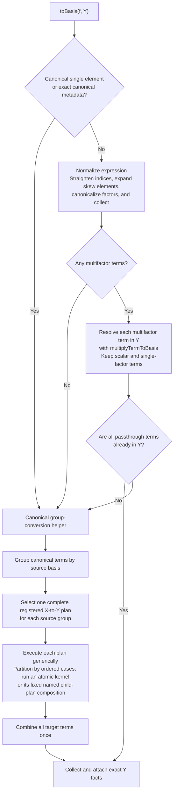
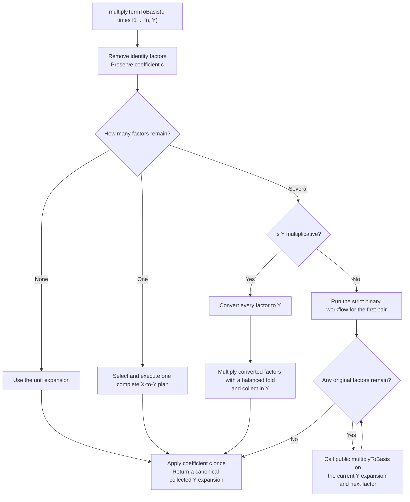
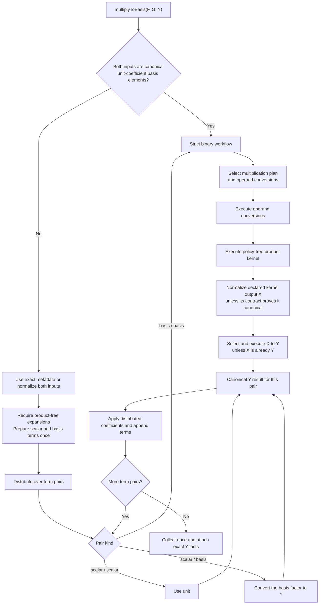
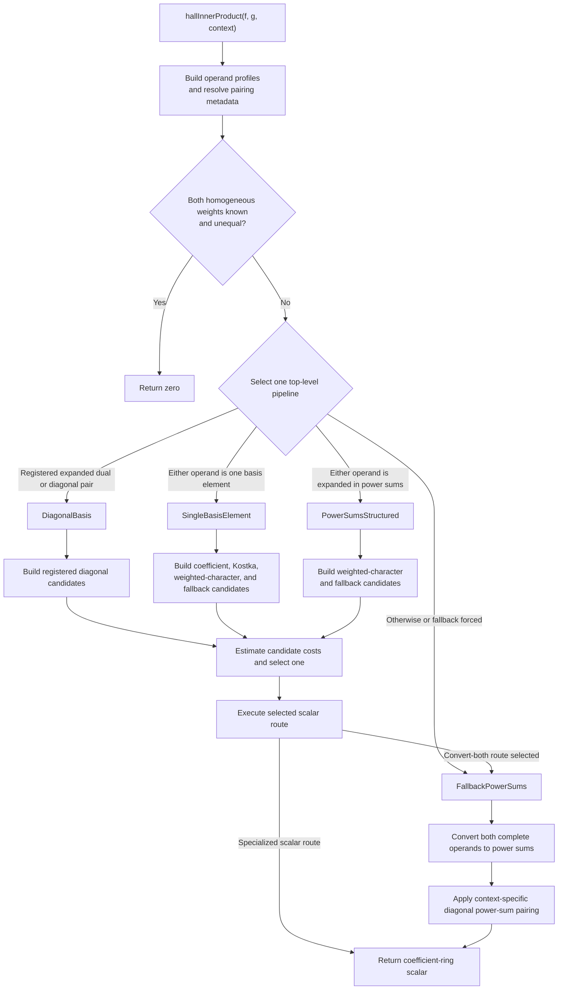

# SymmetricRings C++ pipeline guide

This document describes the engine workflows for basis conversion,
multiplication, plethysm, inner products, and targeted basis coefficients.
The public M2 layer retains ownership of user-defined and transformed-basis
formulas; built-in algebra crosses the raw boundary into these workflows.
The diagrams below describe the current implementation. Proposed replacements
and unchecked experiments remain in `TODO-pipelines.md`.

## Basis conversion

`toBasis(f, Y)` owns pure, mixed-basis, skew, and product-bearing input. A
single canonical basis element and an expression with exact canonical metadata
can enter canonical group conversion immediately. Other input is normalized by
straightening indices, expanding skew elements, canonicalizing factors, and
collecting terms.

The picker considers only complete registered plans with the requested
source and target endpoints. A plan is an ordered set of cases over the whole
expression, individual terms, or homogeneous components. Cases receive only
unassigned input, and the final `otherwise` case proves complete coverage.
Each case contains one atomic kernel, a fixed named-plan delegation, or an
ordered composition of named child plans.

For a mathematician, a plan can be read as a named casewise identity: its
source and target specify the two bases, its conditions describe the portion
of the expression under consideration, and its formula names the conversion
identity or fixed chain of identities to apply. Performance policy chooses
among complete identities; it does not alter their mathematics.

The selected top-level plan fixes every kernel and child identifier that
execution can reach. The generic executor evaluates child cases against the
actual intermediate expression, but never calls the picker. The broad
`X -> PowerSum -> Y` paths are ordinary named composition plans, and the
power-sum-to-Schur component and term hybrids are ordinary piecewise plans;
neither is special pipeline control flow.

Canonical target output is an unconditional kernel and plan invariant checked
by the executor. A plan's `outputGuarantee` condition records only a stronger
shape or profile postcondition needed by a later child; `always()` means that
no stronger condition is claimed.

If resolving products leaves only target terms, the workflow attaches exact
target facts directly instead of performing identity grouping and plan
execution.

The expression-facts contract contains only exact facts about a realized
expression: canonical form, basis composition, homogeneous weight, term and
factor counts, skew counts, single-element index, and provenance. Derived
flags are computed from those values. Selector-only facts such as component
density and power-sum cycle profiles are computed only when a selected policy
consumes them. Exact metadata lets canonical input bypass normalization and
general rescanning.

Arithmetic may retain individually valid hints after it invalidates the exact
canonical-core marker. Only the complete marker can justify a conversion
bypass. Numeric basis IDs are allocated by the package registry and remain
stable, but each engine ring has its own available-basis descriptors.
Cross-ring fallback transport therefore discards basis-identity facts and
reconstructs them from the realized target-ring expression.

## Multiplication

There are three distinct multiplication layers. `multiplyTermToBasis` resolves
one stored product term for `toBasis`. Public `multiplyToBasis` accepts two
product-free linear combinations and distributes over their terms. Its strict
binary helper accepts two canonical basis elements with unit coefficients and
executes one selected multiplication workflow.

### One-term product resolution

`multiplyTermToBasis` removes encoded identity factors and preserves the term
coefficient until the result is complete. Canonical storage has already
removed zero-coefficient terms, so the zero branch in the mathematical
contract does not require a runtime branch here.

### Public distribution and strict binary execution

The public wrapper has a fast path for two canonical unit-coefficient basis
elements. Otherwise it uses exact metadata or normalizes both operands,
requires product-free expansions, prepares every atom once, and distributes
over term pairs. Scalar pairs bypass the product registry. Nonscalar pairs use
the strict workflow, and all distributed results are collected once.

Multiplication plans declare their operand bases, mathematical output basis,
and canonical-output guarantee. Selection fixes operand conversions before
kernel execution. The owning binary workflow selects any support-dependent
post-kernel conversion only after the normalized kernel output exists.
Hall--Littlewood multiplication reaches generator bases through the same
conversion registry.

Stable multiplication plan names are rendered from typed plan identifiers;
applicability and execution never branch on their diagnostic strings.

## Contributor map

- `basis-conversion-policy.*` owns reusable performance-only selection facts.
- `expression-conditions.*` owns inspectable mathematical conditions, logical
  composition, diagnostics, and ordered expression-piece partitioning.
- `basis-conversion.hpp` declares expression facts, plan contracts,
  registries, pickers, executors, and public engine entry points.
- `basis-conversion.cpp` contains the declarative conversion-plan database and
  implements preparation, metadata, selection, execution, product resolution,
  and conversion and multiplication workflows.
- `basis-conversion-kernels.*` owns basis-family conversion mathematics.
- `basis-conversion-products.*` owns Littlewood--Richardson, Pieri,
  border-strip, and monomial-like product mathematics.
- `basis-coefficient.*` owns targeted scalar transition selection.
- `plethysm.*`, `inner-product-dispatch.*`, and
  `inner-product-kernels.*` own their operation-specific workflows.
- `raw-interface.*` and `computations.m2` form the C++/M2 boundary.

To add a direct conversion plan:

1. Add or reuse a policy-free mathematical kernel.
2. Add its contract to `BasisConversionKernel`.
3. Add one hard-coded definition, including its source, target, stable
   identifier, applicability, piece kind, and ordered cases, to
   `basisConversionPlanDatabase`.
4. Express mathematical preconditions with inspectable conditions; add a
   primitive predicate to its natural mathematical owner when needed.
5. Add its executor arm to `executeBasisConversionKernel`.
6. Add forced-plan coverage and a differential test against power sums.

Multiplication follows the same division: registration belongs in
`buildMultiplicationPlans`, applicability in
`multiplicationPlanApplicable`, and execution in
`executeMultiplicationKernel`. Internal kernels use the shared picker and
executor and do not call public conversion or multiplication entry points.

The same complete-plan abstraction is used everywhere conversion occurs. A
caller provides a canonical source expansion, asks the picker for one stable
top-level plan identifier, and passes the resolved definition to the generic
executor. Callers do not split input for particular basis pairs, and composed
plans never re-enter the picker.

## Plethysm

Plain `plethysm(f, g)` converts its operands to power sums and applies
Adams-operation substitution. `plethysmToBasis(f, g, target)` either selects
the applicable specialized Schur recurrence or computes power-sum plethysm and
passes that canonical result, with provenance metadata, to `toBasis`.

The selector tests the fused route's structural applicability before any
algebra. Benchmark evidence determines whether that route remains registered;
benchmarking is not performed at runtime. The fused executor validates its
contract again before running.

The broad route is therefore identical to
`toBasis(plethysm(f, g), Y)`. The fused route avoids materializing the general
power-sum intermediate when its complete contract applies.

## Hall inner products

The current inner-product implementation still uses four top-level pipelines;
the unified weight-splitting workflow in `TODO-pipelines.md` is not yet
implemented. The public entry builds profiles and a pairing context, returns
zero only when both operands have known unequal homogeneous weights, and then
selects one pipeline for the complete expressions.

Candidate costs may use term counts, homogeneous weight, partition lengths,
and transition-cache state. A selected specialized route returns a
coefficient-ring scalar. The broad route calls `toBasis` independently for
both complete operands and then applies the requested power-sum pairing; it
does not split nonhomogeneous operands into weight blocks or group them by
basis first.

## Basis coefficients

`basisCoefficient(f, targetElement)` validates a single non-skew,
partition-indexed target element. It first attempts direct lookup or a targeted
formula for power sums, Schur-like bases, complete or elementary functions,
Hall--Littlewood bases, and monomial-like bases. If no targeted formula
applies, it calls `toBasis` once and reads the requested coefficient.

## Multiplication provenance

Ordinary `mult(f, g)` attaches combinatorial provenance such as horizontal
Pieri, vertical Pieri, border strips, or Littlewood--Richardson structure.
Tags describe the dominant mathematical origin of an expression; they are
selection evidence, not a claim that a particular kernel already ran.

Scalar multiplication preserves tags and exact structural metadata when its
support is unchanged, refreshing coefficient-sensitive facts. General
addition and multiplication retain conservative basis, weight, and shape
hints; workflows attach complete exact metadata only after inspecting a
canonical realized result.
