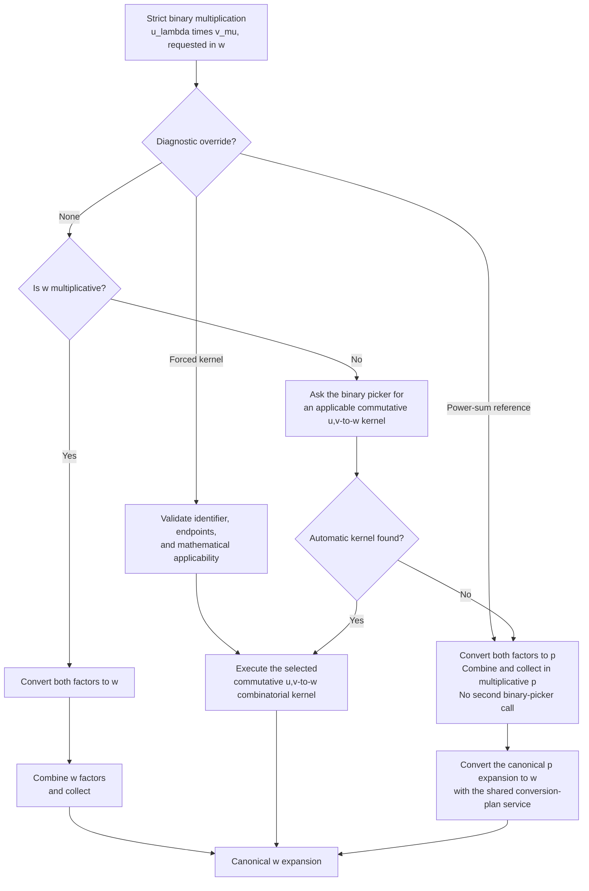
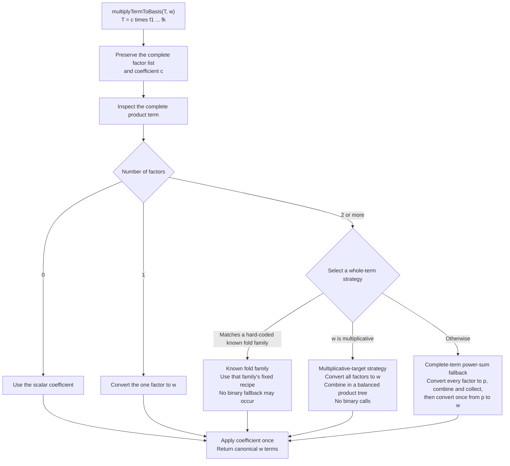
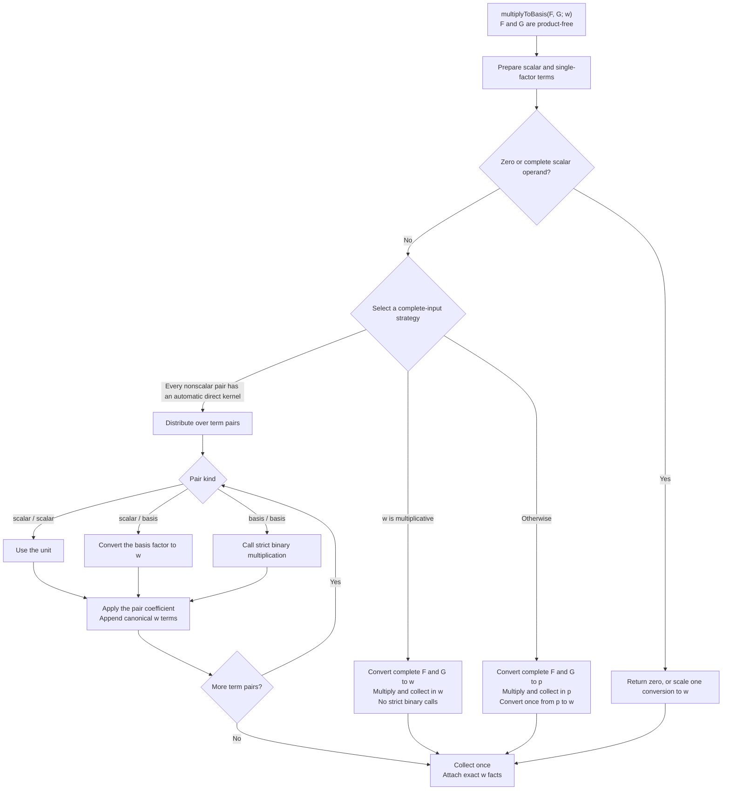

# Multiplication simplification

## Mathematical design

Multiplication has two logically separate mathematical operations.

### 1. Strict binary multiplication

For coefficient-one canonical basis terms $u_\lambda$ and $v_\mu$, a direct
kernel is one combinatorial formula

$$
K_{u,v}^{w}(u_\lambda,v_\mu)
=
u_\lambda v_\mu
\quad\text{expressed canonically in }w.
$$

For fixed $(u_\lambda,v_\mu;w)$, the direct-kernel picker chooses one
mathematically applicable kernel using performance conditions.  A kernel is
already the complete direct $\{u,v\}\mathbin{\to}w$ formula, so binary
multiplication has no plan, composition, piece kind, or piecewise-plan layer.
Commutativity is built into the endpoint: $\{u,v\}\to w$ has one kernel
inventory and one picker, not separate $(u,v)\to w$ and $(v,u)\to w$ entries.

The complete strict calculation is:

1. if $w$ is multiplicative, convert both factors to $w$ and combine them;
2. otherwise, execute the direct kernel chosen by the picker;
3. if no automatically selected direct kernel applies, convert both factors
   to $p$, multiply and collect in $p$, and convert the complete result once
   to $w$.

Mathematical applicability belongs to the kernel declaration.  Performance
preference belongs to the picker.  Executing a selected kernel involves no
further selection.

### 2. Linear extension and multifactor terms

For a complete product term

$$
T=c\,f_1f_2\cdots f_k,
$$

term resolution first sees the entire factor list.  For $k\geq 2$, it uses
exactly these three generic strategies:

1. if $w$ is multiplicative, convert all factors to $w$ and combine them in a
   balanced product tree;
2. if the factor bases and target match a hard-coded known fold family,
   perform that family's prescribed fold;
3. otherwise, convert every factor to $p$, multiply and collect the complete
   product in $p$, and make one $p\mathbin{\to}w$ conversion.

The Schur known fold family is

$$
w=S
\quad\text{and}\quad
\operatorname{basis}(f_i)\in\{S,e,h,p\}
\text{ for every }i.
$$

This one allowed-set condition covers every subset and repetition of those
bases.  Fold-family eligibility is never inferred by searching the binary
kernel declarations.

There is also one same-basis family for each Hall--Littlewood capital basis:

$$
w\in\{Q,B,P,P^\omega\}
\quad\text{and}\quad
\operatorname{basis}(f_i)=w
\text{ for every }i.
$$

Its direct binary kernel uses raising-operator generator coordinates,
multiplication in the corresponding generator basis, and unitriangular
reduction directly to $w$.  Benchmarks showed that replacing this complete
formula by the broad power-sum fallback caused material regressions.  The fold
family is hard-coded from this mathematical closure statement; it is not
discovered from picker records.

For two product-free expansions $F$ and $G$, linear extension makes the same
complete-input decision: multiply in a multiplicative target, distribute only
when every nonscalar term pair has an applicable automatic direct kernel, or
multiply the two complete expansions in $p$ and convert once to $w$.

For an expression $E=\sum_t T_t$, resolve the complete terms and add:

$$
\operatorname{resolveExpression}(E;w)
=
\sum_t\operatorname{resolveTerm}(T_t;w).
$$

Linear extension owns coefficients and sums.  A whole-term strategy may call
strict binary multiplication, but only a hard-coded known fold family is
required to do so.  Binary multiplication is commutative: the picker has one
entry for $\{u,v\}\mathbin{\to}w$ and may orient the two actual arguments for
the selected callable.  It never chooses a global factor order, association,
or intermediate bases for a multifactor term.

### 3. Separation of the mathematical roles

The design can be summarized as

$$
\boxed{
\begin{aligned}
\text{binary kernel} &= \text{one complete direct combinatorial formula},\\
\text{binary picker} &= \text{performance choice among applicable kernels},\\
\text{term strategy} &= \text{complete treatment of one factor list}.
\end{aligned}
}
$$

Additional specialized multifactor formulas may later require their own
design.  They must not add plans to the strict binary problem or weaken the
three generic term strategies above.

## Status and purpose

This document specifies and records the contributor-facing simplification of
multiplication in the `SymmetricRings` engine.  The opening mathematical
section is normative.
If an implementation detail cannot be explained using its binary kernel,
binary picker, strict workflow, or complete-term strategy, that implementation
detail should change.

The C++ kernel declarations cover built-in engine bases.  User-registered,
custom, and transformed-basis formulas remain in the existing M2 extension
layer and reach the engine only through its stable public boundary.  This
redesign must not turn built-in picker data into a replacement for those
hooks.

The implementation therefore has two separate owning workflows:

1. **Strict binary multiplication** computes one product
   $u_\lambda v_\mu$ in a requested basis $w$.
2. **Linear extension and multifactor resolution** handles coefficients, sums,
   and terms with any number of factors.

A contributor adding a new binary multiplication formula should normally edit
only two production locations:

1. implement the kernel;
2. add its mathematical declaration and performance rule to
   `multiplication-picker.cpp`.

A header declaration may be needed as a mechanical third edit.  Tests,
documentation, and benchmarks remain expected, but they must not be additional
kernel-selection sites.

## Part I. Strict binary multiplication

### 1. Binary kernel contract

#### Mathematical workflow

Let $u_\lambda$ and $v_\mu$ be two coefficient-one, canonical basis terms, and
let $w$ be the requested output basis.  A binary multiplication kernel is a
combinatorial algorithm

$$
K_{u,v}^{w} :
  \Lambda_u^{(1)} \times \Lambda_v^{(1)}
  \longrightarrow \Lambda_w
$$

such that

$$
K_{u,v}^{w}(u_\lambda,v_\mu)=u_\lambda v_\mu.
$$

Since $\Lambda$ is commutative,

$$
u_\lambda v_\mu=v_\mu u_\lambda.
$$

Therefore the mathematical endpoint is
$\{u,v\}\mathbin{\to}w$, not two endpoints
$(u,v)\mathbin{\to}w$ and $(v,u)\mathbin{\to}w$.  Each mathematical kernel
algorithm is declared once, and all competing algorithms for that unordered
endpoint appear in one picker entry.  The engine may reverse the two actual
arguments solely to match the callable's written presentation or
applicability predicate.

Here $\Lambda_u^{(1)}$ denotes the set of coefficient-one canonical terms in
the $u$ basis.  The result is guaranteed to be a collected, canonical
expansion in the $w$ basis.  The kernel therefore needs no subsequent
conversion to $w$.

The kernel's mathematical domain is exactly one unordered pair of basis
terms.  Its C++ callable may declare an argument order so the implementation
can name $\lambda$ and $\mu$ consistently, but the selector supplies that
orientation automatically.  Bilinearity, scalar coefficients, sums,
mixed-basis expressions, and products with more than two factors do not belong
to the kernel.

For one pair $(u_\lambda,v_\mu)$, the strict workflow proceeds as follows:

1. if $w$ is multiplicative, convert both factors to $w$ and combine their
   indices;
2. otherwise, select an applicable declared kernel for
   $\{u,v\}\mathbin{\to}w$;
3. if no automatic direct kernel is applicable, compute the product in the
   power-sum basis and then convert the result to $w$.

This is the automatic order.  An explicit forced-kernel request used by tests
or benchmarks is validated before step 1, just as a forced conversion plan is
validated before ordinary conversion selection.  Forcing is not production
policy and may not bypass endpoint or mathematical-applicability checks.
Tests and benchmarks may instead request the independent power-sum reference,
which executes step 3 directly.  The two diagnostic overrides are mutually
exclusive and do not alter automatic policy.

The first and third alternatives are fixed structural workflows.  Only the
third is a fallback; neither is a multiplication plan or a kernel masquerading
as a direct $\{u,v\}\mathbin{\to}w$ formula.

There are no piecewise binary plans.  If two different combinatorial
algorithms compute the same map—for example, a general rule and a specialized
Pieri rule—each algorithm is a separate kernel.  The picker selects between
them from mathematical applicability conditions and performance policy.

A kernel may of course contain cases intrinsic to its combinatorial formula.
For example, a border-strip algorithm may distinguish different strip
geometries.  Such cases implement the mathematics of that one algorithm; they
must not perform performance selection among unrelated algorithms.

This strict binary problem is separate from extending multiplication over
sums and from resolving products of more than two factors.  Those operations
construct whole terms and then choose an appropriate term-resolution
strategy.  Repeated strict binary multiplication is one possible strategy,
not the definition of the outer workflow.

#### Engine workflow

Strict binary multiplication should have only these conceptual parts:

- **Kernel:** a callable implementation of one mathematical
  $\{u,v\}\mathbin{\to}w$ algorithm.
- **Picker:** the single location that records which kernels are available and
  decides which applicable kernel to use.
- **Strict binary workflow:** accepts two canonical basis terms and executes
  the chosen kernel or one of its fixed structural workflows.

Linear extension and multifactor resolution form a separate outer workflow.
They prepare expressions, distribute sums, preserve coefficients, choose a
strategy for each resulting term, and collect the result.  Their strategy may:

- convert all factors to a multiplicative target and combine them at once;
- use a hard-coded known fold family;
- convert the complete factor list to $p$, collect there, and convert once to
  the requested target.

The multifactor workflow reaches strict binary multiplication only through the
bilinear `multiplyToBasis` contract.  Neither outer workflow may depend on
binary-picker records or the private kernel executor.

The completed binary design must not contain any of the following:

- `MultiplicationPlan`;
- `MultiplicationPlanId`;
- `MultiplicationPlanSelection`;
- `KernelPlan` or `CompositionPlan` for multiplication;
- a plan database separate from the kernel picker;
- an enum switch that translates a plan into a kernel;
- piece kinds, piece partitioning, or child multiplication plans.

Every picker-callable kernel should use one standard mathematical input,
parallel to `BasisConversionInput`:

```cpp
struct BinaryMultiplicationInput
{
  CanonicalBasisTermView first;
  CanonicalBasisTermView second;
  RingBasis target;
};
```

This is the programming form of
$K_{u,v}^{w}(u_\lambda,v_\mu)$.  Each term view supplies its basis endpoint and
partition index; `target` supplies the ring-local realization of $w$.  The
input intentionally omits coefficients, surrounding expressions, factor
lists, picker policy, mutable workflow state, and result metadata.

`RingBasis` is the neutral shared ring-local basis descriptor used by both
conversion and multiplication. Its shared ownership keeps multiplication from
depending on a conversion-named type or creating a second nearly identical
endpoint type.

The picker may store small declarative kernel records, but those records
describe kernels rather than plans.  A representative shape is:

```cpp
using BinaryMultiplicationKernel =
    ring_elem (SymmetricEngineRing::*)(
        const BinaryMultiplicationInput&) const;

struct BinaryMultiplicationKernelId
{
  std::string value;
};

struct BinaryMultiplicationRequest
{
  std::optional<BinaryMultiplicationKernelId> forcedKernel;
  bool usePowerSumReference = false;
  bool traceWorkflow = false;

  bool hasForcedKernel() const
  {
    return forcedKernel.has_value();
  }

  bool requestsPowerSumReference() const
  {
    return usePowerSumReference;
  }
};

struct BinaryMultiplicationKernelDefinition
{
  BinaryMultiplicationKernelId identifier;
  BasisKind firstArgumentBasis;
  BasisKind secondArgumentBasis;
  BasisKind targetBasis;
  BinaryMultiplicationCondition applicableWhen;
  BinaryMultiplicationKernel kernel;
};

struct SelectedBinaryMultiplicationKernel
{
  const BinaryMultiplicationKernelDefinition* definition;
  RingBasis target;
  bool callableTakesReversedArguments;
};
```

The exact C++ representation may be simpler, but it must preserve these
mathematical facts:

- the unordered input endpoint $\{u,v\}$ is explicit;
- the guaranteed target basis $w$ is explicit;
- stable basis kinds are resolved to the requested ring-local target before
  execution;
- the callable kernel is stored directly;
- mathematical applicability is stored with the kernel definition;
- performance preference is stored separately in the picker policy;
- the two source endpoints are treated as one commutative, unordered pair;
- the stable identifier is available for testing, tracing, forcing, and
  benchmarking.

The forced-kernel and power-sum-reference modes are mutually exclusive
diagnostic requests.  Construction or boundary validation must reject a
request containing both.

The picker returns the chosen kernel together with the mechanical argument
orientation in which its callable and applicability condition are written and
the resolved ring-local target, or reports that no automatic direct kernel
applies.  This orientation is not mathematical policy: the two input factors
are commutative and have one unordered endpoint.  The strict workflow—not the
picker—then owns the broad fallback.  This is not a mathematical plan
hierarchy.

The kernel returns only its mathematical result.  The strict executor owns
semantic tags, exact output facts, canonical-target validation, resource
accounting shared by all kernels, and diagnostic contract errors.  Existing
lower-level combinatorial helpers may keep specialized signatures; only the
kernel declared to the picker must use the standard input.

“Shared resource accounting” does not forbid checkpoints inside a
combinatorial loop.  A kernel that generates terms incrementally must use the
engine's common budget/checkpoint facility there so configured limits are
enforced before excessive allocation.  The kernel must not define its own
limit or its own failure policy.

### 2. Contributor workflow

#### Mathematical workflow

Suppose a contributor has a combinatorial formula for

$$
u_\lambda v_\mu
=
\sum_\nu c_{\lambda,\mu}^{\nu}w_\nu.
$$

The contributor should need to answer only:

1. What are the exact mathematical conditions under which the formula is
   valid?
2. How does the formula compute the coefficients
   $c_{\lambda,\mu}^{\nu}$?
3. Under which input shapes should the picker prefer it to other valid
   formulas?

These answers describe the commutative pair.  A contributor may choose a
convenient argument presentation inside the callable, but never answers the
questions a second time for the reversed factor order.

The formula itself must accept one $u_\lambda$ and one $v_\mu$ and return a
canonical $w$ expansion.  It must not distribute over sums, inspect unrelated
terms, convert its result, choose another kernel, or call the public
multiplication workflow.

For example, horizontal Pieri is a strict kernel

$$
K_{S,h}^{S}(S_\lambda,h_r)
=
\sum_{\substack{\nu/\lambda\text{ is a}\\
                  \text{horizontal }r\text{-strip}}}
S_\nu.
$$

Its output is already in the Schur basis.

#### Engine workflow

The first edit implements the formula in the multiplication-kernel source:

```cpp
ring_elem
SymmetricEngineRing::schurTimesCompleteViaHorizontalPieri(
    const BinaryMultiplicationInput& input) const
{
  const Partition& lambda = input.first.index;
  const Partition& row = input.second.index;

  // The picker guarantees that row has at most one part.
  CoeffMap result;
  for (const auto& partition :
       schurTimesCompleteViaHorizontalPieri(
           lambda, row.empty() ? 0 : row.front()))
    addCoeff(result, partition, coefficientRing->one());
  return coeffMapToElement(
      result,
      input.target.id,
      input.target.displayName(),
      input.target.order,
      false);
}
```

The second edit is in `multiplication-picker.cpp`.  Its first part makes the
kernel mathematically available:

```cpp
addMultiplicationKernel(
    "Schur*Complete->Schur:horizontal-Pieri",
    K::Schur,
    K::Complete,
    K::Schur,
    completeIndexIsOneRow(),
    &SymmetricEngineRing::
        schurTimesCompleteViaHorizontalPieri);
```

Its adjacent endpoint-policy block says when to select the kernel:

```cpp
addMultiplicationPicker(
    K::Schur,
    K::Complete,
    K::Schur,
    {"Schur*Complete->Schur:horizontal-Pieri",
     "Schur*Complete->Schur:"
     "repeated-horizontal-Pieri"});
```

The kernel's `completeIndexIsOneRow()` condition is a correctness
precondition.  The picker's `otherwise()` case is a performance rule: try the
single-row formula first, then the already declared total
repeated-horizontal-Pieri kernel.  If the specialized kernel's applicability
fails, the generic picker continues to the total kernel without duplicating
the one-row condition in policy.

This one kernel-and-picker declaration handles both
$S_\lambda h_r$ and $h_rS_\lambda$.  The contributor must not add a second
Complete--Schur picker or wrapper kernel for the reversed input order.

These two changes are in the two visibly separated database blocks of one
production source file. The contributor does not edit a separate
multiplication-plan file. The helper names state the two mathematical roles
and use the same vocabulary as the conversion picker.

The contributor-facing source order should therefore be:

```text
multiplication-kernels.cpp
    the combinatorial formulas

multiplication-picker.cpp
    the mathematically valid kernel declarations
    followed by performance choices among applicable kernels
```

An ordinary binary-kernel contributor should not need to read the strict
workflow, generic executor, expression metadata, multifactor resolver, cache
construction, or raw interface.  This is the multiplication analogue of the
simplified conversion contributor drill, with the conversion plan edit omitted
because one strict binary kernel is already the complete
$\{u,v\}\mathbin{\to}w$ formula.

The contributor does not add:

- a plan identifier enum member;
- a plan-construction case;
- a separate applicability switch;
- a kernel-execution switch;
- a post-kernel conversion;
- bilinear distribution code.

If a declaration is needed in a header, it is mechanical and should be next to
the other binary kernels.  A focused differential test and benchmark should
exercise the stable identifier, but neither should participate in production
dispatch.

### 3. The binary kernel picker

#### Mathematical workflow

For fixed $u_\lambda$, $v_\mu$, and target $w$, let

$$
\mathcal K(u_\lambda,v_\mu;w)
$$

be the automatically available declared kernels with endpoint
$\{u,v\}\mathbin{\to}w$ whose identifiers occur in an applicable picker case and
whose mathematical preconditions hold.  The picker considers these kernels in
the order written in its cases and chooses the first one.  Kernels listed only
in `alternativeKernels` remain available through explicit forcing but are not
members of $\mathcal K(u_\lambda,v_\mu;w)$.

Applicability and preference have different meanings:

- applicability proves that a kernel computes the requested product;
- preference predicts which applicable kernel will compute it more cheaply.

An incorrect preference may hurt performance.  An incorrect applicability
condition may produce a wrong answer.  The code and tests must make that
distinction visually clear.

Picker conditions apply to the complete pair
$(u_\lambda,v_\mu)$.  They are not cases that partition either input.  The
picker is called only by the strict binary workflow.  An outer expression or
multifactor strategy that chooses strict binary multiplication calls the
strict workflow once for each pair that it elects to resolve that way.

#### Engine workflow

The picker should be the one obvious source file to inspect when asking:

- which direct binary kernels exist;
- which unordered factor-basis pair and target each serves;
- under what conditions each formula is valid;
- which formula is preferred for a given pair.

The fixed ordering of direct selection relative to the two structural
workflows belongs in the short strict binary workflow.

The picker representation should parallel the simplified conversion picker,
but reference kernel identifiers directly because binary multiplication has no
plan layer:

```cpp
struct BinaryMultiplicationPreference
{
  BinaryMultiplicationCondition condition;
  std::vector<BinaryMultiplicationKernelId> kernelsInOrder;
  mutable std::vector<
      const BinaryMultiplicationKernelDefinition*> kernelDefinitions;
};

struct BinaryMultiplicationPicker
{
  UnorderedBasisPair factorBases;
  BasisKind targetBasis;
  std::vector<BinaryMultiplicationPreference> preferences;
  // Mathematically valid kernels available only through explicit forcing.
  std::vector<BinaryMultiplicationKernelId> alternativeKernels;
};
```

`UnorderedBasisPair` normalizes its two basis kinds, so
`addBinaryMultiplicationPicker(u,v,w,...)` and lookup for $(v,u)\to w$ refer to
the same entry.  Contributors never write a second reversed picker.

The kernel-definition block is the source of truth for the unordered
mathematical endpoints, mathematical applicability, the callable's declared
argument presentation, and the callable itself.  The picker block owns only
ordered performance preferences.  Do not
repeat applicability conditions inside picker rules merely to protect a
kernel: the generic picker always checks the referenced kernel's applicability
before returning it.

Each preference case contains an explicit ordered list because multiplication
kernels can have different mathematical domains.  The selector returns the
first applicable kernel in the chosen case's list.  This is still one
performance choice for the complete pair, not a piecewise formula: no part of
either input is assigned to a different kernel.

Use the role names consistently:

- `selectBinaryMultiplicationKernel` examines facts and returns a kernel
  definition together with its mechanical argument orientation and resolved
  ring-local target, without performing algebra;
- `traceBinaryMultiplicationSelection` reports that decision without
  performing algebra;
- `executeBinaryMultiplicationKernel` invokes the selected callable without
  making another selection.

The enclosing strict workflow may separately use
`traceBinaryMultiplicationWorkflow` to report a diagnostic override or one of
the two structural workflows.  This keeps “which kernel?” distinct from “which
strict workflow branch?” in traces and benchmark reports.

Endpoint buckets should be built once by unordered factor-basis pair and
target, so selection does not scan unrelated kernels.  Each definition is
discoverable from either input order without duplicating its kernel declaration
or picker policy.  For distinct factor bases, the selector orients the actual
arguments to the callable's declared presentation.  When the two factor bases
are equal, it tries both argument orientations when necessary to satisfy a
kernel's applicability condition.  Within one endpoint bucket, all
performance choices therefore remain explicit and readable.

Picker conditions must themselves describe the commutative pair.  For
distinct bases, use basis-named predicates such as
`completeIndexIsOneRow()` rather than “left” and “right.”  For two factors in
the same basis, use symmetric predicates such as
`eitherIndexIsOneRow()` or `bothIndicesHave...`.  A callable may still name its
arguments `left` and `right`; that is a mechanical presentation chosen after
the commutative picker decision.  Validation must reject a basis-named
single-index predicate when the endpoint contains zero or two factors of that
basis.

A pre-resolved picker containing one `otherwise()` list with one
unconditionally applicable kernel may use a generic sole-kernel shortcut
before constructing lazy cost facts.  The shortcut still returns the ordinary
`SelectedBinaryMultiplicationKernel`, orients the arguments mechanically, and
is validated from the same declarations; it is not an endpoint-specific
bypass.

The generic direct-kernel picker should:

1. validate the strict canonical pair facts;
2. for a forced identifier, resolve its definition, match its unordered
   endpoints, orient the factors to its callable presentation, and validate
   applicability;
3. find the single picker indexed by the unordered pair $\{u,v\}$ and target
   $w$;
4. report no automatic direct kernel if the picker is forced-only; otherwise
   evaluate its preference cases in order, ending with `otherwise()`;
5. whenever a case condition holds, consider its listed kernel identifiers in
   their explicit order;
6. orient the inputs to each referenced callable and return the first kernel
   whose unordered endpoints and mathematical applicability match;
7. if a matching case yields no applicable kernel, continue to the next case,
   with `otherwise()` meaning that no earlier case selected a kernel;
8. report “no direct kernel” only after the final case yields no applicable
   kernel, without executing the broad fallback.

The picker must also support:

- exact commutative endpoint lookup by $\{u,v\}$ and $w$;
- unconditional commutative lookup, so $(u,v)\to w$ and $(v,u)\to w$ always
  use the same picker entry;
- lazy computation of shape or cost facts;
- stable kernel identifiers;
- forcing one kernel by identifier for tests and benchmarks;
- a trace explaining applicability and the final choice.

Every endpoint with a declared kernel has one explicit picker definition,
including a sole unconditional or forced-only kernel.  A one-kernel automatic
picker uses one final `otherwise()` case like the horizontal-Pieri example; a
forced-only endpoint has no preference cases and lists its kernels as
alternatives.  This makes “add the formula, then update its picker” universal
and prevents a hidden selection convention based on the number of
declarations.  Endpoint-specific policy must be declarative data in
`multiplication-picker.cpp`, not a basis-kind switch in the generic picker.
As in conversion, a final `otherwise()` rule makes the ordinary preference
order readable.  Also as in conversion, the alternative list contains
mathematically valid kernels available only through forcing, comparison, and
benchmarking; it is not an automatic fallback order.  Unlike conversion, the
kernel list in an automatic case may contain no applicable direct kernel for a
particular pair.  The selector then continues through the remaining cases and
eventually the final `otherwise()` list.  If none applies, the strict
workflow—not the direct picker—owns the always-correct power-sum fallback.

Forcing a kernel is valid only when its unordered endpoint and mathematical
applicability match the requested pair.  Forced selection may bypass ordinary
performance preference and the automatic multiplicative-target precedence,
but it may never bypass correctness preconditions.  The strict workflow
handles this diagnostic override before automatic selection; the generic
picker itself remains concerned only with direct kernels.

The cache key must include every fact that can alter selection.  Prefer caching
endpoint buckets and immutable definitions over caching individual pair
decisions unless benchmarks show that pair-decision caching is useful.

No current endpoint should need a central numeric cost abstraction.  If a
genuinely quantitative competition is later demonstrated, keep its estimator
beside that endpoint's ordered picker rules.  The generic picker must not gain
a switch that recognizes individual mathematical kernels.

### 4. Strict binary multiplication

#### Mathematical workflow

Strict binary multiplication accepts exactly two coefficient-one, canonical
basis terms:

$$
(u_\lambda,v_\mu;w)
\longmapsto
u_\lambda v_\mu\text{ expressed in }w.
$$

It does not accept sums, scalar coefficients, or encoded products.  Its only
work is to choose and execute one direct kernel or one of the two structural
workflows.  The result is one canonical $w$ expansion.



The diagram contains no distribution or multifactor branch: every input to
this workflow is already one strict pair.

#### Engine workflow

The strict entry point should expose the mathematical decision directly:

```cpp
ring_elem
SymmetricEngineRing::multiplyCanonicalBasisTerms(
    const CanonicalBasisTermView& left,
    const CanonicalBasisTermView& right,
    int targetBasisId,
    const BinaryMultiplicationRequest& request) const
{
  validateBinaryMultiplicationRequest(request);

  if (request.hasForcedKernel())
    {
      auto kernel = selectBinaryMultiplicationKernel(
          left, right, targetBasisId, request);
      return executeBinaryMultiplicationKernel(
          *kernel, left, right);
    }

  if (request.requestsPowerSumReference())
    return multiplyBasisTermsViaPowerSums(
        left, right, targetBasisId);

  if (targetBasisIsMultiplicative(targetBasisId))
    return multiplyBasisTermsViaMultiplicativeTarget(
        left, right, targetBasisId);

  if (auto kernel =
          selectBinaryMultiplicationKernel(
              left,
              right,
              targetBasisId,
              request))
    return executeBinaryMultiplicationKernel(
        *kernel, left, right);

  return multiplyBasisTermsViaPowerSums(
      left, right, targetBasisId);
}
```

This sketch is a readability target, not a demand for those exact helper
types.  In particular, hot loops may use views into existing storage rather
than allocate wrapper objects.

The binary request is explicit call state.  Ordinary workflows pass an
automatic request; a benchmark or diagnostic entry point may pass one forced
stable identifier or request the independent power-sum reference.  The two
diagnostic modes are mutually exclusive and are validated before selection.
Production execution must not read a process-global environment variable or
mutable forcing setting.

The entry point should assert or validate its strict input contract at one
boundary.  It must not normalize general expressions or silently apply
bilinearity.  This keeps accidental calls with the wrong abstraction visible
and prevents binary-selection facts from becoming a second expression-facts
system.

The direct kernel executor should do only the common mechanical work:

- orient the two factors as recorded by the selection and construct the strict
  input view;
- call the selected function pointer;
- attach the guaranteed $w$ facts;
- validate the contract in tests or diagnostic builds.

It must not invoke the picker, select conversions, or normalize a kernel result
whose contract already guarantees canonical $w$ output.

### 5. The two structural workflows

#### Mathematical workflow

##### Multiplicative target

If $w$ is multiplicative, then

$$
u_\lambda v_\mu
=
\operatorname{toBasis}(u_\lambda,w)
\cdot
\operatorname{toBasis}(v_\mu,w),
$$

where multiplication on the right is obtained by combining the $w$ factors.
For example, in the power-sum basis,

$$
p_\alpha p_\beta=p_{\alpha\sqcup\beta}.
$$

The conversion of either factor may be a sum.  The workflow distributes the
two converted $w$ expansions and combines their indices using the
multiplicative structure of $w$.

##### Broad fallback through power sums

If $w$ is not multiplicative and no automatic direct kernel is applicable,
compute

$$
u_\lambda v_\mu
\longrightarrow
\left(u_\lambda v_\mu\right)_p
\longrightarrow
\left(u_\lambda v_\mu\right)_w.
$$

The first arrow converts $u_\lambda$ and $v_\mu$ to $p$, multiplies them using
the multiplicative structure of $p$, and collects the canonical $p$
expansion.  The second arrow is one ordinary registered basis-conversion plan
$p\mathbin{\to}w$.  The fallback is therefore a fixed complete calculation;
it does not recursively call strict binary selection.

#### Engine workflow

Both structural workflows belong beside the strict binary workflow.  They
must use the shared conversion picker and executor already used by `toBasis`;
multiplication must not build a second conversion registry.

The notation $\operatorname{toBasis}(f,w)$ in the mathematical formulas means
“apply the selected canonical conversion plan.”  The engine helpers must call
the shared internal conversion-plan service, not recursively call the public
`toBasis` workflow.  This preserves the acyclic ownership direction

$$
\operatorname{toBasis}
\longrightarrow
\operatorname{multiplyTermToBasis}
\longrightarrow
\operatorname{multiplyToBasis}
\longrightarrow
\text{strict binary multiplication},
$$

while allowing each stage to use the lower-level conversion picker and
executor.

The multiplicative-target helper should:

1. convert the left term to $w$;
2. convert the right term to $w$;
3. distribute their canonical $w$ expansions;
4. combine $w$ indices;
5. collect once.

The via-power-sums helper should:

1. convert both strict factors to $p$ using the shared conversion plans;
2. multiply and collect their canonical $p$ expansions;
3. convert the realized canonical $p$ expansion to $w$ using the shared
   conversion system;
4. return the canonical $w$ result.

The implementation contains no recursive strict-binary call and therefore no
second binary picker invocation.  Once the strict workflow chooses this
fallback, every remaining mathematical step is fixed.

Neither fallback should be registered as a fake direct kernel.  A direct
kernel's output contract says that its callable itself produces $w$; the
fallbacks instead coordinate conversions and multiplication.

## Part II. Linear extension and multifactor resolution

### 6. The outer workflow

#### Mathematical workflow

This is a second logical part of the multiplication system.  It is not an
extension of the binary picker.

$$
T
=
c\,f_1f_2\cdots f_k
$$

denotes one canonical product term whose factors may use different bases.  The
term resolver computes $T$ in the requested basis $w$.  Its strategy is a
decision about the complete factor list, not a succession of decisions that
must necessarily be binary.

The elementary cases are:

$$
\begin{aligned}
k=0 &: && T=c,\\
k=1 &: && T=c\,\operatorname{toBasis}(f_1,w).
\end{aligned}
$$

For $k\geq 2$, the initial outer workflow has exactly three strategies, in this
order:

1. **Multiplicative-target strategy.**  If $w$ is multiplicative, convert every
   factor directly to $w$, multiply the converted expansions in a balanced
   product tree using the multiplicative structure of $w$, and collect:

   $$
   T
   =
   c\prod_{i=1}^{k}\operatorname{toBasis}(f_i,w).
   $$

   This is one all-factor operation and does not call strict binary
   multiplication.  Associativity permits the balanced parenthesization.  At
   each level, multiply adjacent pairs and carry an unpaired final factor to
   the next level.  This limits the size disparity between intermediate
   expansions and avoids multiplying every factor through one steadily
   growing left-fold accumulator.

2. **Known fold family.**  Apply a fold only when the complete factor
   list matches one explicitly declared mathematical fold family.  The rule
   fixes the target, the allowed factor-basis set, and the fold recipe; the
   engine does not search for an ordering, infer closure from the kernel
   database, or discover a fold dynamically.

   The Schur fold family is

   $$
   w=S,
   \qquad
   \operatorname{basis}(f_i)\in\{S,e,h,p\}
   \quad\text{for every }i.
   $$

   Its fixed recipe uses the first already-Schur factor as the seed when one
   exists; otherwise it converts $f_1$ to $S$. It then folds every remaining
   factor in stored order. Every intermediate term is in $S$, and the next
   factor is in one of $S,e,h,p$, so the Schur--Schur,
   Schur--elementary, Schur--complete, or Schur--power-sum kernel applies.

   This statement requires automatically reachable kernels that are total on
   arbitrary canonical indices for

   $$
   \{S,S\}\to S,\qquad
   \{S,e\}\to S,\qquad
   \{S,h\}\to S,\qquad
   \{S,p\}\to S.
   $$

   These may be Littlewood--Richardson, repeated vertical Pieri, repeated
   horizontal Pieri, and repeated Murnaghan--Nakayama, respectively.
   Shape-specialized kernels may be preferred first, but a one-row Pieri
   kernel alone does not establish the complete-basis family required by the
   fold.

   One membership test against the allowed set covers every mixture,
   repetition, and subset of $\{S,e,h,p\}$.  The code must not enumerate
   cases such as $\{S,e\}$, $\{S,h,p\}$, and so on.  A future known fold family
   should likewise be one explicit target-and-allowed-set rule with one fixed
   recipe.

   The Hall--Littlewood capital fold families are

   $$
   w\in\{Q,B,P,P^\omega\},
   \qquad
   \operatorname{basis}(f_i)=w
   \quad\text{for every }i.
   $$

   Their common fixed recipe converts the first factor to $w$ (a no-op for
   canonical input) and folds left-to-right with the total direct
   $\{w,w\}\to w$ generator-triangular kernel.  This formula first writes each
   factor in raising-operator generator coordinates, multiplies those
   coordinates, and unitriangularly reduces the product directly to $w$.
   The four normalization/omega families are explicit hard-coded mathematical
   rules; eligibility is not inferred from the kernel database.

3. **Complete-term power-sum fallback.**  Otherwise, convert every factor to
   $p$, multiply and collect the complete product in $p$, and convert that one
   collected expansion to $w$:

   $$
   T
   =
   c\,
   \operatorname{toBasis}
   \left(
     \prod_{i=1}^{k}\operatorname{toBasis}(f_i,p),
     w
   \right).
   $$

   This performs one $p\mathbin{\to}w$ conversion workflow call for the whole
   term.  It must not be implemented as a binary fold in $w$ whose individual
   missing kernels each trigger their own
   $(u,v)\mathbin{\to}p\mathbin{\to}w$ fallback workflow.

For $k=2$, the second strategy is one seed conversion to $S$ (possibly a
no-op) followed by one direct binary-kernel call.  The third strategy performs
the same mathematics as the ordinary strict binary fallback.  The distinction
becomes essential for $k>2$, where an uncontrolled binary fold could cause
repeated $p\mathbin{\to}w$ conversions after every linear expansion.

Additional specialized multifactor formulas may eventually require a separate
design.  They must not be added to the strict binary picker or obscure these
three generic strategies.

Linear extension is then independent of the term strategy.  For

$$
E=\sum_t T_t,
$$

resolve each complete term and add:

$$
\operatorname{resolveExpression}(E;w)
=
\sum_t\operatorname{resolveTerm}(T_t;w).
$$

Separately, `multiplyToBasis` is the bilinear extension of strict binary
multiplication.  If

$$
F=\sum_i a_i f_i,
\qquad
G=\sum_j b_j g_j,
$$

where each $f_i$ and $g_j$ is a scalar or one canonical basis factor, then

$$
FG
=
\sum_{i,j}a_i b_j(f_i g_j).
$$

The bilinear wrapper also sees its two complete inputs before distribution.  It
uses the same three-strategy principle at expression scope:

1. if $w$ is multiplicative, convert both complete expansions to $w$ and
   multiply there;
2. if every realized nonscalar term pair has an applicable automatic direct
   kernel with output in $w$, distribute and call strict binary
   multiplication for those pairs;
3. otherwise, convert the two complete expansions to $p$, multiply and collect
   in $p$, and make one $p\mathbin{\to}w$ conversion.

Thus a large bilinear product does not make a separate
$p\mathbin{\to}w$ conversion for every unsupported term pair.  Scalar pairs
still use the unit or convert the one nonscalar factor.  This wrapper never
calls `multiplyTermToBasis`.





Only a known fold family calls strict binary multiplication repeatedly.
The multiplicative-target and complete-term power-sum strategies operate on
the whole factor list and avoid repeated binary fallback conversions.  The
known fold reaches strict binary multiplication through the bilinear
`multiplyToBasis` contract because every intermediate may be an expansion.
Within one `multiplyToBasis` call, only the direct-coverage distribution
strategy calls strict binary multiplication; its other two strategies operate
on the complete input expansions.

#### Engine workflow

The implementation should expose three different contracts:

```cpp
// Strictly two coefficient-one canonical basis terms.
ring_elem multiplyCanonicalBasisTerms(
    const CanonicalBasisTermView& left,
    const CanonicalBasisTermView& right,
    int targetBasisId,
    const BinaryMultiplicationRequest& request) const;

// One coefficient and zero or more canonical factors.
ResolvedProductTerm resolveProductTermInBasis(
    const ProductTermView& term,
    int targetBasisId) const;

// Product-free linear combinations; extends the strict product bilinearly.
ring_elem multiplyExpressionsInBasis(
    ring_elem left,
    ring_elem right,
    int targetBasisId) const;
```

The existing public names may remain where API compatibility requires them:

- `multiplyTermToBasis` should be the term-resolution workflow;
- `multiplyToBasis` should be the linear-extension workflow;
- a clearly named strict helper should own binary selection.

Ordinary callers pass an automatic `BinaryMultiplicationRequest`.
Only diagnostic and benchmark callers supply a forced identifier, request the
power-sum reference, or request a workflow trace; that request state is not
part of either mathematical input term.

`toBasis` must pass each unresolved multifactor term once, with its complete
factor list intact, to `multiplyTermToBasis`.  It must not implement its own
factor fold or distribute the term before the outer strategy is chosen.  This
makes term resolution one shared operation rather than a conversion-specific
copy of multiplication policy.

`multiplyToBasis` should read like the linear algebra:

```cpp
ring_elem
SymmetricEngineRing::multiplyToBasis(
    ring_elem left,
    ring_elem right,
    int targetBasisId) const
{
  auto operands =
      prepareProductFreeMultiplicationOperands(left, right);

  if (auto elementaryResult =
          multiplyZeroOrScalarOperands(
              operands, targetBasisId))
    return *elementaryResult;

  if (targetBasisIsMultiplicative(targetBasisId))
    return multiplyExpressionsViaMultiplicativeTarget(
        operands, targetBasisId);

  if (!everyNonscalarPairHasApplicableKernel(
          operands, targetBasisId))
    return multiplyExpressionsViaPowerSums(
        operands, targetBasisId);

  auto termPairs =
      distributeOverPreparedTermPairs(operands);

  auto productTerms =
      multiplyTermPairsInBasis(termPairs, targetBasisId);

  return collectCanonicalMultiplicationResult(
      std::move(productTerms), targetBasisId);
}
```

The term resolver should make its own whole-term decision:

```cpp
ResolvedProductTerm
SymmetricEngineRing::multiplyTermToBasis(
    const ProductTermView& term,
    int targetBasisId) const
{
  if (term.hasNoFactors())
    return resolveScalarProductTerm(term);

  if (term.hasOneFactor())
    return convertSingleFactorToBasis(
        term, targetBasisId);

  if (targetBasisIsMultiplicative(targetBasisId))
    return multiplyTermViaMultiplicativeTarget(
        term, targetBasisId);

  if (termMatchesSchurFoldFamily(
          term, targetBasisId))
    return multiplyTermViaKnownKernelFold(
        term, targetBasisId);

  if (termMatchesHallLittlewoodCapitalFoldFamily(
          term, targetBasisId))
    return multiplyTermViaKnownKernelFold(
        term, targetBasisId);

  return multiplyTermViaPowerSums(
      term, targetBasisId);
}
```

This is again a readability target.  `termMatchesSchurFoldFamily` means exactly
“the target is Schur and every nonidentity factor basis belongs to
$\{S,e,h,p\}$.”  It does not inspect kernel definitions, search possible
associations, or estimate a cost. `multiplyTermViaKnownKernelFold` uses the
first already-Schur factor as its seed when one exists and otherwise converts
the first factor to Schur. It then uses the stored order for every unconsumed
factor. This fixed native-seed rule avoids converting a power-sum factor
through a large Schur expansion when the term already supplies the Schur
accumulator required by the fold.

The predicate should be visibly equivalent to:

```cpp
bool
SymmetricEngineRing::termMatchesSchurFoldFamily(
    const ProductTermView& term,
    int targetBasisId) const
{
  static constexpr std::array schurFoldFactorBases{
      BasisKind::Schur,
      BasisKind::Elementary,
      BasisKind::Complete,
      BasisKind::PowerSum};

  return basisKind(targetBasisId) == BasisKind::Schur &&
         allFactorBasesBelongTo(
             term, schurFoldFactorBases);
}
```

This is hard-coded mathematical knowledge, not an algorithm for discovering
closed subsets.  The one `allFactorBasesBelongTo` call automatically covers
every subset and repetition of the four allowed bases.  Startup validation may
confirm that the four required total automatic kernel families above remain
available, but that validation does not decide when to fold.

`multiplyTermViaKnownKernelFold` may call `multiplyToBasis` for each fold step,
because an intermediate direct product can be a linear combination.
`multiplyToBasis` then distributes that expansion and calls the strict binary
workflow for each basis-term pair.  Neither helper calls
`multiplyTermToBasis`, so the dependency remains acyclic.

`multiplyTermViaMultiplicativeTarget` should first convert the complete factor
list to $w$, then combine adjacent converted expansions level by level until
one remains.  An odd final expansion is carried unchanged to the next level.
This balanced product tree is fixed execution policy for the
multiplicative-target strategy; it is not selected by the binary picker and
must not be replaced by a left fold.

The binary subsystem should expose a shared read-only mathematical
availability query derived from the validated kernel definitions and the
picker's automatic references.  `multiplyToBasis` may use it on each realized
nonscalar term pair to decide whether complete-input distribution is safe.
This exact-pair query respects commutativity and reports only whether automatic
strict selection will return a direct kernel; it does not choose a
multifactor fold.  The term resolver never uses it to infer closure.  Known
fold families are the hard-coded mathematical rules above.

The complete-term power-sum helper must preserve the factorized input until all
factors have been converted to $p$.  It then multiplies and collects in $p$
before making exactly one conversion workflow call on the complete $p$
expansion.  It must not implement this calculation by repeatedly calling
strict binary multiplication with target $w$.

Thus, among the three complete-term strategies, only a known fold family
reaches strict binary multiplication.  It does so through the public
`multiplyToBasis` contract; the term resolver must not reach into the binary
picker, execute a binary kernel directly, or pretend a complete factor list is
a binary input.

Do not introduce a new multifactor plan representation as part of this change.
Implement the three generic strategies directly and record specialized
multifactor formulas as a later design task.  The binary kernel interface must
not expose factor vectors, coefficients, linear combinations, or multifactor
selection state.

## Shared requirements

### 7. Facts, conditions, and metadata

#### Mathematical workflow

Selection may depend on properties of $\lambda$ and $\mu$, such as:

- their weights and lengths;
- whether one is a row or a column;
- whether one represents a single power-sum cycle;
- estimated support growth for competing formulas.

Exact shape conditions establish mathematical applicability.  Estimated costs
establish preference only.

#### Engine workflow

Follow the existing `ExpressionCondition` conventions, but use a typed
`BinaryMultiplicationCondition` whose context is exactly the strict pair.  A
lightweight binary facts view should reference the two strict terms and
compute additional selector facts lazily.  Reuse partition predicates and
common logical/diagnostic helpers where their mathematical meaning is
identical; do not make expression-piece conditions silently accept a pair
context.

There must be one construction method for binary facts.  The strict binary entry
point, picker, forcing support, traces, and benchmark harness must not
construct similar profiles in different ways.  The facts view retains both
partitions but exposes one normalized unordered basis pair; commuted calls
therefore reach the same endpoint bucket and policy.

The outer workflow has different facts: coefficient, term count, factor count,
factor bases, target multiplicativity, and any future whole-term profile.
Construct those through the shared expression/term facts machinery.  Do not
enlarge binary facts to carry them merely because one outer strategy happens
to call binary multiplication.

For `multiplyToBasis`, direct-coverage inspection is an exact complete-input
fact: every realized nonscalar term pair must have at least one applicable
automatic direct kernel.  Compute this lazily from the prepared term views and
the shared availability query.  It is not a performance estimate and does not
choose which kernel each later strict call will use.

Condition constructors should use mathematical names, for example:

```cpp
completeIndexIsOneRow()
eitherIndexIsOneColumn()
eitherIndexIsOnePowerSumCycle()
combinedWeightAtMost(12)
```

Like conversion conditions, binary multiplication conditions must be
inspectable values rather than arbitrary Boolean lambdas or values implicitly
convertible to `bool`.  Their logical language should be:

$$
C::=\top\mid\text{primitive pair predicate}\mid
(C\land C)\mid(C\lor C)\mid\neg C.
$$

The binary condition context is the complete commutative strict pair
$(\{u_\lambda,v_\mu\};w)$.  A condition on one index, both indices, coefficient
domain, or target basis must declare that context explicitly.  Primitive
partition predicates remain with `partitions.*`; binary facts code owns
weight, coefficient-domain, and endpoint facts.  The condition layer owns
only inspectable values, logical composition, short-circuit evaluation, and
readable diagnostic formatting.

Here $\top$ is `always()`.  `otherwise()` is an ordered picker marker, not an
ordinary condition: it appears only as the final preference rule, means that
no earlier rule selected an applicable kernel, and may not occur inside `And`,
`Or`, or `Not`.

Do not store redundant booleans when they can be derived from exact partition
data.  Performance thresholds belong in the picker and require a short comment
describing the measured crossover that motivates them.

The following invariants match the simplified conversion architecture:

- **Canonical boundary.**  A direct kernel receives exactly two
  coefficient-one canonical basis terms and returns a collected canonical
  expansion in its declared target basis.
- **No decline after selection.**  Once a direct kernel is returned, its
  applicability has been established.  The kernel runs once and may not ask
  the workflow to select another formula.
- **Applicability versus preference.**  Kernel declarations own mathematical
  preconditions.  Picker rules own only performance preferences.
- **Stable identifiers.**  Kernel identifiers are stable strings used for
  forcing, traces, tests, and benchmarks.  Endpoint-specific identifiers do
  not appear in the generic picker, strict workflow, or executor.
- **Shared conversion system.**  Every factor conversion and every final
  $p\mathbin{\to}w$ conversion requests an ordinary conversion plan through
  the same plan database and picker used by `toBasis`, through the internal
  canonical-conversion service rather than the public `toBasis` entry point.
- **Metadata and resources.**  Generic workflows enforce computation limits,
  preserve semantic tags, reuse exact facts, and attach canonical result
  metadata.  Kernels do not reimplement those responsibilities.

Kernel execution cannot call the binary picker.  The strict workflow may call
the conversion picker for an explicitly required basis conversion, just as
other engine callers do.  A known outer fold calls the bilinear
`multiplyToBasis` contract for each fold step; that wrapper makes the necessary
strict-binary requests.  The outer workflow never invokes a kernel callable or
binary-picker record itself.

### 8. Validation and testing

#### Mathematical workflow

Every direct kernel must be checked against an independent broad calculation:

$$
K_{u,v}^{w}(u_\lambda,v_\mu)
=
\operatorname{toBasis}
\left(
  \operatorname{toBasis}(u_\lambda,p)
  \cdot
  \operatorname{toBasis}(v_\mu,p),
  w
\right).
$$

Tests must cover the boundaries of every applicability condition and every
performance crossover.  Every automatic and forced kernel request must give
the same answer with its two factors commuted.

#### Engine workflow

Kernel-definition validation should confirm:

- unique stable identifiers;
- valid basis endpoints;
- a non-null callable;
- one unordered mathematical source pair, with one declared callable
  presentation;
- applicability-condition context and endpoint compatibility.

Picker-definition validation should confirm:

- at most one picker definition for each unordered factor-basis pair and
  target;
- every referenced kernel identifier exists;
- every referenced kernel has the picker's unordered source pair and target;
- only the final preference is `otherwise()`;
- all preference conditions use the complete-pair context;
- picker conditions are commutative; in particular, equal-basis endpoints may
  not use asymmetric left/right predicates;
- a basis-named single-index predicate names exactly one factor of its
  endpoint;
- every endpoint with a declared kernel has an explicit picker;
- preferences are either empty for a forced-only endpoint or end in exactly
  one `otherwise()` case;
- every preference case contains a nonempty ordered kernel list;
- alternative-kernel identifiers exist and have the picker's endpoints;
- each ordered kernel list and each alternative list contains no duplicate
  identifier;
- no kernel is both automatic and alternative-only for the same endpoint;
- every kernel is reachable from a preference or is explicitly listed as an
  alternative;
- kernels retained only for forcing and benchmarking are explicitly marked
  alternative rather than silently orphaned.

Known-fold validation should separately confirm that the Schur fold has total
automatic coverage for the four unordered families
$\{S,S\}$, $\{S,e\}$, $\{S,h\}$, and $\{S,p\}$ with target $S$.  This is a
consistency assertion about a hard-coded rule, not a search that creates or
selects fold families.

It should likewise confirm total automatic coverage for
$\{w,w\}\to w$ for each
$w\in\{Q,B,P,P^\omega\}$ used by the Hall--Littlewood capital folds.

Contract tests should confirm that every kernel:

- accepts only strict coefficient-one basis terms;
- is total whenever its applicability condition holds;
- is invoked exactly once after selection;
- returns a product-free, collected expansion;
- returns only the declared target basis;
- does not call the picker or a public multiplication entry point.

Runtime validation should retain:

- mutually exclusive forced-kernel and power-sum-reference request modes;
- forced-kernel endpoint and applicability checks;
- canonical strict-input checks at picker and executor boundaries;
- canonical target checks after a kernel callable;
- an execution guard preventing a kernel from entering binary selection;
- explicit contract errors rather than execution-time reselection;
- exact conversion-plan validation inside both structural workflows.

Strict binary end-to-end tests should cover:

- every direct kernel;
- both input orders for every mixed-basis kernel, using one picker entry;
- both argument orientations for equal-basis kernels with asymmetric callable
  presentations;
- validation that no reversed duplicate picker can be declared;
- ordered preference lists skipping inapplicable kernels and continuing to
  the final `otherwise()` case;
- forced-only alternatives remaining absent from automatic selection;
- the multiplicative-target workflow;
- the via-power-sums workflow;
- the explicit power-sum-reference request, including rejection of a request
  that also forces a kernel;
- forced execution and correct rejection of every kernel;
- mixed pairs of input bases;
- coefficient rings and QQ-shadow promotion where conversion is required;
- resource limits at each strict workflow boundary.

Outer-workflow end-to-end tests should separately cover:

- zero and scalar operands;
- linear extension over sums;
- mixed input bases;
- a product-free pair of expansions whose every nonscalar term pair has a
  direct kernel;
- a product-free pair with unsupported term pairs, using one complete-input
  $p\mathbin{\to}w$ conversion rather than per-pair fallbacks;
- zero-, one-, two-, and many-factor terms;
- the multiplicative-target strategy, with a balanced product tree and no
  binary call, including odd and even numbers of factors;
- the Schur fold for mixtures, repetitions, and representative subsets of
  $\{S,e,h,p\}$, with no binary fallback;
- arbitrary multipart indices in the $e$, $h$, and $p$ factors, proving that
  the fold uses the total repeated-rule kernels rather than relying only on
  column, row, or single-cycle specializations;
- Schur-fold lists both with and without a native Schur factor, confirming the
  fixed native-seed rule and its first-factor conversion fallback;
- the complete-term power-sum fallback, with exactly one collected
  $p\mathbin{\to}w$ conversion workflow call;
- rejection of the Schur fold when even one factor basis lies outside
  $\{S,e,h,p\}$;
- each same-basis Hall--Littlewood capital fold, including normalized and
  omega families, against the independent power-sum reference;
- validation that the known-fold predicate is one allowed-set membership test,
  not an enumeration of basis subsets and not a kernel-database closure
  search;
- coefficient preservation and collection;
- resource limits and cancellation;
- agreement of all three outer strategies with the broad reference.

A contributor-surface fixture should demonstrate one new binary kernel and
statically check that:

- production wiring changes only the kernel file and
  `multiplication-picker.cpp`, plus an optional header declaration;
- no multiplication-kernel enum or kernel-execution switch returns;
- the generic strict workflow contains no endpoint-specific kernel
  identifiers;
- stable kernel identifiers occur only in kernel declarations, picker rules,
  tests, traces, benchmarks, and documentation.

### 9. Benchmarking and selection improvements

#### Mathematical workflow

Benchmarks compare algorithms for the same mathematical map on the same pair
of partitions.  They should separately measure:

- strict kernel execution;
- picker overhead;
- strict binary multiplicative-target conversion and combination;
- the strict binary power-sum fallback;
- direct-coverage linear distribution and result collection;
- complete-input bilinear power-sum fallback;
- complete term resolution for each multifactor strategy.

Only strict-kernel comparisons should determine which direct algorithm the
picker prefers.  Conversion or distribution overhead must not be attributed to
the kernel.

Commuted benchmark cases may measure callable-orientation overhead, but they
must resolve to the same unordered picker entry and automatic kernel policy.
Reports should display one normalized $\{u,v\}\to w$ endpoint rather than
pretend the two input orders are different formulas.

#### Engine workflow

The benchmark harness should accept:

- left basis and partition;
- right basis and partition;
- target basis;
- a forced stable kernel identifier, or automatic selection;
- an explicit broad-fallback mode.

A separate term/expression benchmark should additionally accept either a
complete factor list or two product-free expansions and the requested outer
strategy.  It must report whether strict binary multiplication was called,
rather than assuming that it was.

Use identical mathematical case IDs, warmup, repeated measurements, and
separate processes where global caches would otherwise bias a comparison.
Trace output should state the selected kernel or structural workflow.

Benchmark support must use the same picker and facts construction as
production.  Environment variables may configure a benchmark executable or
test harness, but the harness must translate that configuration into explicit
request state; ordinary production execution must not consult them.

Benchmarks must retain the engine's configured weight, term-count, allocation,
and intermediate-expansion limits.  The runner should use conservative,
changeable case bounds, a per-process timeout, and low default concurrency;
larger bounds require an explicit benchmark option.  Do not generate an
unbounded Cartesian product of partitions or cases merely to compare picker
rules.

When measurements justify changing which direct binary kernel is preferred,
edit only the ordered rules in `multiplication-picker.cpp`.  Do not add
threshold checks to kernels or duplicate an algorithm merely to special-case a
benchmark.  A proposed change to the three outer strategies is a separate
expression/term-workflow decision and must not be smuggled into the binary
picker.

### 10. File organization

#### Mathematical workflow

The source layout should let a mathematician find formulas first, then see
their selection policy, and only then inspect expression-management details.

#### Engine workflow

The intended ownership is:

- `multiplication-kernels.hpp/.cpp`: strict combinatorial binary formulas;
- `symmetric-engine-ring.*` (or another neutral shared basis header): the
  ring-local `RingBasis` descriptor used by both conversion and multiplication;
- `binary-multiplication.cpp`: the strict two-term entry point and its two
  structural workflows;
- `multiplication.cpp`: linear extension, complete product-term construction,
  multifactor strategy, a clearly marked block of hard-coded known fold-family
  predicates and recipes, and result collection;
- `multiplication-picker.hpp/.cpp`: typed strict-pair facts and inspectable
  conditions, kernel declarations by unordered endpoint, and the ordered
  performance rules; their logical interface follows
  `expression-conditions.*` without mixing expression-piece and strict-pair
  contexts;
- `basis-conversion.*`: the shared conversion plans, picker, and executor used
  by the structural workflows.

Formulas formerly in `basis-conversion-products.*` move by mathematical topic
without changing their algorithms during the initial refactor. If
separate product-family files are eventually useful, group them by mathematics
and retain one obvious kernel header.

Each source file should begin with a concise ownership comment and use block
comments at mathematical topic boundaries.  Avoid interleaving:

- formula implementations;
- binary picker policy;
- strict binary orchestration;
- linear expression handling;
- multifactor strategy;
- known fold-family predicates and their fixed recipes;
- conversion orchestration;
- benchmark controls.

### 11. Migration sequence

#### Mathematical workflow

The migration must preserve the current formulas and selection choices before
retuning performance.  Architectural equivalence is established by comparing
every migrated kernel and both structural workflows with the current
implementation and the broad power-sum reference.

#### Engine workflow

1. Record current automatic selections and benchmark baselines for stable
   binary cases in both input orders.
2. Move the existing ring-local basis descriptor to neutral shared ownership
   as `RingBasis`, then extract one strict `BinaryMultiplicationInput` view and
   the canonical output contract.
3. Extract strict two-factor selection and execution from the current
   expression-level workflow.
4. Separate the product-free bilinear wrapper in `multiplyToBasis` from the
   complete-factor-list strategy in `multiplyTermToBasis`, preserving the
   direction `toBasis -> multiplyTermToBasis -> multiplyToBasis -> strict
   binary`.
5. Add the typed strict-pair condition context beside the multiplication
   picker, following the existing logical constructors and diagnostic
   formatting while reusing shared partition predicates.
6. Store each callable kernel definition once under its unordered source pair,
   retain only the callable's mechanical argument presentation, and store one
   picker block for $\{u,v\}\to w$ in `multiplication-picker.cpp`.
7. Build and validate stable-identifier and unordered-endpoint indexes once,
   resolve picker references to immutable definitions, reject reversed
   duplicate pickers, and reject every other malformed or orphaned declaration
   described above.
8. Split currently combined dispatchers into mathematical kernels, including:
   - Schur--Schur Littlewood--Richardson;
   - Schur--complete repeated horizontal Pieri, with any single-row
     specialization declared separately;
   - Schur--elementary repeated vertical Pieri, with any single-column
     specialization declared separately;
   - Schur--power-sum repeated Murnaghan--Nakayama, with any single-cycle
     specialization declared separately;
   - monomial-like exponent splitting;
   - applicable Hall--Littlewood product formulas.
9. Reconcile any order-dependent current choices into one commutative picker
   policy, recording the chosen formula and benchmark evidence before changing
   any other thresholds.  Never preserve an order difference by duplicating a
   reversed endpoint.
10. Implement mutually exclusive request-scoped forced-kernel and power-sum
   reference modes before automatic structural selection, and remove
   process-global multiplication forcing from ordinary production calls.
11. Implement the strict multiplicative-target workflow with shared conversion
   plans.
12. Implement the terminal strict via-power-sums workflow as a fixed sequence
    of shared conversion plans and power-sum multiplication, with no recursive
    binary selection.
13. Implement the three complete-input strategies in `multiplyToBasis`:
    - convert both expansions directly to a multiplicative target;
    - distribute only when every nonscalar pair has an automatic direct
      kernel;
    - otherwise convert both complete expansions to $p$, collect, and convert
      once to $w$.
14. Implement the three ordered complete-term strategies:
    - convert all factors directly to a multiplicative target and combine the
      converted expansions in a balanced product tree;
    - use the hard-coded Schur fold when every factor basis belongs to
      $\{S,e,h,p\}$;
    - within that known-fold strategy, use the same-basis
      Hall--Littlewood capital fold for $Q$, $B$, $P$, and $P^\omega$;
    - otherwise convert all factors to $p$, collect the complete product, and
      convert once to $w$.
15. Implement the Schur fold as one allowed-set membership predicate, followed
    by the fixed “use the first Schur factor when present, otherwise convert
    the first factor to Schur, then fold every unconsumed factor in stored
    order” recipe. Do not enumerate subsets or infer closure from picker data.
16. Validate that the Schur fold's required unordered kernel families are
    automatically available, and ensure its execution cannot enter either
    strict structural workflow.
17. Ensure the bilinear and complete-term power-sum strategies each make one
    collected
    $p\mathbin{\to}w$ conversion call rather than one call per expanded pair.
18. Classify every remaining current multifactor branch under one of the three
    generic strategies.  Preserve reusable mathematics inside that strategy
    and remove any redundant routing branch after differential validation; no
    compatibility dispatcher remains at completion.
19. Remove the old multiplication-plan representation, construction,
    applicability switch, identifier switch, executor switch, and caches.
20. Move code into the topic-oriented files, update `e/CMakeLists.txt`, and
    update `AGENTS.md`, the engine README, and `README-pipelines.md` with the
    two-location contribution rule.
21. Run separate strict-binary and outer-workflow differential tests, followed
    by the full package tests.
22. Rerun the recorded benchmarks.  Tune the binary picker independently from
    any later multifactor policy after mathematical and routing equivalence is
    established.

During migration, old and new selection code may coexist only behind a named
temporary compatibility boundary, and only one may be authoritative for any
call.  That boundary must have an explicit removal step; no second selection
system remains at completion.

### 12. Non-goals

#### Mathematical workflow

This redesign supplies the three generic strategies above for products of
three or more basis factors.  It does not design additional specialized
multifactor formulas, and it does not change any symmetric-function identity,
coefficient convention, or basis normalization.

#### Engine workflow

This redesign does not:

- add binary multiplication plans under another name;
- add piecewise binary execution;
- add separate picker entries for the two orders of a commutative factor pair;
- make the binary picker choose multifactor association or intermediate bases;
- infer multifactor fold families from the kernel database or enumerate every
  subset of an allowed factor-basis set;
- require every outer strategy to call strict binary multiplication;
- move user-defined M2 dispatch policy into C++;
- move custom or transformed-basis hooks out of M2;
- duplicate basis-conversion plans inside multiplication;
- put performance thresholds into combinatorial kernels;
- change public M2 syntax or production raw-interface entry points; private
  benchmark requests may have explicit raw boundaries;
- replace arbitrary-precision arithmetic or resource safeguards;
- retune algorithms before the picker reproduces current choices, apart from
  the required reconciliation of formerly order-dependent policy.

### 13. Completion criteria

#### Mathematical workflow

- [x] Every binary kernel represents one complete
      $\{u,v\}\mathbin{\to}w$ combinatorial algorithm.
- [x] Every kernel guarantees canonical output in $w$.
- [x] Strict binary multiplication accepts exactly two coefficient-one,
      canonical basis terms.
- [x] The strict multiplicative-target workflow is correct for every supported
      multiplicative target.
- [x] The strict broad fallback computes in $p$ and then converts to $w$.
- [x] The strict broad fallback is a fixed calculation with no recursive
      strict-binary selection.
- [x] Linear extension and coefficients are owned by the outer workflow.
- [x] Complete product terms are presented to one term-resolution boundary.
- [x] The outer workflow lists and orders exactly the multiplicative-target,
      known-fold-family, and complete-term-power-sum strategies.
- [x] The multiplicative-target term strategy combines converted factors in a
      balanced product tree, carrying an odd final factor to the next level,
      rather than using a steadily growing left-fold accumulator.
- [x] Only a hard-coded known fold family requires strict binary
      multiplication.
- [x] The complete-term power-sum fallback performs one collected
      $p\mathbin{\to}w$ conversion workflow call.
- [x] The bilinear complete-input fallback likewise performs one collected
      $p\mathbin{\to}w$ conversion rather than one conversion per unsupported
      term pair.
- [x] Multifactor policy is explicitly outside the binary picker.

#### Engine workflow

- [x] Conversion and multiplication use one neutrally named ring-local
      `RingBasis` descriptor.
- [x] A contributor adds a binary formula by editing its kernel and the picker,
      plus a mechanical header declaration if needed.
- [x] Kernel definitions store typed callables and are the single source of
      truth for unordered source endpoints, applicability, callable
      presentation, and target basis.
- [x] Picker rules reference stable kernel identifiers and contain only
      performance preferences.
- [x] The generic picker is the only direct-kernel selection mechanism and
      contains no endpoint-specific control-flow branches.
- [x] Every endpoint with a declared kernel has one readable, declarative
      picker definition keyed by unordered factor-basis pair and target,
      including sole-kernel and forced-only endpoints.
- [x] Each picker case records an explicit ordered list of kernels, and
      `alternativeKernels` contains only forced comparison alternatives.
- [x] Applicability and preference conditions are inspectable values rather
      than arbitrary lambdas.
- [x] Kernel forcing and tracing are explicit diagnostic request state;
      the independent power-sum reference is an explicit mutually exclusive
      mode, and ordinary production calls read no forcing environment or
      mutable global.
- [x] No multiplication plan types, plan database, or plan executor remain.
- [x] No binary piece partitioning or child-plan machinery remains.
- [x] No compatibility dispatcher or second multiplication-selection system
      remains.
- [x] The generic executor contains no switch over mathematical kernels.
- [x] Direct-kernel execution performs no conversion and no further selection.
- [x] The two strict structural workflows reuse the shared basis-conversion
      system.
- [x] The strict binary entry point contains no distribution, coefficients, or
      multifactor policy.
- [x] `multiplyToBasis` visibly follows product-free preparation, elementary
      cases, complete-input strategy selection, optional direct-kernel
      distribution, and collection.
- [x] If any nonscalar pair lacks an automatic direct kernel,
      `multiplyToBasis` uses one complete-input power-sum fallback rather than
      one strict fallback per distributed pair.
- [x] `multiplyTermToBasis` owns zero-, one-, two-, and many-factor term
      routing without reaching into the binary picker.
- [x] The dependency direction is
      `toBasis -> multiplyTermToBasis -> multiplyToBasis -> strict binary`,
      with no reverse public-workflow calls.
- [x] Binary selection is globally commutative: $(u,v)\to w$ and
      $(v,u)\to w$ share one picker, and each mathematical kernel algorithm
      has one declaration used for both orders.
- [x] The Schur fold is selected exactly when the target is $S$ and every
      factor basis belongs to $\{S,e,h,p\}$.
- [x] The Schur fold's four required unordered families have total automatic
      kernels for arbitrary canonical indices; specialized Pieri or
      single-cycle kernels are not mistaken for total coverage.
- [x] The Schur fold uses one set-membership predicate and the fixed
      native-Schur-seed recipe; it neither enumerates subsets nor infers
      closure from kernel data.
- [x] Each Hall--Littlewood capital fold is selected exactly when the target
      and every factor use the same basis in $\{Q,B,P,P^\omega\}$, and its
      total direct kernel performs no conversion-plan selection.
- [x] A known fold cannot fall back through $p$ after execution starts.
- [x] The multiplicative-target and complete-term power-sum strategies resolve
      all factors without repeated strict binary calls.
- [x] Kernel, binary picker, strict binary workflow, linear extension, and
      multifactor-policy code are grouped separately with mathematical
      boundary comments, including one clearly marked known-fold-family block.
- [x] Every kernel and structural workflow has differential contract coverage.
- [x] Tests verify the strict binary and outer-workflow contracts separately.
- [x] Every forced kernel agrees with the independent complete-term power-sum
      reference wherever it is applicable.
- [x] Automatic direct-kernel selections match the recorded pre-overhaul
      mathematical formulas where those choices were already commutative; any
      former order-dependent choice is reconciled once and documented before
      further picker retuning.
- [x] Benchmarks can force each binary kernel and broad fallback without
      changing production code.
- [x] Term and expression benchmarks identify the selected outer strategy and
      whether it called strict binary multiplication.
- [x] Conversion and multiplication benchmarks show no material unexplained
      regression after the structural migration.
- [x] The engine README, pipeline guide, and contributor instructions teach
      the two-location binary-kernel workflow with one mathematical example.
- [x] The full `SymmetricRings` install/check target passes.
