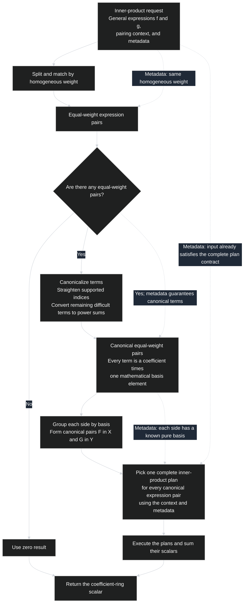
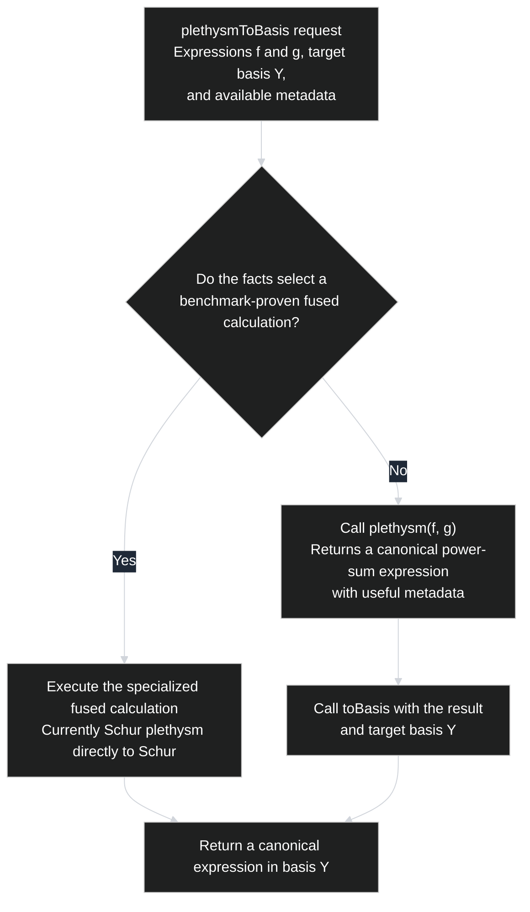

# SymmetricRings pipeline redesign checklist

This checklist records the design principles for replacing the current C++
pipeline systems with simpler, mostly linear workflows.  It intentionally
specifies architectural outcomes before choosing implementation details.

## Conversion/multiplication status

The conversion and multiplication portions of this design are implemented by
`toBasis`, `multiplyTermToBasis`, and `multiplyToBasis`. They use one
exact canonical-core facts contract with lazy selector profiles, an
independent cached direct-kernel registry, arbitrary
intermediate-basis composition, ordered plan forcing, policy-free executors,
and explicit multiplication stages. Differential and forced-plan tests cover
every registered conversion and multiplication plan family, M2-owned custom
and transformed bases, coefficient rings and QQ-shadow promotion, metadata
invalidation, skew and multifactor inputs, and configured resource boundaries.

The shared-plan workflow owns the public entry points. Unchecked whole-project
criteria below remain open where they concern the separate inner-product and
plethysm redesigns.

The completed boxes through the conversion and multiplication sections apply
only to those workflows. The later inner-product, plethysm, optional-metadata,
and storage experiments retain their own independent status.

## Conversion/multiplication central invariant

- [x] Enforce the central workflow invariant:
  > Each public calculation has one owning, mostly linear workflow.  Every
  > request follows that workflow.  A stage may be bypassed only when known
  > facts guarantee its postcondition.  The old specialized pipelines become
  > bypasses, internal plans, or explicit helper operations rather than
  > competing top-level workflows.

## Conversion/multiplication design principles

- [x] Use consistent terminology: workflow, stage, bypass, plan, registry,
      helper, kernel, and operation-specific pipeline.
- [x] Give each public calculation one complete owning workflow.
- [x] Make each workflow mostly linear, using loops only when intrinsic to the
      calculation.
- [x] Replace every former specialized pipeline with a documented bypass, plan,
      helper operation, or ordinary workflow stage.
- [x] Permit a bypass only when known facts guarantee the skipped stage's
      postcondition.
- [x] Use provenance and performance hints for plan selection, never as
      correctness guarantees.
- [x] Give every stage, helper, and plan explicit input and output contracts and
      make it total over its accepted domain.
- [x] Keep helper dependencies explicit and acyclic; prefer the direction
      `toBasis -> multiplyTermToBasis -> multiplyToBasis`, with no reverse calls.
- [x] Use one shared `X -> Y` plan registry from `toBasis`,
      `multiplyTermToBasis`, `multiplyToBasis`, and any other calculation needing
      basis conversion.
- [x] Select the complete basis composition before execution and select each
      direct plan before executing that edge. A support-dependent later edge
      may be selected only at an explicit stage boundary from exact realized
      facts; do not begin one plan, decline, and select another.
- [x] Keep kernels small, reusable, policy-free, and unable to call public
      workflow entry points.
- [x] Use one shared facts representation, compute each fact at most once when
      possible, and compute expensive facts lazily.
- [x] Optimize locally by adding a bypass guarantee, improving a stage or helper,
      registering a better plan, or improving a kernel.
- [x] Preserve useful intermediate representations and cached facts across
      stages and helper calls.
- [x] Separate plan non-applicability from mathematical or engine execution
      errors.
- [x] Trace executed and bypassed stages, helper calls, registry selections, and
      the facts that justified them.
- [x] Test every bypass and optimized plan against the ordinary broad
      calculation at its selection boundaries.
- [x] Make adding a kernel or plan a local registry change with explicit
      preconditions, differential tests, and benchmark evidence when needed.

## Conversion/multiplication completion criteria

- [x] Confirm that each public calculation has one mostly linear workflow.
- [x] Confirm that `toBasis` uses the same workflow for pure and mixed inputs.
- [x] Confirm that every former specialized pipeline has become a documented
      bypass, plan, helper operation, or workflow stage.
- [x] Confirm that every bypass is justified by a fact that guarantees the
      skipped stage's postcondition.
- [x] Confirm that helper-operation dependencies are explicit and acyclic.
- [x] Confirm that no plan or helper recursively calls its owning public entry
      point.
- [x] Confirm that every stage, helper, and selected plan is total for its
      declared domain.
- [x] Confirm that shared kernels contain no workflow- or plan-selection policy.
- [x] Confirm that broad stage calculations remain independent correctness
      references for optimized plans and bypasses.
- [x] Confirm that `toBasis`, `multiplyTermToBasis`, and `multiplyToBasis` use the
      same independent `X -> Y` plan registry.
- [x] Demonstrate adding at least one new conversion kernel using the intended
      contributor workflow.
- [x] Update `README-pipelines.md` so its decision trees reflect the completed
      architecture.

## Expression metadata

Every expression should carry enough exact metadata to support workflow
bypasses and plan selection without repeatedly rescanning it.  Simple flags
such as zero, single-term, product-free, pure-basis, and homogeneous should be
derived from richer counts and profiles where possible rather than maintained
as independent facts that can become inconsistent.

The first list is required for the initial workflow redesign.  The second list
contains useful extension points that should not block that redesign.

### Metadata required for the initial redesign

**Canonical form**

- [x] Record whether indices are normalized.
- [x] Record whether the expression is skew-free.
- [x] Record whether the expression is collected and sorted.
- [x] Record whether the expression is product-free.
- [x] Record the number of terms containing unresolved products.
- [x] Record the maximum number of factors in one term.

**Basis composition**

- [x] Record every basis appearing among the expression's factors.
- [x] Record the pure basis when every factor uses one basis.
- [x] Record the expanded basis when every nonscalar term is one canonical
      basis element.
- [x] Record whether the expression is mixed-basis.
- [x] Record whether the expression is one canonical basis element.
- [x] For one canonical basis element, record its basis identifier and index.

**Term structure**

- [x] Record the total term count.
- [x] Record scalar-term, single-factor-term, and product-term counts.
- [x] Derive zero, scalar, single-term, and single-basis-element facts from the
      term counts and canonical-form facts.

**Weights**

- [x] Record each known weight and its term count.
- [x] Derive homogeneity and the homogeneous weight from the weight profile.
- [x] Record the maximum partition length.
- [x] Derive support density separately for each weight.

**Factor structure**

- [x] Record the basis kind of every factor and factor counts by basis kind.
- [x] Record the presence of Schur, complete, elementary, and power-sum
      factors.
- [x] Record the presence and number of skew factors.
- [x] Record whether all factors are Schur-compatible.
- [x] Record whether all factors are Hall--Littlewood generators.

**Power-sum support**

- [x] Record whether the expression is one power-sum basis element.
- [x] Record whether every term is a single cycle and the number of
      single-cycle terms.
- [x] Record the parts common to every power-sum index and whether `p_1` is
      common.
- [x] Record the short-cycle weight in each index.
- [x] Record the number of currently complete-friendly terms.
- [x] Record the minimum and maximum cycle sizes and numbers of cycles.

**Special single-element shape**

- [x] Record whether the coefficient of a single element is one.
- [x] Record its partition length and largest part.
- [x] Record whether its index is one row or one column.
- [x] For a skew element, record its outer and inner indices.

**Provenance**

- [x] Record plethysm, Littlewood--Richardson, horizontal-Pieri,
      vertical-Pieri, and border-strip provenance.
- [x] Represent mixed or unknown provenance explicitly.
- [x] Use provenance only as a performance hint, never as a correctness
      guarantee for a bypass.

### Potentially useful future metadata

**Partition geometry**

- [ ] Consider counts of rows, columns, hooks, rectangles, and general shapes.
- [ ] Consider minimum and maximum largest parts and partition lengths.
- [ ] Consider Durfee-square size and maximum Jacobi--Trudi determinant
      dimension.
- [ ] Consider conjugation invariance and self-conjugate shapes.

**Skew geometry**

- [ ] Consider maximum outer and inner partition lengths and weights.
- [ ] Consider skew-size distributions, connectedness, and component counts.
- [ ] Consider whether shapes belong to families supported by specialized
      unskewing kernels.

**Detailed support distribution**

- [ ] Consider term counts indexed simultaneously by basis and weight.
- [ ] Consider density distributions across weights.
- [ ] Consider index-length and largest-part histograms.
- [ ] Consider common index parts or factors.
- [ ] Consider estimated support growth under conversion or multiplication.

**Detailed factorization**

- [ ] Consider the factor-kind sequence for each term.
- [ ] Consider minimum, maximum, and total factors per term.
- [ ] Consider maximum factor weight and repeated-factor counts.
- [ ] Consider common factors across terms.
- [ ] Consider counts of terms eligible for particular multiplication
      families.

**Coefficient profile**

- [ ] Consider whether all coefficients are one, are `+1` or `-1`, or are
      integral.
- [ ] Consider approximate maximum coefficient size.
- [ ] Consider the presence of coefficient-ring parameters and estimated
      coefficient-arithmetic complexity.

**Additional basis-specific profiles**

- [ ] Consider richer power-sum cycle histograms.
- [ ] Consider Schur shape-family distributions.
- [ ] Consider Hall--Littlewood generator and raising-operator statistics.
- [ ] Consider monomial exponent-pattern statistics.
- [ ] Consider plethysm-specific outer/inner shape and degree profiles.

**Cached derived views**

- [ ] Consider caching equal-weight buckets and single-basis groups.
- [ ] Consider caching coefficient maps in known bases.
- [ ] Consider caching normalized, unskewed, and frequently used converted
      forms.

**Richer provenance**

- [ ] Consider recording the primary support-producing operation and most
      recent transformation separately.
- [ ] Consider preserving mixed-origin information and important origins across
      basis conversion.
- [ ] Consider stable operation parameters relevant to future benchmarking.

### Flat storage grouped by weight

Consider keeping one flat term vector, but grouping its terms into contiguous
blocks using the existing canonical monomial order inside each block.  Put one
unknown-weight block first, followed by the exact-weight blocks.  Store offsets
only for the known blocks: the unknown block runs from the start of the vector
to the first known offset, and each known block ends at the next offset or the
end of the vector.  Thus the current flat representation is the natural special
case with no known-block offsets and the whole vector unknown.

A basis should declare whether its elements are homogeneous with weight
determined by their indices; a term goes into a known block only when every
factor has such a rule.  Transformed bases retain this property when possible,
while terms involving nonhomogeneous bases remain in the unknown block.

Store each known weight and starting offset once rather than recomputing the
weight of every term.  Operations should construct and propagate blocks using
their mathematical effects on weight.  These effects need not map one input
weight to one output weight: for example, `s_lambda[X+z]` has combined
`(X+z)`-weight `|lambda|` but produces terms of every applicable `X`-weight at
most `|lambda|`.  Do not physically subdivide blocks by basis unless later
benchmarks justify it.

- [ ] Evaluate flat, contiguous weight blocks as part of the storage design.
- [ ] Add a basis property such as `isHomogeneousByIndex` and retain one
      leading unknown-weight block for all other terms.
- [ ] Make operations propagate block weights instead of rescanning terms.

## Shared `X -> Y` plan registry

Basis conversion plans must live in a separate registry rather than inside any
one workflow.  `toBasis`, `multiplyTermToBasis`, and `multiplyToBasis` all
request plans from this same registry.  Other calculations may use it as well.
This prevents conversion behavior and performance choices from diverging
between callers.

There are three parts: the plan registry, the plan picker, and the plan
executor.  A registered plan describes one **direct** conversion from a
canonical expression in one basis to a canonical expression in another basis.
Direct does not mean that the plan must use one kernel.  **A plan answers exactly
one question: Which parts of this expression are sent to which kernel or
kernels?**  A plan that sends different parts of the expression to different
kernels is a **hybrid plan** (e.g., it may send low-weight terms to one kernel, 
and high-weight terms to another). Implementation details such as evaluation order and collection are absent from a plan and belong to the generic executor.

The registry is a policy-free catalog of these direct plans.  A direct basis
pair `(A, B)` may have several competing plans, including hybrid plans.  Each
registered plan has a stable identifier and declares its mathematical
applicability requirements.  The registry does not know which applicable plan
is expected to perform best.

The picker owns all performance policy.  First, it knows the expected best
basis composition from source `X` to target `Y`, such as `(X, Y)` or
`(X, p, Y)`.  Second, for every adjacent pair in that composition, it knows the
expected best applicable direct plan.  It requests those plans from the
registry and returns the basis composition together with the ordered plans,
without executing them.  Thus a direct conversion returns one plan, while
`X -> p -> Y` returns an `X -> p` plan followed by a `p -> Y` plan.  The returned
composition is a selection result, not another registered plan. An important point is that **the picker knows the best (expected) way to convert from `X -> Y`, depending on the expression metadata.** So, it does not always need to select the same plan, or composition of plans. For example, for low weights it might choose plan1, whereas for higher weights it chooses the composition (plan2,plan3), and in certain special cases it chooses hybridPlan4. 

In automatic mode the picker uses expression metadata, computing or inspecting
additional expression facts only when needed.  For reproducible tests and
benchmarks, a caller may bypass either level of performance policy by requesting
a particular basis composition, particular stable plan identifiers for its
direct steps, or both.  Every requested plan must still match its adjacent basis
pair and satisfy its correctness preconditions; an unknown or inapplicable
request is an explicit error and must not silently fall back.

The executor receives the selected composition and ordered plans.  It executes
them in order, passing the canonical output of each direct plan to the next,
then returns the final canonical target-basis expression.  The executor performs
composition but makes no performance selection.  Improving or adding a direct
plan therefore benefits every conversion composition for which the picker
selects that plan, without duplicating that plan inside other registry entries.

An `X -> Y` plan has a strict input contract: its expression is a linear
combination entirely in basis `X`, and every nonscalar term consists of a
coefficient times exactly one already-normalized, non-skew `X`-basis element in
the mathematical sense.  The input has no unresolved products, mixed source
bases, skew elements, or indices requiring straightening.  Its output is a
canonical, collected linear combination entirely in basis `Y`, with exactly one
normalized `Y`-basis element per nonscalar term.  Normalization, multiplication,
and separation of mixed-basis expressions therefore happen before an
expression is given to an `X -> Y` plan.

Each direct or hybrid plan can have additional requirements.  For example, a
plan can require that its input expression be homogeneous or contain one term.
The picker determines whether every selected plan satisfies its requirements,
in addition to deciding which composition and plans are expected to be fastest.
After selection, the executor does not repeat those applicability decisions.

- [x] Create one independent registry for direct basis-conversion plans.
- [x] Allow any `(X, Y)` pair to register multiple competing plans under stable
      identifiers.
- [x] Define a direct plan solely as the connection from parts of one canonical
      source-basis expression to one or more kernels that collectively return a
      canonical target-basis expression.
- [x] Support hybrid plans that send different parts of one expression to
      different kernels.
- [x] Do not let registered plans choose intermediate bases, compose other
      plans, or call the picker.
- [x] Keep mathematical plan definitions and applicability requirements in the
      registry, but keep performance-selection policy out of it.
- [x] Make the picker select the expected best basis composition from source
      `X` through zero or more intermediate bases to target `Y`.
- [x] Make the picker request the expected best applicable direct plan from the
      registry for every adjacent pair in the selected composition.
- [x] Let callers prescribe the basis composition, stable direct-plan
      identifiers, or both as a benchmarking bypass.
- [x] Validate every automatic or requested plan against its adjacent basis
      pair and mathematical preconditions, returning an explicit error rather
      than silently falling back.
- [x] Return the selected basis composition and ordered direct plans to one
      generic executor without executing them in the picker.
- [x] Make the executor compose the selected plans in order without making
      performance decisions.
- [x] Enforce the exact normalized, product-free, single-source-basis input
      contract at every registry call site.
- [x] Key plan selection by source basis `X`, target basis `Y`, and the relevant
      expression facts.
- [x] Require every selected direct or hybrid plan to be complete for the facts
      used to select it.
- [x] Keep registry selection side-effect-free and separate from plan execution.
- [x] Make `toBasis` use the registry for every source-basis group.
- [x] Make `multiplyTermToBasis` use the same registry directly for one-factor
      conversion and indirectly through `multiplyToBasis` for each pairwise
      product required by a nonmultiplicative target.
- [x] Make `multiplyToBasis` use the same registry for conversions required by
      its binary product plans.
- [x] Allow other calculations to use the registry without depending on
      `toBasis`.
- [x] Do not duplicate `X -> Y` selection logic inside multiplication code.
- [x] Do not let registry plans call `toBasis`, `multiplyTermToBasis`, or
      `multiplyToBasis`.
- [x] Register a new conversion plan or competing kernel in one obvious
      location.

## Proposed `toBasis` design

`toBasis` should have one owning workflow for both pure and mixed expressions.
The broad workflow is normalization, multiplication, grouping, plan selection,
execution, and combination. A former specialized pipeline should become
either a bypass whose guarantee proves that one or more stages are unnecessary,
or a complete source-to-target plan selected after preparation.

- [x] Replace the separate pure-basis and general conversion pipelines with one
      `toBasis` workflow.
- [x] Treat a known canonical, product-free expansion in one basis as a fast
      bypass to source-to-target composition and plan selection.
- [x] Treat known power-sum input as the same bypass with source basis `p`.
- [x] Treat known homogeneous weight and cached weight blocks as bypasses inside
      plan construction.
- [x] Represent whole-expression and grouped conversions as complete plan
      choices rather than top-level pipelines.
- [x] Send every unresolved product term to `multiplyTermToBasis`, which returns
      a canonical expansion in the requested target basis.
- [x] After multiplication, require every term to contain exactly one canonical
      basis element, while allowing different terms to use different bases.
- [x] Group remaining terms by source basis, pass target-basis terms through,
      and select one complete basis composition and its direct plans for each
      other group.
- [x] Execute every group's ordered plans under the ownership of the original
      `toBasis` request and combine the results in the target basis.


## Proposed `multiplyTermToBasis` design

`multiplyTermToBasis` accepts one coefficient times any number of normalized
mathematical basis elements and a target basis `Y`.  It owns that product until
it has produced a canonical, collected linear combination entirely in `Y`, with
one normalized `Y`-basis element per nonscalar term.  It first removes scalar
and identity factors while preserving the coefficient.  Zero, unit, and
one-factor inputs then take the corresponding trivial or `X -> Y` branch.

For multiple factors, the target basis determines the calculation.  If `Y` is
multiplicative, one helper converts the factors to `Y`, combines them using the
multiplicative rule, and collects the result; this branch never calls
`multiplyToBasis`.  If `Y` is not multiplicative, `multiplyTermToBasis`
repeatedly calls binary `multiplyToBasis` for the next pair and combines and
collects the returned `Y` expansion until no unmultiplied factors remain.  All
branches meet at one final stage, which applies the preserved coefficient once
and returns the canonical collected `Y` expansion.

`multiplyToBasis(F, G, Y)` accepts exactly two already-normalized mathematical
basis elements `F` and `G`, which need not belong to the same basis.  It chooses
and executes one complete multiplication plan for `F * G`.  The selected kernel
declares the basis `X` of its output, but its output is not assumed to be
canonical: it may, for example, contain skew elements or indices requiring
straightening.  The binary plan must first normalize that output into a
canonical `X` expansion satisfying the `X -> Y` input contract, and only then
request and execute the selected `X -> Y` composition and its ordered direct
plans.  A proven canonical kernel output may bypass normalization; after
normalization, `X = Y` may bypass conversion.
`multiplyToBasis` returns the same canonical pure-`Y` format as
`multiplyTermToBasis`.

- [x] Remove scalar and identity factors, preserve the scalar coefficient, and
      apply it once in the common final stage.
- [x] Represent a zero coefficient as the zero expansion and an empty factor
      list as the unit expansion before entering the common final stage.
- [x] For one remaining factor in basis `X`, request the same `X -> Y`
      composition and ordered direct plans used by `toBasis` from the shared
      picker and registry.
- [x] For multiple factors and a multiplicative target `Y`, use one helper that
      converts the factors to `Y`, combines them multiplicatively, and collects
      the result without calling `multiplyToBasis`.
- [x] For multiple factors and a nonmultiplicative target `Y`, repeatedly call
      `multiplyToBasis` for the next pair and combine and collect each returned
      `Y` expansion until no multiplication remains.
- [x] Require `multiplyToBasis` to select and complete one binary
      product-to-`Y` plan.
- [x] Require every product kernel to declare the source basis `X` of its
      output without assuming that the output is already canonical.
- [x] Require binary product plans to normalize kernel output, including
      straightening indices and expanding skew elements, before requesting a
      conversion composition and its direct plans from the shared picker and
      registry.
- [x] Bypass kernel-output normalization or `X -> Y` conversion only when known
      facts guarantee the corresponding postcondition.
- [x] Collect like terms and canonicalize target indices after every pairwise
      step to control intermediate growth.
- [x] Never respond to a failed pair-product calculation by selecting another
      plan or calling `toBasis`.
- [x] Return a canonical, collected linear combination with one `Y`-basis
      element per nonscalar term.


## Proposed `hallInnerProduct` design

The inner product should have one owning workflow for two general expressions,
a pairing context, and their metadata.  The workflow first discards pairs of
homogeneous components with unequal weights.  It then canonicalizes the
remaining terms, groups each side by basis, obtains one complete plan for every
resulting expression pair, executes those plans, and sums their scalar results.

The initial canonicalization policy should be deliberately broad and simple:
straighten the cases handled directly and convert every other difficult term to
power sums.  Later measurements may justify optimized handling of products,
Pieri or Littlewood--Richardson structure, skew elements, or other special
forms.  Those optimizations belong inside the canonicalization stage and must
preserve its postcondition, so they do not change the surrounding workflow.

Metadata turns former specialized pipelines into bypasses.  Homogeneity can
bypass weight splitting, canonical-form guarantees can bypass normalization,
and known pure bases can bypass grouping.  When metadata guarantees the entire
plan input contract for both expressions, the request goes directly to plan
selection.

- [ ] Replace `DiagonalBasis`, `SingleBasisElement`,
      `PowerSumsStructured`, and `FallbackPowerSums` with one inner-product
      workflow.
- [ ] Split and match the two expressions by homogeneous weight, discarding
      unmatched weights and bypassing the split when metadata already proves
      the expressions form one equal-weight pair.
- [ ] Return zero when no equal-weight pairs remain.
- [ ] Canonicalize every remaining term into a coefficient times exactly one
      mathematical basis element, initially by straightening supported cases
      and converting every other difficult term to power sums.
- [ ] Bypass canonicalization only when metadata guarantees its complete
      postcondition.
- [ ] Within each equal-weight pair, group each side by basis and form every
      required pair consisting of an `X` expression and a `Y` expression.
- [ ] Bypass basis grouping when metadata guarantees that each side already has
      one pure basis.
- [ ] Go directly from the public request to plan selection when metadata
      guarantees one canonical, equal-weight, pure-basis expression pair.
- [ ] Select all complete plans before executing them, execute the plans, and
      sum their coefficient-ring scalars.



### Inner-product plans

An inner-product plan accepts a resolved pairing context and two homogeneous
canonical basis expansions of the same weight:

```text
F = sum of a_lambda X_lambda,    G = sum of b_mu Y_mu.
```

`F` is entirely in one basis `X`, and `G` is entirely in one basis `Y`; the two
bases may differ.  Every nonscalar term has one already-normalized, non-skew
basis element in the mathematical sense.  The inputs are collected and contain
no unresolved products, mixed bases, skew elements, or indices requiring
straightening.  A plan returns one coefficient-ring scalar, is complete over
its declared domain, and cannot decline after execution begins.

The registry is a policy-free catalog and may hold several competing plans for
the same pairing context and basis pair `(X, Y)`.  Each plan has a stable
identifier and explicit mathematical preconditions.  A separate picker uses
the common weight, expression metadata, and the expressions themselves when
necessary to return the expected best applicable plan without executing it.
The picker also accepts a specific plan identifier for reproducible tests and
benchmarks; an unknown or inapplicable requested plan is an explicit error and
must not silently fall back.  A generic executor applies the returned plan.

Initial plan families should include registered dual or diagonal coefficient
pairing, coefficient extraction with a chosen operand orientation, direct
Kostka or conjugate-Kostka formulas, weighted Schur-character formulas, and
power-sum diagonal pairing.  Conversion of both inputs to power sums is the
broad always-applicable plan, not a fallback entered after another plan
declines.  Plans may use the shared `X -> Y` picker, registry, and executor for
required conversions, but they may not call the public inner-product workflow.

- [ ] Create one independent inner-product plan registry with stable plan
      identifiers and explicit applicability requirements.
- [ ] Allow multiple competing plans for the same pairing context and basis
      pair `(X, Y)`.
- [ ] Create a separate picker supporting automatic and specifically requested
      plan selection without execution.
- [ ] Enforce the canonical, pure-basis, equal-weight input contract at every
      picker and executor call site.
- [ ] Keep the power-sum diagonal plan broad and always applicable.
- [ ] Require every selected plan to complete without declining or selecting a
      replacement plan during execution.
- [ ] Let plans reuse the shared `X -> Y` picker, registry, and executor without
      calling the public inner-product workflow.
- [ ] Test optimized plans against the power-sum diagonal plan at applicability
      and picker-selection boundaries.

## Proposed plethysm design

Plethysm needs relatively little architectural change.  The existing
`plethysm(f, g)` calculation already has the right main responsibility: compute
the plethysm in power sums and return a canonical power-sum expression with
useful metadata.  Ordinary basis conversion should remain outside that
function and should be performed by the shared `toBasis` workflow.

The combined `plethysmToBasis` operation makes one decision before calculation
begins.  A benchmark-proven fused calculation may be selected when its complete
preconditions are known; otherwise the operation simply calls `plethysm(f, g)`
and then `toBasis`.  The power-sum result's metadata should let `toBasis` bypass
normalization and grouping and proceed directly to the `p -> Y` plan picker.
Thus the main work is to clarify ownership and remove unnecessary forwarding
pipeline machinery, not to redesign the mathematical plethysm kernels.

- [x] Give `plethysm(f, g)` the explicit contract of returning a canonical,
      collected power-sum expression with accurate canonical-form, weight, and
      plethysm-provenance metadata.
- [x] Keep all ordinary target-basis conversion out of `plethysm(f, g)`.
- [x] Make `plethysmToBasis` choose a complete fused calculation, when one is
      justified, before any calculation begins.
- [x] Make the ordinary `plethysmToBasis` path call `plethysm(f, g)` and then
      call the shared `toBasis` workflow with target basis `Y`.
- [x] Use the returned metadata to enter the canonical pure-power-sum bypass in
      `toBasis` and proceed directly to the `p -> Y` plan picker.
- [x] Remove or collapse forwarding-only post-plethysm pipeline stages that do
      not perform an independent mathematical calculation.
- [x] Retain a fused calculation only while benchmarks demonstrate a useful
      advantage over `plethysm(f, g)` followed by `toBasis`.
- [x] Test the ordinary and fused paths against each other throughout the
      fused path's declared domain.


