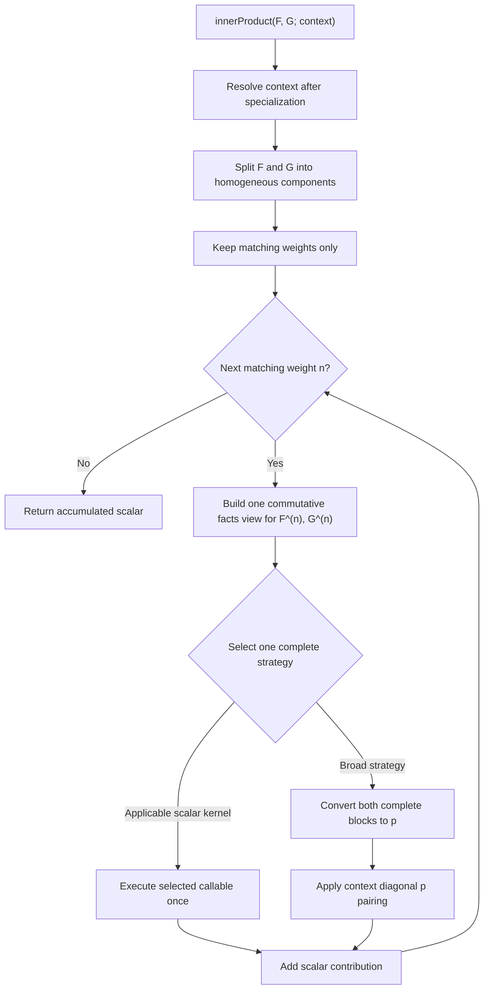

# Inner-product simplification

## Mathematical design

This section is the normative specification. Inner products have four
mathematical objects:

1. a **pairing context**, which defines the bilinear form;
2. a **scalar kernel**, which is one complete formula on a homogeneous pair;
3. a **picker**, which chooses one applicable formula for performance;
4. a **graded workflow**, which pairs equal-weight components and adds the
   resulting scalars.

The design follows the same separation used by conversion and multiplication:

$$
\boxed{
\begin{aligned}
\text{context} &= \text{the bilinear form},\\
\text{kernel} &= \text{one complete scalar formula},\\
\text{picker} &= \text{performance choice},\\
\text{graded workflow} &= \text{bilinear extension by weight}.
\end{aligned}
}
$$

Mathematical validity must not be encoded as performance policy, and execution
of a selected formula must not make another inner-product selection.

### 1. Pairing contexts

Let $\Lambda_A$ be the ring of symmetric functions over a coefficient ring
$A$. A pairing context $c$ specifies a graded symmetric bilinear form

$$
\langle-,-\rangle_c:
\Lambda_A\times\Lambda_A\longrightarrow A.
$$

Every supported context has a diagonal power-sum formula

$$
\langle p_\lambda,p_\mu\rangle_c
=
\delta_{\lambda\mu}\,d_c(\lambda).
$$

For the ordinary Hall inner product,

$$
d_{\mathrm{Ordinary}}(\lambda)=z_\lambda.
$$

For the Hall--Littlewood inner product used by this package,

$$
d_{\mathrm{HallLittlewood}}(\lambda)
=
\frac{z_\lambda}
{\prod_i(1-t^{\lambda_i})}.
$$

A context may also declare diagonal or dual basis relationships. For bases
$u$ and $v$, such a relationship has the form

$$
\langle u_\lambda,v_\mu\rangle_c
=
\delta_{\lambda\mu}\,a_{c,u,v}(\lambda).
$$

The current built-in dual pairs have $a_{c,u,v}(\lambda)=1$; the mathematical
contract permits a nontrivial diagonal factor for registered M2 pairings.

A context declaration owns:

- its stable mathematical name;
- its required parameters and coefficient-ring hypotheses;
- the power-sum diagonal factor $d_c$;
- its registered diagonal or dual basis relationships.

It contains no cost estimate, preferred algorithm, operand profile, or
selection state. The context is resolved explicitly after parameter
specialization. The engine never infers it from a basis symbol or display
text.

### 2. Graded reduction

Write finite expressions as homogeneous sums

$$
F=\sum_{n\geq0}F^{(n)},
\qquad
G=\sum_{n\geq0}G^{(n)}.
$$

Since every supported pairing is graded,

$$
\langle F,G\rangle_c
=
\sum_{n\geq0}
\langle F^{(n)},G^{(n)}\rangle_c.
$$

Components whose weights occur in only one operand contribute zero and are
discarded without conversion. Degree zero is included, so scalars satisfy

$$
\langle a,b\rangle_c=ab.
$$

The graded workflow makes one complete decision for each matching homogeneous
pair $(F^{(n)},G^{(n)})$. It does not distribute a component by basis, by term,
or by a guessed scalar route before that decision. A mixed-basis or
product-bearing component remains intact and reaches the broad power-sum
calculation when no specialized complete formula applies.

This is the only piece decomposition in the inner-product workflow. There is
no inner-product plan layer and no recursive picker call on smaller pieces.
The decomposition itself is not specific to inner products: it is a general
operation on symmetric-function expressions and should be available to other
engine workflows.

### 3. Homogeneous scalar kernels

For a fixed context $c$ and weight $n$, a scalar kernel is a mathematical map

$$
K:
\Lambda_A^{(n)}\times\Lambda_A^{(n)}
\longrightarrow A
$$

with an exact applicability condition $A_K(F,G,c)$. It must satisfy

$$
A_K(F,G,c)
\quad\Longrightarrow\quad
K(F,G;c)=\langle F,G\rangle_c.
$$

The endpoint is commutative:

$$
\{F,G\}\longmapsto A,
$$

not two different endpoints for $(F,G)$ and $(G,F)$. A callable may use a
convenient argument orientation, but the picker supplies that orientation
mechanically after making one symmetric decision.

A kernel is complete on the homogeneous pair it accepts. It:

- returns one coefficient-ring scalar;
- does not return an expansion for a later inner-product stage;
- does not choose another scalar kernel;
- does not decline after selection;
- does not call the public inner-product workflow;
- does not contain performance thresholds.

The existing specialized mathematics becomes the following kernels.

#### Registered diagonal pairing

If

$$
F=\sum_\lambda f_\lambda u_\lambda,
\qquad
G=\sum_\lambda g_\lambda v_\lambda
$$

are complete canonical expansions in a registered diagonal pair, then

$$
K_{\mathrm{diagonal}}(F,G;c)
=
\sum_\lambda
f_\lambda g_\lambda a_{c,u,v}(\lambda).
$$

The runtime pairing descriptor supplies $u$, $v$, and the diagonal-factor
kind. Reversing the operands uses the same descriptor and kernel declaration.

#### Dual-basis coefficient

If one operand is a scaled basis element $b\,v_\mu$ and $u,v$ are dual in
context $c$, then

$$
K_{\mathrm{dual\ coefficient}}(F,bv_\mu;c)
=
b\,a_{c,u,v}(\mu)\,[u_\mu]F.
$$

This kernel uses the shared targeted `basisCoefficient` service. It does not
reimplement coefficient selection and does not turn coefficient routes into
inner-product routes.

#### Kostka formulas

In the ordinary context,

$$
\begin{aligned}
\langle s_\lambda,h_\mu\rangle
  &=K_{\lambda\mu},\\
\langle s_\lambda,e_\mu\rangle
  &=K_{\lambda'\mu},\\
\langle s^\omega_\lambda,h_\mu\rangle
  &=K_{\lambda'\mu},\\
\langle s^\omega_\lambda,e_\mu\rangle
  &=K_{\lambda\mu}.
\end{aligned}
$$

Each distinct identity is one scalar kernel with an exact strict-pair
applicability condition. These kernels accept scaled basis elements through
the common scalar-kernel boundary and multiply their scalar coefficients
exactly once.

#### Weighted characters

Suppose

$$
F=\sum_\mu f_\mu p_\mu,
\qquad
G=\sum_\lambda g_\lambda s_\lambda.
$$

Since

$$
s_\lambda
=
\sum_\mu \frac{\chi^\lambda_\mu}{z_\mu}p_\mu,
$$

the context-$c$ formula is

$$
K_{\mathrm{weighted\ characters}}(F,G;c)
=
\sum_{\mu,\lambda}
f_\mu g_\lambda
\chi^\lambda_\mu
\frac{d_c(\mu)}{z_\mu}.
$$

This is one complete formula for a power-sum expansion paired with a Schur
expansion. Its commuted call uses the same kernel declaration.

#### Power-sum diagonal pairing

For two canonical power-sum expansions,

$$
F=\sum_\lambda f_\lambda p_\lambda,
\qquad
G=\sum_\lambda g_\lambda p_\lambda,
$$

the formula is

$$
K_{\mathrm{power\ sums}}(F,G;c)
=
\sum_\lambda f_\lambda g_\lambda d_c(\lambda).
$$

The context supplies $d_c$ directly. There must not be a second
`PowerSumPairingKind` that repeats the context identity.

### 4. Broad power-sum calculation

Every homogeneous pair has the fixed calculation

$$
B_c(F,G)
=
K_{\mathrm{power\ sums}}
\bigl(
\operatorname{toBasis}(F,p),
\operatorname{toBasis}(G,p);
c
\bigr).
$$

This is the unconditional mathematical reference and fallback. It:

1. converts the complete left component to power sums;
2. converts the complete right component to power sums;
3. applies the context's diagonal power-sum formula once.

Both conversions use the shared conversion-plan service. The inner-product
workflow does not create conversion plans, choose intermediate bases, or
reimplement conversion fallback.

The broad calculation is a fixed structural workflow, not a fake specialized
kernel. The picker may choose it for performance, and the outer workflow uses
it whenever no specialized kernel applies. Once chosen, it performs no further
inner-product selection.

### 5. Performance picker

For a homogeneous pair and context, let

$$
\mathcal K(F,G;c)
=
\{K:A_K(F,G,c)\text{ holds}\}
$$

be the applicable specialized scalar kernels. The picker chooses either one
member of $\mathcal K(F,G;c)$ or the broad power-sum calculation.

Picker cases are ordered performance rules. A representative policy is:

1. prefer registered diagonal coefficient intersection when both operands are
   already expanded in a declared diagonal pair;
2. when one operand is a single basis element, consider applicable strict
   formulas and the dual-coefficient functional;
3. for a power-sum/Schur expansion pair, consider weighted characters;
4. otherwise use the broad power-sum calculation.

Each referenced kernel's mathematical applicability is checked independently
from the picker case. A picker condition may say that one applicable formula
is expected to be cheaper; it may not make an invalid formula valid.

The final `otherwise` case names the broad calculation. If benchmarks justify
using the broad calculation earlier for some input profile, that is an
ordinary readable picker rule.

No current inner-product endpoint should require a central numeric cost
switch. Prefer inspectable ordered conditions. If a genuine quantitative
crossover remains after benchmarking, keep its named estimator beside the
specific picker rule that uses it.

Changing picker policy may change running time but must not change the scalar:

$$
K(F,G;c)=B_c(F,G)
$$

whenever $K$ is applicable.

### 6. Complete graded workflow

The complete operation is:

1. resolve and validate the pairing context after specialization;
2. return zero immediately if either operand is zero;
3. split both operands into exact homogeneous components;
4. retain only weights present in both operands;
5. for each retained weight, construct one symmetric pair-facts view;
6. select one specialized kernel or the broad calculation;
7. execute the selected formula once;
8. add the coefficient-ring scalars.



There is no top-level pipeline enum, no second route selector inside a
pipeline, and no inner-product plan or child-plan mechanism.

## Implementation plan

### Status and purpose

This document specifies a pending contributor-facing simplification of the
inner-product architecture. The mathematical section above is normative. If
an implementation detail cannot be explained as a pairing context, scalar
kernel, picker rule, broad power-sum calculation, or graded extension, that
detail should change.

The current implementation has accidental duplication:

- `InnerProductPipeline` first chooses one of four candidate inventories;
- `InnerProductRoute` then chooses the actual scalar formula;
- route identity is repeated in an enum, name switch, cost switch, execution
  switch, and several pipeline-specific candidate builders;
- the broad calculation appears both as a pipeline and as a route candidate;
- nonhomogeneous operands receive one whole-expression decision;
- commutativity is represented by repeated original/swapped branches;
- `InnerProductKind` and `PowerSumPairingKind` describe the same context twice;
- runtime pairing metadata is collapsed into a source-keyed map, even though
  the M2 registry permits multiple rules per source;
- process environment variables carry forcing and tracing state into ordinary
  production execution;
- context resolution, pairing encoding, M2 fallback, and public wrapping are
  spread across broad ring/element and computation modules.

The redesign removes these synchronization points without removing any
mathematical formula or the M2 extensibility fallback.

### Contributor model

The contributor-facing question should be:

> I have a scalar formula for one class of homogeneous operand pairs. Where do
> I implement it, how do I state its exact domain, and when should it be
> preferred?

The answer should be visible in this order:

```text
inner-product-kernels.cpp
    the scalar formulas

inner-product-picker.cpp
    exact kernel declarations and ordered performance policy

inner-product.cpp
    the stable graded workflow and broad calculation
```

An ordinary new specialized formula requires two conceptual production edits:

1. **Kernel:** implement the complete scalar formula.
2. **Picker:** declare its stable identity, commutative applicability, and
   performance preference.

A declaration in `inner-product-kernels.hpp` is allowed as a mechanical third
edit when the kernel is a `SymmetricEngineRing` member.

No edit to the graded workflow, generic executor, a route enum, a pipeline
enum, a name switch, or a central cost switch should be necessary.

Adding a basis relationship is different from adding a scalar algorithm. A
new diagonal or dual relationship should normally require only M2 metadata;
the generic registered-diagonal and dual-coefficient kernels consume it.

Adding a new pairing context is also a separate contribution:

1. define its mathematical parameter and specialization policy in M2;
2. define its power-sum diagonal factor;
3. register any built-in diagonal basis relationships;
4. add differential tests against the power-sum definition.

It must not require copying every existing scalar kernel into a
context-specific dispatcher.

### Invariants that must not be weakened

#### Correct broad fallback

Every supported pairing context has a complete power-sum definition. Every
specialized kernel agrees with that definition wherever it is applicable.
User-registered bases retain their M2 conversion and pairing hooks.

#### One selection per homogeneous pair

The picker is called once for each matching weight. A selected kernel is
invoked exactly once and cannot reenter selection. The broad calculation
contains conversion-plan selection but no inner-product selection.

#### Applicability versus preference

Kernel declarations own exact mathematical preconditions. Picker rules own
only performance policy. Execution failure after selection is an explicit
computation or contract error, not a reason to try another kernel.

#### Commutativity

Each scalar algorithm has one declaration for the unordered operand pair. The
selector may reverse actual arguments to match the callable's written
presentation. Reversed declarations and order-dependent policy are invalid.

#### Exact homogeneous boundaries

Weight splitting is exact and includes scalars. A specialized kernel sees one
complete homogeneous pair. Mixed bases, skew terms, and products remain
complete inputs and use the broad route unless an exact specialized contract
supports them.

#### Shared services

The broad calculation uses the shared conversion-plan service. The
dual-coefficient formula uses the shared targeted coefficient service.
Inner-product code does not duplicate either selector or executor.

#### M2 and C++ ownership

M2 owns:

- public option parsing;
- parameter specialization and result-ring policy;
- context resolution;
- registered basis relationships and arbitrary M2 pairing functions;
- custom and transformed-basis fallback.

C++ owns:

- built-in homogeneous facts and weight splitting;
- built-in scalar kernels;
- built-in performance selection;
- the built-in power-sum calculation;
- computation limits and scalar-kernel contract checks.

### Pairing-context representation

Collapse `InnerProductKind` and `PowerSumPairingKind` into one resolved context
definition. A representative engine shape is:

```cpp
using PowerSumDiagonalFactor =
    ring_elem (SymmetricEngineRing::*)(
        const Partition&) const;

struct InnerProductContext
{
  InnerProductContextId identifier;
  const char* displayName;
  PowerSumDiagonalFactor powerSumDiagonalFactor;
  std::vector<ResolvedInnerProductPairing> pairings;
};
```

The exact identifier representation may remain a small raw-interface code,
but one validated context database must bind that code to its name and
callable. `powerSumDiagonalFactor` invokes the stored callable; it does not
switch on a second context enum.

Use a sequence, not a source-keyed map, for pairing descriptors:

```cpp
struct ResolvedInnerProductPairing
{
  RingBasis source;
  RingBasis dual;
  InnerProductPairingKind kind;
};
```

This preserves multiple M2 rules for the same source. Build a normalized
unordered lookup index for matching operands, while retaining the source and
dual roles needed by coefficient extraction. Do not require users to register
the reversed relationship.

The compact raw representation must validate:

- a known context identifier;
- triples of source id, dual id, and pairing kind;
- basis ids available on the receiving ring;
- no exact duplicate descriptor;
- no conflicting descriptors for the same context and ordered mathematical
  roles;
- engine kinds that the C++ kernel can actually interpret.

Arbitrary M2 pairing functions remain M2-only. The raw boundary carries only
descriptors whose mathematical factor is understood by the engine.

### Homogeneous facts and conditions

`InnerProductProfile` has been removed. Inner-product requests now carry the
same exact `ExpressionFacts` values used by conversion, multiplication, and
normalization. Complete canonical fact caches are reused; otherwise the shared
expression inspector computes each operand's facts once. Pairing descriptors
and transition-cache state remain operation-specific rather than being folded
into expression structure.

The request and selection layer should expose, lazily where appropriate:

- the common homogeneous weight;
- term counts;
- expanded and pure basis ids;
- whether an operand is one scaled, non-skew basis element;
- its basis id and partition index;
- product-free, normalized, skew-free, and collected facts;
- maximum partition length;
- relevant transition-cache state;
- matching registered pairing descriptors.

There must be one construction path used by automatic selection, forced
selection, tracing, and benchmarks.

Use a typed, inspectable `InnerProductCondition` rather than arbitrary Boolean
lambdas:

$$
C::=\top\mid\text{primitive pair predicate}\mid
(C\land C)\mid(C\lor C)\mid\neg C.
$$

Representative constructors are:

```cpp
contextIs(InnerProductContextId::Ordinary)
operandsAreExpandedInRegisteredPair()
eitherOperandIsSingleBasisElement()
singleBasisPairIs(BasisKind::Schur, BasisKind::Complete)
expandedBasisPairIs(BasisKind::PowerSum, BasisKind::Schur)
maximumPartitionLengthAtMost(8)
```

Pair conditions are commutative. Basis-named predicates may identify the
unique operand in a distinct-basis pair, but generic left/right predicates
must not make policy order-dependent.

`otherwise()` is an ordered picker marker, not a Boolean condition. It appears
only as the final preference and may not occur inside logical composition.

### Standard scalar-kernel interface

Every picker-callable scalar kernel uses one standard input:

```cpp
struct HomogeneousInnerProductInput
{
  ring_elem first;
  ring_elem second;
  int weight;
  const InnerProductContext& context;
  const ResolvedInnerProductPairing* pairing = nullptr;
};

using InnerProductKernel =
    ring_elem (SymmetricEngineRing::*)(
        const HomogeneousInnerProductInput&) const;
```

`pairing` is resolved mathematical context data for the generic registered
pairing kernels. It is null for formulas that do not consume a registered
relationship. The selected-kernel record supplies mechanical argument
orientation and the resolved descriptor; those are not performance inputs to
the callable.

The input intentionally omits:

- picker policy;
- estimated cost;
- mutable workflow state;
- unmatched weights;
- surrounding nonhomogeneous expressions;
- forcing or tracing configuration.

Lower-level character, Kostka, coefficient-map, and diagonal-factor helpers
may retain specialized signatures. Only the callable declared to the picker
must use the standard input.

### Callable kernel declarations

Store typed callables directly:

```cpp
struct InnerProductKernelDefinition
{
  InnerProductKernelId identifier;
  InnerProductCondition applicableWhen;
  InnerProductKernel kernel;
};

struct SelectedInnerProductKernel
{
  const InnerProductKernelDefinition* definition;
  bool callableTakesReversedArguments;
  const ResolvedInnerProductPairing* pairing;
};
```

The definition is the single source of truth for:

- stable kernel identity;
- mathematical applicability;
- callable formula.

Known basis endpoints and context restrictions are inspectable parts of the
applicability condition. The generic executor invokes the stored callable; it
contains no switch over mathematical algorithms.

The selected record may carry a resolved runtime pairing and mechanical
orientation. It must not carry a second algorithm identity or a later fallback
choice.

### Declarative picker

Use one obvious picker inventory:

```cpp
enum class InnerProductStrategyKind
{
  Kernel,
  PowerSumReference
};

struct InnerProductStrategy
{
  InnerProductStrategyKind kind;
  std::optional<InnerProductKernelId> kernel;
};

struct InnerProductPreference
{
  InnerProductCondition condition;
  std::vector<InnerProductStrategy> strategiesInOrder;
};
```

The exact C++ representation may use a variant instead of an enum. A generic
variant switch between “invoke a stored callable” and “run the fixed
power-sum calculation” is structural and may remain. No switch over specific
kernel identities may remain.

The picker algorithm is:

1. validate the homogeneous commutative pair facts;
2. honor an explicit forced kernel after applicability validation;
3. evaluate ordered preference cases;
4. within a matching case, return the first referenced applicable kernel or
   the broad strategy;
5. continue to the next case when no referenced kernel applies;
6. require the final `otherwise()` case to contain the broad strategy;
7. return the selected strategy without executing it.

Every kernel has a stable string identifier for forcing, traces, tests, and
benchmarks. Kernels retained only for differential comparison appear in an
explicit alternatives list rather than becoming unreachable declarations.

The current central `estimateInnerProductCandidateCost` switch should not be
ported mechanically. First express current choices as readable ordered rules.
After structural equivalence, benchmark actual crossovers. If a local numeric
estimator is justified, keep it beside the policy that uses it and name the
measured quantities.

### Reusable homogeneous-component service

Add one general C++ function that accepts any engine symmetric-function
expression and returns its separate homogeneous components:

```cpp
struct HomogeneousComponent
{
  int weight;
  ring_elem expression;
};

std::vector<HomogeneousComponent>
SymmetricEngineRing::homogeneousComponents(
    ring_elem expression) const;
```

The exact type names may differ, but the contract must remain general:

- the input may be zero, a scalar, mixed-basis, skew, product-bearing, or
  nonhomogeneous;
- each returned expression belongs to the same symmetric ring;
- every returned expression is homogeneous of its recorded weight;
- components are returned in increasing weight order;
- zero components are omitted, and zero input returns an empty list;
- the original expression is exactly the sum of the returned components;
- grouping does not convert bases, resolve products, or run operation-specific
  selection.

The function computes exact term weights from the engine representation,
groups and collects terms once, and preserves reusable exact facts on each
result. It belongs to shared expression inspection rather than the
inner-product module. Inner products are its first consumer, but conversion,
truncation, generating-series, coefficient, and future Hopf-algebra workflows
must be able to call the same function without depending on inner-product
types or policy.

### Graded workflow and broad execution

Use the shared `homogeneousComponents` service rather than implementing local
weight grouping. Preserve exact cached facts on a component when known, and infer
only the facts needed by the selected strategy.

A readability target is:

```cpp
ring_elem
SymmetricEngineRing::innerProduct(
    ring_elem left,
    ring_elem right,
    const InnerProductContext& context,
    const InnerProductRequest& request) const
{
  auto leftByWeight =
      indexComponentsByWeight(homogeneousComponents(left));
  auto rightByWeight =
      indexComponentsByWeight(homogeneousComponents(right));
  ring_elem result = coefficientRing->zero();

  for (int weight : commonWeights(leftByWeight, rightByWeight))
    {
      auto input = buildHomogeneousInnerProductInput(
          leftByWeight.at(weight),
          rightByWeight.at(weight),
          weight,
          context);
      auto strategy =
          selectInnerProductStrategy(input, request);
      result = coefficientRing->add(
          result,
          executeInnerProductStrategy(strategy, input));
    }

  return result;
}
```

The broad helper should read like its mathematics:

```cpp
ring_elem
SymmetricEngineRing::innerProductViaPowerSums(
    const HomogeneousInnerProductInput& input) const
{
  ring_elem firstPowerSums =
      convertCanonicalExpression(
          input.first, BasisKind::PowerSum);
  ring_elem secondPowerSums =
      convertCanonicalExpression(
          input.second, BasisKind::PowerSum);
  return pairPowerSumExpansions(
      firstPowerSums,
      secondPowerSums,
      input.context);
}
```

The helper calls the shared internal conversion service, not the public M2
`toBasis` wrapper. It converts each complete block once and applies the
context factor once.

### Explicit diagnostics

Replace production environment-variable reads with request-scoped diagnostic
state:

```cpp
struct InnerProductRequest
{
  std::optional<InnerProductKernelId> forcedKernel;
  bool usePowerSumReference = false;
  bool traceSelection = false;
};
```

A forced kernel and the power-sum reference are mutually exclusive. Ordinary
production calls pass an automatic request.

For a nonhomogeneous request, forcing a kernel requires that kernel to apply
to every nonzero matching-weight pair; otherwise forcing is rejected. The
power-sum reference applies to every block.

Benchmark or test harnesses may translate environment configuration into this
explicit request. The production inner-product workflow itself must not read a
forcing or tracing environment variable.

Trace output should report:

- the resolved context;
- the matching weight;
- normalized commutative operand facts;
- the selected stable kernel or `power-sum-reference`;
- mechanical callable orientation when relevant;
- the exact performance condition that selected it.

### M2 implementation boundary

Create a focused `innerProducts.m2` package module during the refactor. Move
into it:

- `innerProductKindCode` and pairing-map encoding;
- context resolution after specialization;
- direct registered-pairing fallback;
- the power-sum fallback for non-engine-readable expressions;
- public `hallInnerProduct` option parsing and wrapping;
- public pairing-inspection helpers if their ownership remains clearer there.

`registeringBases.m2` continues to own the central relationship registries,
and `builtInBases.m2` continues to declare built-in pairing mathematics.
`symmetricRingsAndElements.m2` should construct rings and elements rather than
encode inner-product dispatch data. `computations.m2` should not retain a
second inner-product workflow after the move.

The public wrapper should:

1. validate two elements in the same symmetric ring;
2. specialize parameters and choose the result ring;
3. resolve the explicit pairing context;
4. call the engine once when both inputs and the context metadata are engine
   readable;
5. otherwise use the M2 graded diagonal/power-sum fallback;
6. return a scalar in the promised coefficient ring.

M2 direct pairing must remain able to execute arbitrary registered `Pairing`
functions. C++ receives only built-in pairing kinds. No C++ picker database
may become a replacement for custom or transformed-basis hooks.

### Target file ownership

#### `inner-product-kernels.hpp/.cpp`

Own:

- context-specific power-sum diagonal factors;
- coefficient-map diagonal pairing;
- registered dual-coefficient evaluation;
- Kostka scalar identities;
- weighted-character scalar identities;
- their lower-level mathematical helpers.

Do not contain picker policy, stable preference order, workflow forcing,
weight splitting, or public entry points.

#### `inner-product-picker.hpp/.cpp`

Own:

- typed pair facts and inspectable conditions;
- callable kernel definitions;
- stable kernel identifiers;
- commutative applicability validation;
- ordered performance preferences;
- forced-kernel validation and selection tracing.

Do not execute kernels, convert operands, or split nonhomogeneous inputs.

#### `inner-product.hpp/.cpp`

Own:

- resolved built-in contexts;
- exact graded workflow;
- fixed broad power-sum calculation;
- structural strategy execution;
- public engine entry point;
- explicit diagnostic request validation.

The final filename may retain `inner-product-dispatch.*` for compatibility,
but its content must follow this ownership. “Dispatch” must not justify
keeping the pipeline/route hierarchy.

#### Shared services

- `expression-inspection.*` owns the general `homogeneousComponents`
  operation, exact weight grouping, and reusable expression facts. This API
  has no dependency on inner-product contexts, kernels, or picker state.
- `basis-coefficient.*` owns targeted coefficient selection.
- `basis-conversion.*` owns conversion plan selection and execution.
- `operation-records.hpp` owns only neutral compact records shared across
  modules, not picker policy.

### Validation

#### Context validation

Validate once:

- unique stable context identifiers;
- non-null power-sum diagonal callables;
- required parameter availability;
- pairing descriptors with valid ring-local basis ids;
- supported engine pairing kinds;
- preservation of multiple rules per source basis;
- no exact duplicate or conflicting pairing records.

#### Kernel validation

Validate:

- unique nonempty stable kernel identifiers;
- non-null callables;
- conditions valid for the homogeneous pair context;
- commutative basis-pair conditions;
- no generic left/right performance predicates;
- every registered-pairing kernel requests the descriptor it consumes;
- every declared kernel is reachable automatically or marked as a diagnostic
  alternative.

#### Picker validation

Validate:

- one ordered picker definition;
- every referenced kernel exists;
- every preference condition is a pair condition;
- strategy lists are nonempty and contain no duplicates;
- only the final case is `otherwise()`;
- the final case reaches `power-sum-reference`;
- every automatic kernel is referenced;
- alternatives are explicit and not accidentally automatic.

#### Runtime contracts

Retain:

- same-ring input validation;
- exact coefficient-ring promotion;
- explicit context and parameter errors;
- forced-kernel applicability checks;
- mutually exclusive forced and reference modes;
- one facts construction per homogeneous pair;
- an execution guard preventing inner-product reselection;
- explicit errors after a selected kernel fails;
- resource checks in Kostka, character, conversion, and coefficient services.

### Testing

Every specialized kernel must agree with the independent reference:

$$
K(F,G;c)=
\left\langle
\operatorname{toBasis}(F,p),
\operatorname{toBasis}(G,p)
\right\rangle_c.
$$

Tests should separately cover:

- ordinary and Hall--Littlewood contexts;
- degree-zero scalars, zero operands, and unequal homogeneous weights;
- nonhomogeneous inputs with overlapping and disjoint weight sets;
- a nonhomogeneous input whose different weights select different kernels;
- the general homogeneous-component service on zero, scalar, skew,
  mixed-basis, product-bearing, and nonhomogeneous expressions;
- reconstruction of every tested input by summing its returned homogeneous
  components, with increasing weights and correct per-component metadata;
- complete registered dual and diagonal expansions;
- every strict Kostka identity;
- targeted dual-coefficient evaluation;
- weighted-character evaluation;
- direct power-sum diagonal pairing;
- the complete-block power-sum fallback;
- products, mixed bases, skew terms, and normalization through the fallback;
- both input orders for every kernel and strategy;
- multiple pairing rules for one source basis;
- transformed and user-registered M2 pairings;
- parameter specialization to $t=0$ and result-ring promotion;
- QQ-shadow transport where applicable;
- forced execution and correct rejection of every kernel;
- mutually exclusive forced-kernel and reference requests;
- resource-limit failures and cache behavior.

A contributor-surface check should ensure that:

- no `InnerProductPipeline` or `InnerProductRoute` enum returns;
- no executor switch names mathematical kernels;
- no generic picker branch names a basis-specific formula;
- a fixture kernel changes only the kernel and picker locations, plus an
  optional header declaration;
- production execution reads no inner-product forcing environment variable.

### Benchmarking

Record baselines before changing selection policy. Measure separately:

- exact weight splitting;
- pair-facts construction;
- picker overhead;
- each scalar kernel;
- one complete-block power-sum calculation;
- a full nonhomogeneous graded sum;
- M2 custom-basis fallback.

Benchmarks must compare the same mathematical homogeneous pairs and context.
Commuted inputs must reach the same picker policy. Reports should show one
normalized operand-pair description rather than separate left/right
endpoints.

Only scalar-kernel comparisons should tune kernel preferences. Weight-splitting
or conversion overhead must not be attributed to a kernel. A proposed change
to graded decomposition or the broad calculation is a workflow change, not a
picker threshold.

### Migration sequence

1. Record current scalars, homogeneous automatic selections, forced-route
   results, traces, and benchmark baselines.
2. Add differential reference helpers that explicitly convert both operands
   to power sums.
3. Add the general C++ `homogeneousComponents` service in shared expression
   inspection; verify ordered components, exact reconstruction, metadata, and
   the graded identity on nonhomogeneous expressions without changing
   homogeneous selection.
4. Replace the parallel context enums with one resolved context definition and
   a stored power-sum diagonal callable.
5. Replace the source-keyed pairing map with a validated descriptor sequence
   and commutative lookup index.
6. Introduce `HomogeneousInnerProductInput`, typed kernel callables, stable
   kernel definitions, and generic callable execution.
7. Migrate the power-sum, registered diagonal, dual coefficient, Kostka, and
   weighted-character formulas one mathematical family at a time.
8. Add typed pair conditions and one declarative picker. Initially reproduce
   the current choices for homogeneous inputs.
9. Add the fixed structural power-sum strategy as the final picker case and
   explicit diagnostic reference mode.
10. Replace the four pipeline runners with the single graded workflow.
11. Replace original/swapped candidate branches with one commutative selector
    and mechanical callable orientation.
12. Replace environment forcing and tracing with explicit request state.
13. Move M2 inner-product policy into `innerProducts.m2` and preserve arbitrary
    registered pairing functions and power-sum conversion hooks.
14. Remove `InnerProductPipeline`, `InnerProductRoute`,
    `InnerProductOrientation` as policy, `PowerSumPairingKind`, the central
    route-cost switch, route-name switch, route-execution switch, and
    pipeline-specific candidate builders.
15. Update the package load order, engine build membership, ownership maps,
    pipeline guide, public documentation, and contributor instructions.
16. Run structural validation, kernel differential tests, package tests, and
    documentation examples.
17. Rerun benchmarks and tune only declarative picker rules after mathematical
    and routing agreement is established.

During migration, old and new selection code may coexist only behind a named
temporary comparison boundary. Exactly one path is authoritative for a call,
and the compatibility boundary has an explicit removal step.

### Non-goals

This redesign does not:

- change the ordinary or Hall--Littlewood scalar-product conventions;
- implement the reserved Schur-Q or Macdonald contexts;
- remove the power-sum fallback;
- move custom or transformed-basis pairing functions into C++;
- duplicate conversion or coefficient-selection machinery;
- introduce inner-product plans under another name;
- split homogeneous blocks by basis or term for hidden reselection;
- make the picker choose a pairing context;
- infer context from display symbols;
- change public `hallInnerProduct` syntax;
- retune performance before structural equivalence;
- weaken computation limits, exact coefficient transport, or error reporting.

### Completion criteria

#### Mathematical workflow

- [ ] Pairing contexts explicitly define the power-sum diagonal factor and
      registered diagonal relationships.
- [ ] Every scalar kernel is one complete formula on a homogeneous operand
      pair.
- [ ] Every kernel has an exact mathematical applicability condition.
- [ ] Every specialized kernel agrees with the independent power-sum
      calculation.
- [ ] The operation splits both inputs by weight and pairs matching components
      only.
- [ ] Homogeneous decomposition is a general mathematical expression operation,
      not an inner-product-specific helper.
- [ ] Each matching weight receives exactly one complete strategy decision.
- [ ] Mixed-basis, skew, and product-bearing components retain the correct
      complete-block fallback.
- [ ] The broad calculation converts each complete block to power sums once.
- [ ] Inner-product selection is commutative.
- [ ] The picker contains performance policy only.

#### Engine workflow

- [ ] `InnerProductKind` and `PowerSumPairingKind` are replaced by one resolved
      context definition.
- [ ] Multiple pairing rules for one source basis survive the raw metadata
      boundary.
- [ ] Scalar kernel definitions store typed callables and stable identifiers.
- [ ] Kernel execution contains no switch over mathematical algorithms.
- [ ] One declarative picker owns all built-in scalar-kernel preference.
- [ ] The generic picker contains no basis-specific control-flow branches.
- [ ] No `InnerProductPipeline`, `InnerProductRoute`, or pipeline-specific
      candidate builders remain.
- [ ] The broad power-sum calculation is one fixed structural strategy, not a
      fake scalar kernel or nested pipeline.
- [ ] Exact facts are constructed once per homogeneous pair and shared by
      selection, forcing, tracing, and benchmarks.
- [ ] A reusable C++ function accepts any symmetric-function expression and
      returns its ordered, exact homogeneous components without conversion or
      inner-product dependencies.
- [ ] Reversed inputs use one kernel declaration and one picker policy.
- [ ] Forcing and tracing are explicit request state; ordinary production calls
      read no inner-product forcing environment variables.
- [ ] `basisCoefficient` and basis conversion remain shared lower-level
      services rather than duplicated inner-product subsystems.
- [ ] M2 retains context resolution, specialization, metadata, and
      custom-basis fallback.
- [ ] Inner-product M2 policy lives in a focused module rather than broad
      ring/element and computation files.
- [ ] Database and runtime validation cover every context, kernel, picker rule,
      and selected-strategy contract.
- [ ] Differential, commutativity, graded, specialization, extensibility, and
      resource-limit tests pass.
- [ ] Benchmarks show no material unexplained regression.
- [ ] The engine README, pipeline guide, package README, and contributor
      instructions teach the context/kernel/picker/graded-workflow model.
- [ ] The full `install-SymmetricRings check-SymmetricRings` target passes.
